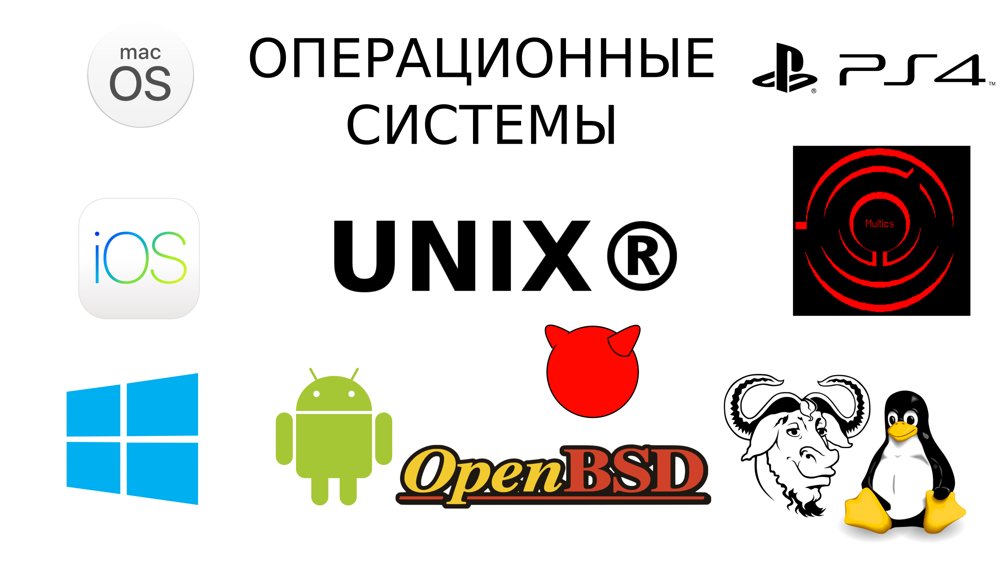
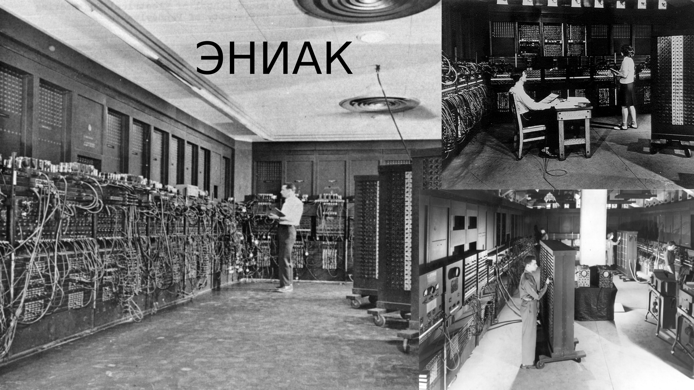
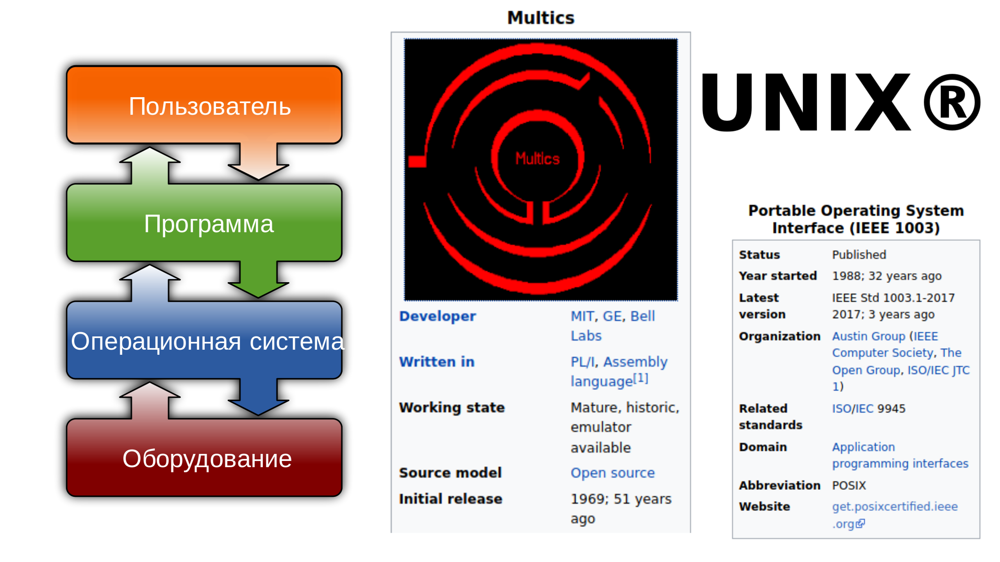



##### Появление операционных систем

Во времена моего детства на вопрос “какая у тебя операционная система?” люди отвечали Pentium 4. C появлением мобильных операционных систем Android и iOS и развитием публичного противостояния между Apple и Samsung все больше людей узнало понятие “операционная система”.  Но, я считаю, что для полноценного осознания чего-либо нужно понимать причины появления. Поэтому давайте заглянем в историю программного обеспечения.

Когда-то компьютеры занимали целую комнату, но выполняли только одну задачу в одно время. Под задачей я подразумеваю прикладную программу – программу, с которой работает пользователь. Допустим, ваш браузер, почтовый клиент, текстовой редактор или игра – всё это прикладные программы.

Так вот, как правило, компьютеры стояли в институтах и работники могли долго ждать, пока до них дойдёт очередь работать с компьютером, как в семье где 10 детей и 1 компьютер. Со временем, мощности компьютеров росли и была необходимость выполнения нескольких задач последовательно или параллельно, а также возможность работать нескольким пользователям одновременно. Появилась концепция разделения времени, так называемый “time-sharing”, на основе которой создали служебные программы, которые решали вопросы многозадачности.

Со временем, такие служебные программы стали приобретать всё больше функций.  Если раньше программы взаимодействовали с оборудованием напрямую, то теперь часть задач брали на себя служебные программы. Они стали эдакой прослойкой между прикладными программами и оборудованием. Набор этих служебных программ начал называться операционной системой, одна из первых реализаций которых называлась Multics. На её идеях создали UNIX, который задал стандарты для современных операционных систем.

##### Из чего состоит?

Операционная система – это прослойка между прикладным ПО и оборудованием. Но и ОС можно разделить на 3 составляющие:

- Ядро. Существуют разные типы архитектур ядер, я рассмотрю модульный вариант, который используется в Linux.  Ядро это программа, отвечающая сразу за несколько важных функций. Одна из основных называется планировщик задач – часть ядра, отвечающая за многозадачность, решающая, какие программы когда посылать на исполнение процессору для максимальной производительности и эффективности работы, тот самый “time-sharing”. Часть ядра занимается оперативной памятью – решает, когда и что загружать или выгружать из оперативной памяти. Также ядро отвечает за непосредственную работу с оборудованием за счёт специальных модулей, называемых драйверами. Когда прикладное ПО хочет работать с оборудованием, допустим, игра хочет обработать какие-то данные и вывести на экран изображение, она обращается к ядру, а ядро пересылает запрос через драйвер на видеокарту. У ядра есть и другие функции, но на пока этого достаточно.

- Системные библиотеки. Администраторы с библиотеками практически не работают, но всё же стоит знать о них хотя бы поверхностно. Программы частично хранят часть кода, функции или данные в виде специальных файлов, называемых библиотеками.

- Оболочка и утилиты. Одна из важных функций операционной системы – дать пользователю интерфейс взаимодействия с компьютером. Интерфейс может быть как графическим, так и текстовым. Не стоит думать, что текстовый интерфейс – это какое-то окно в скрытый мир компьютера, через которое вы можете делать с компьютером всё что угодно. Да, текстовый интерфейс, как правило, несколько функциональнее графического, но его писали люди для людей и функции у него как у графического интерфейса – дать возможность запускать программы, работать с файлами и т.п. Современные операционные системы содержат сотни небольших программ, называемых утилитами, которые могут служить как для самой системы для каких-то внутренних задач по обслуживанию, так и для пользователей для какого-то базового функционала, а также для диагностики и решения проблем.

##### GNU/Linux

Коммерческие компании, которые разрабатывают операционные системы, дают название своим продуктам Windows, MacOS, Android или iOS. Но в случае с GNU/Linux всё сложилось несколько иначе – ядро, называемое Linux, разрабатывают одни люди, точнее даже сказать тысячи людей и компаний, а библиотеки и утилиты сотни других людей и компаний. Что-то осталось ещё с 80-ых, а что-то появляется и исчезает каждый год. Как правило, какие-то базовые утилиты разрабатывает организация GNU, а большинство остальных утилит и оболочек выпускается под лицензией GNU GPL (даже ядро). И есть люди и компании, которые берут эти компоненты, соединяют и получают операционную систему в готовом виде, которую называют GNU/Linux. Но у разных людей свои видения и свои цели, в итоге получается много разных вариаций этой операционный системы, которые называют дистрибутивами. Ubuntu, Debian, Centos, RedHat Enterprise Linux – всё это дистрибутивы, которые используют программы GNU и ядро Linux. Есть дистрибутивы, которые отличаются только набором предустановленных программ и настройками графического интерфейса, и есть дистрибутивы, в которых абсолютно разных подход к обновлениям, поддержке и даже наличие каких-то специфичных программ.

Современные операционные системы для персональных компьютеров, как правило, распространяются в виде специальных файлов с расширением ISO. Этот файл – так называемый образ диска – содержит программу-установщик операционной системы и для установки его следует записать на диск или флешку и загрузить компьютер с этого устройства. И хотя есть возможность поставить несколько операционных систем одновременно, ошибка при установке может привести к потере данных, поэтому к процессу установки следует относиться очень серьёзно. Я буду рассматривать установку операционной системы в отдельной части.

Как правило, дистрибутивы GNU/Linux можно скачать с официальных сайтов дистрибутива бесплатно и без всяких регистраций, а коммерческие операционные системы предоставляют доступ к этому файлу только после покупки лицензии – специального документа, разрешающего использование копии программного обеспечения. Некоторые операционные системы жёстко привязаны к определённому железу – как например, MacOS, но большинство ставится на различное оборудование при наличии драйверов.

Про операционные системы и GNU/Linux можно говорить очень-очень много, поэтому у меня есть [стрим](https://youtu.be/HJEJm6pXrx0), в котором я обсудил многие темы, которые не затронул в этой части. Тут же я дал только минимально необходимую информацию для понимания.
