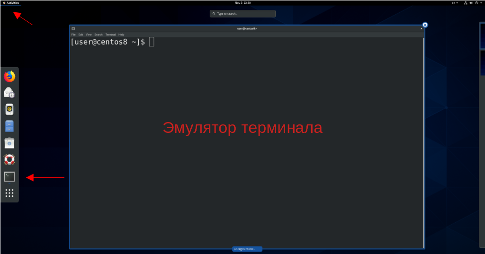
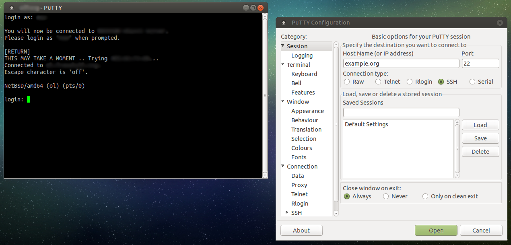
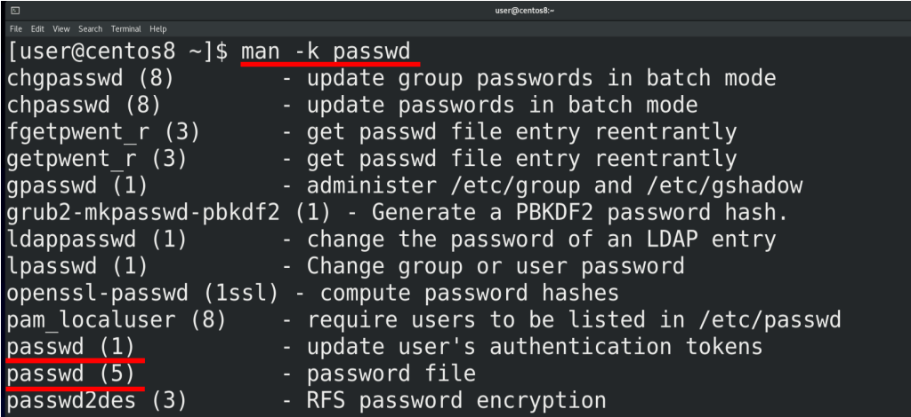



Чтобы пользователь мог взаимодействовать с компьютером, операционная система предоставляет два интерфейса – графический и текстовой. Есть заблуждение, что текстовый интерфейс нужен исключительно для задач администрирования, но, на самом деле,  в текстовом интерфейсе можно слушать музыку, читать новости, общаться и даже сёрфить интернет. Графический или текстовый интерфейс – это понятие, а различные реализации называются оболочками.


Благодаря тому, что дистрибутивы GNU/Linux разрабатывает не одна компания, а любой желающий, существует множество различных графических и текстовых оболочек, на любой вкус и цвет. Текстовые оболочки называют интерпретаторами командной строки или shell. По сути, это программы, которые могут отличаться функционалом, но стандартной оболочкой для UNIX-подобных операционных систем является sh, также называемая шелл. А одна из самых популярных называется bash. С помощью интерпретаторов пользователи могут делать практически всё, что может быть связано с запуском программ – ставить условия запуска, использовать переменные, повторять с разными значениями, автоматизировать и т.д. Одно из преимуществ bash над sh - автодополнение. Когда вы что-то печатаете на bash, часто вы можете нажать tab, который допишет команду до конца, а если есть несколько вариантов, то двойное нажатие по tab покажет их.



Есть 3 основных способа получить доступ к текстовому интерфейсу. При наличии графического интерфейса, чаще всего используется эмулятор терминала. Есть множество различных эмуляторов терминала, в основном они отличаются внешним видом и горячими клавишами.


При отсутствии графического интерфейса, либо при каких-либо проблемах с ним, используется виртуальная консоль, также называемая виртуальным терминалом. Их обычно много и к ним можно подключиться даже имея графический интерфейс, обычно для этого используется комбинация клавиш Alt + Ctrl + F1, F2 и т.д, обычно до F6. Так как VirtualBox перехватывает клавиши, на нём это можно сделать с помощью "правый Ctrl"+F1 и т.п. Графический интерфейс запускается на одной из виртуальных консолей.



Но, чаще всего, администраторы работают с компьютерами не напрямую, а удалённо. Для этого они используют программы для удалённого доступа, работающие с протоколом SSH. Одна из самых популярных на Windows называется Putty, но в Windows 10 это можно делать и без дополнительных программ, просто написав в терминале Windows команду ssh пользователь@айпи.адрес и введя пароль пользователя.

Программы, работающие в текстовом интерфейсе, часто называют командами. Этих команд огромное количество и знать всё наизусть не нужно. Большинство команд, с которыми вы будете работать, вы без труда запомните, так как их создавали для людей - они просты и логичны.  Сложные команды всегда можно где-нибудь записать или найти. Чтобы знать, как работать с командой, вы должны знать её синтаксис.


Давайте, для примера, рассмотрим команду ls.

```
ls
```

ls – от cлова list – команда, с помощью которой можно просмотреть содержимое директории. Запомните – GNU/Linux – регистрозависимая операционная система. Если вы напишете L большое или S большое – получится уже другое значение, а так как таких команд нет, интерпретатор выдаст ошибку. Тоже самое касается файлов – файлы file маленькими, FILE  большими, fIle, fILe  и т.д. это разные файлы, которые никак друг с другом не конфликтуют. Но это больше относится файловым системам.

Когда у вас в терминале много текста это может напрягать, поэтому терминал можно легко очищать с помощью комбинации Ctrl+L или команды clear.  А с помощью стрелок вы можете листать ранее выполненные команды.


Возвращаясь к команде ls. У большинства команд есть различные опции и многим командам можно передавать значения. Для примера, команда ls -i покажет содержимое директории с соответствующими инодами. "-i" в данном случае – опция. Опции часто называют ключами команды. Если написать ls -i file,  то мы передали команде ключ -i и значение в виде имени файла. Как результат, баш нам показал только информацию по одному файлу.

```
ls -i file
```

Что делать, если вы забыли или не знаете какой-то ключ или в целом синтаксис? Для этого в системе есть документация, которая также будет доступна во время экзамена по Red Hat. Кстати, об экзамене. Во время экзамена вы вольны пользоваться как графическим интерфейсом, так и текстовым, но, поверьте, на работу с графическим интерфейсом у вас просто не хватит времени. Работать в текстовом интерфейсе гораздо эффективнее. Возвращаясь к документации. Есть 3 основных способа получить доступ к документации – с помощью утилиты man, с помощью утилиты info и при помощи встроенной в большинство команд опции help.


Самый быстрый и простой способ – опция help.

```
ls --help
```

Как правило, это не документация, а небольшая подсказка по ключам и синтаксису, которая доступна, если писать команду, а затем два дефиса и help.


man – утилита для чтения документации, доступная на большинстве UNIX-подобных систем. Допустим, меня интересует документация по команде ls. Я пишу man ls:

```
man ls
```

и открывается страница документации. Чтобы её закрыть, нажимаем q. q часто используется различными терминальными программами для выхода. Документацию можно листать с помощью стрелок и клавиш PgUp/PgDn.


Если написать / , а потом какой-то текст, допустим ключ -i, и нажать enter программа попытается найти этот текст в документации. Как правило, в начале документации показывается имя программы, синтаксис, описание и ключи, а в конце у некоторых программ можно найти примеры команд в секции EXAMPLES, а также связанные программы.


Что касается утилиты info: 

```
info ls
```

она пришла на замену man, хотя большинство до сих пор пользуются man. info лучше работает с большими документами и поддерживает гиперссылки.


А что делать, если вы не знаете команду? В таком случае можно попытаться её найти. Кроме гугла, это можно сделать с помощью команды man с опцией -k, либо команды apropos. Допустим, я не знаю, как поменять пароль пользователю. Я могу написать man -k password:

```
man -k passwd
```

и man выдаст мне все страницы документации, в секции NAME которых есть слово password. Результатов может быть много, но, если поискать, можно найти подходящий вариант.

Кстати, вы заметили циферки рядом с названиями? Давайте посмотрим, что это такое.


Для этого зайдём в документацию самого man, написав man man:

```
man man
```

Здесь написано, что man состоит из нескольких секций и эти цифры относятся к определённым секциям. Допустим, 1 – это про команды и функции оболочки, 5 – это про формат файлов и т.д.



В некоторых случаях, для одного слова есть несколько страниц в документации в разных секциях, как например для passwd. passwd у нас это не только команда для смены пароля, но и специальный файл,  в котором хранится информация о пользователях. Чтобы посмотреть документацию по команде, пишем man 1 passwd, а чтобы посмотреть документацию по файлу, пишем man 5 passwd.

```
man 1 passwd
man 5 passwd
```


Ну и напоследок. Всё что вы вводите в терминале, сохраняется в истории. Для просмотра введённых команд используйте команду history.

```
history
```

Для повторения предыдущей команды используйте два восклицательных знака, а для повторения какой-то определённой команды из истории, напишите восклицательный знак и номер команды.

```
!!
!48
```

Я постарался рассмотреть самые базовые принципы работы с текстовым интерфейсом, но это очень огромная тема с большим количеством всяких плюшек, которые облегчают работу администратору. По мере того, как мы будем проходить другие темы, я буду рассказывать и о других нюансах, но на пока этого достаточно. Без практики вы быстро забудете все команды, поэтому обязательно уделите время практике.
