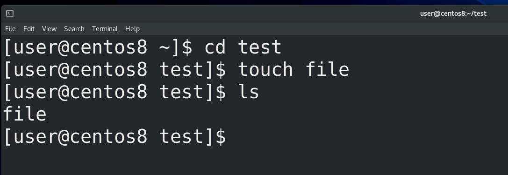
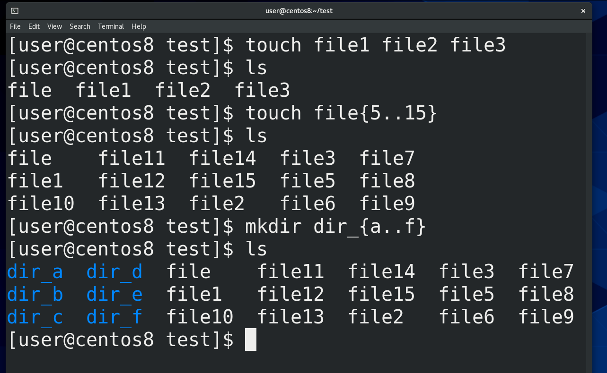
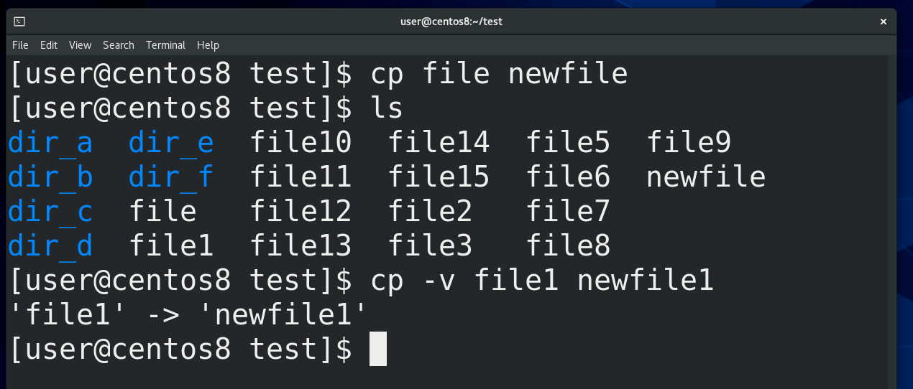
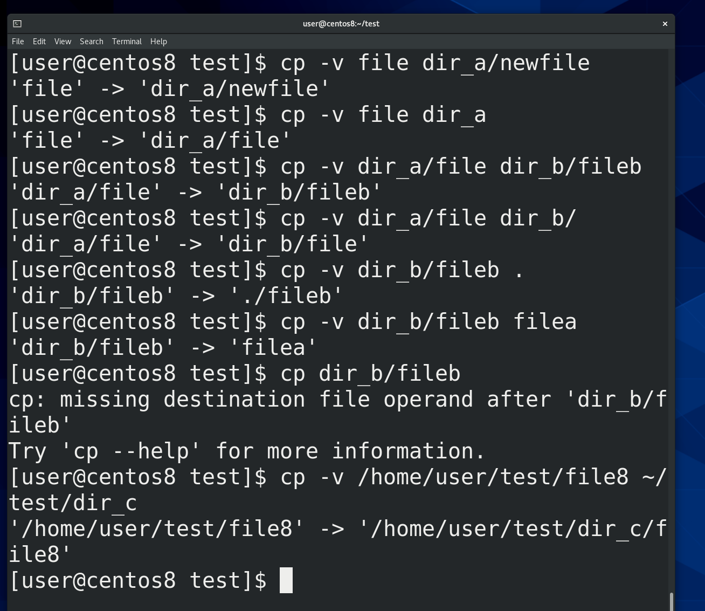
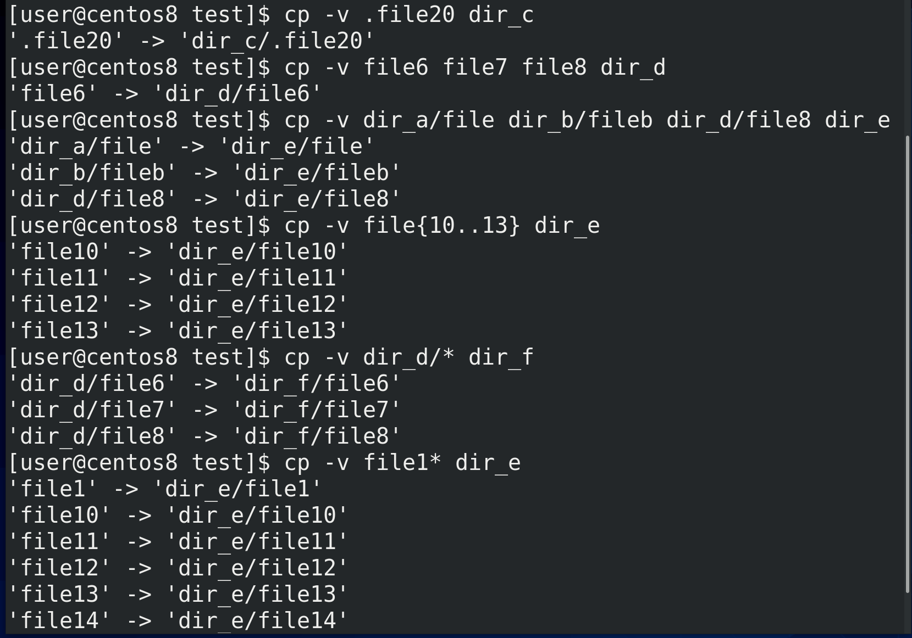
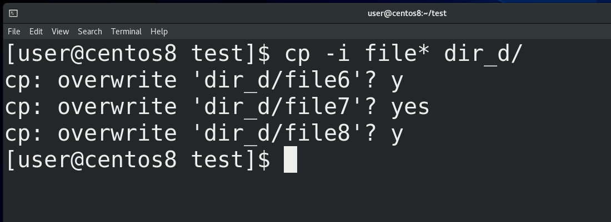
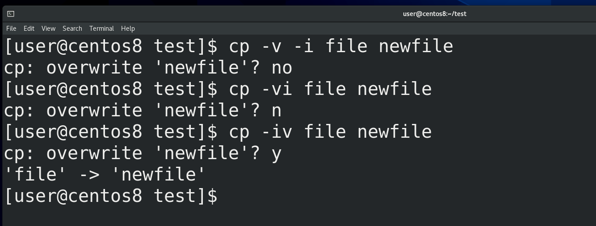
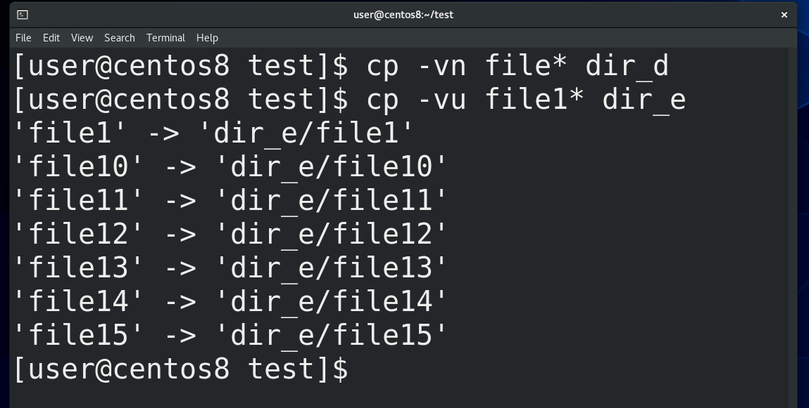





Чтобы научиться работать с файлами, нам понадобятся тестовые файлы. Их мы можем создать с помощью команды touch filename. Вообще, основная задача touch – обновить время доступа к файлу, поэтому и такое название – потрогать. Если файл существует, применив touch на него ничего с ним не случится, только обновится информация в иноде, а если файла не существует – он создастся.

```
touch file
```

Это может быть полезно в каких-нибудь скриптах, но и сейчас это помогает нам создать тестовые файлы.



С помощью touch можно разом создать несколько файлов:

```
touch file1 file2 file3
```

Одна из фишек командной строки – возможность работать с регулярными выражениями. Например, мы можем написать:

```
touch file{5..15}
```

и баш преобразит это в:

```
touch file5 file6 file7 ...
```

и т.д., в итоге мы получим кучу файлов. Тоже самое работает и с буквами, допустим, тот же:

```
mkdir dir_{a..f}
```

Но о регулярных выражениях мы еще поговорим.


Также можно создавать невидимые файлы и директории. Для этого в начале имени файла или директории следует указывать точку. Например: 

```
touch .file20
mkdir .dir_h
```

Если посмотреть на вывод ls, скрытых файлов и директорий не увидеть. Чтобы их увидеть, для ls нужен ключ -a:

```
ls -a
```

Тогда мы увидим все файлы в директории. Для того, чтобы увидеть скрытые файлы в файловом менеджере, можно нажать Ctrl + h. Тоже самое, чтобы скрыть. Обычно скрытые файлы нужны всяким программам для хранения настроек в домашней директории пользователя, но не только. В целом это позволяет скрыть ненужные пользователю файлы и директории.



И так, что можно делать с файлами?  Начнём с копирования. Для этого используется команда cp – copy. Чтобы скопировать файл в текущую директорию, используем cp имя нужного файла и имя для копии:

```
cp file newfile
```

Команда что-то сделала, а чтобы увидеть, что произошло, нужно посмотреть (ls). Многие команды сами могут показывать, что происходит во время работы. Обычно для этого используется опция verbose (подробно) -  вы часто будете натыкаться на эту опцию. Обычно она пишется как -v. То есть:

```
cp -v file1 newfile1
```

Тут мы видим, что файл скопировался.



Чтобы скопировать файл в директорию, используем:

```
cp -v file dir_a/newfile
```

Но вообще, если копировать в другую директорию, то необязательно указывать новое имя, можно просто написать:

```
cp -v file dir_a
```

Можно копировать из одной директории в другую:

```
cp -v dir_a/file dir_b/fileb
```

либо также не указывая нового имени:


```
cp -v dir_a/file dir_b
```

Ещё можно копировать из другой директории в текущую, используя ссылку для текущей директории – точку,  как я говорил в прошлый раз. То есть:

```
cp -v dir_b/fileb .
```

если вы не хотите менять имя,  либо, если вы хотите новое имя, то достаточно просто указать его:

```
cp -v dir_b/fileb filea
```

В общем, идея какая – для текущей директории путь не нужен, но нельзя просто написать:

```
cp dir_b/fileb
``` 

потому что синтаксис требует указать, куда файл нужно копировать. Если это не сделать, команда подумает, что недописана и просто выдаст ошибку. Ну и до этого мы использовали относительные пути, а так мы можем работать и с полными путями, например:

```
cp -v /home/user/test/file8  ~/temp/dir_c
```



Копирование скрытых файлов ничем не отличается от копирования обычных файлов – просто не забывайте указывать точку в начале названия файла, потому что это часть названия файла:

```
cp -v .file20 dir_c
```

Можно копировать несколько файлов разом, но тогда нужно копировать их в другую директорию:

```
cp -v file6 file7 file8 dir_d
```

Ну и по той же логике, указывая пути:

```
cp -v dir_a/file dir_b/fileb dir_d/file8 dir_e
```

Помните про регулярные выражения? Можем использовать и здесь. Допустим:

```
cp -v file{10..13} dir_e
```

Кроме фигурных скобок, можно использовать и звёздочку – её часто называют wildcard – она означает, что подойдёт любое значение. Допустим, в директории dir\_d есть три файла и я хочу скопировать все три:

```
cp -v dir_d/* dir_f
```

Тогда все файлы скопируются. Или, допустим, я хочу скопировать все файлы, названия которых начинаются с file1, а сюда подходят файл file1, file10, file11, file12 и т.д. Я пишу cp -v file1* dir_e и все подходящие файлы скопируются.



Давайте рассмотрим ещё пару ключей. Допустим, ключ -i – интерактивно. Что это значит? Когда вы копируете файл, если существует файл с таким названием в директории назначения, этот файл просто перезапишется. Это  не всегда нас устраивает, иногда мы хотим лично решать, что перезаписывать, а что нет. Поэтому здесь нам поможет ключ -i. Допустим, cкопируем все файлы в директорию dir_d:

```
cp -i file* dir_d
```

Командная строка начнёт спрашивать, а что же делать с файлами, которые существуют там с тем же именем. Мы можем отказаться от перезаписывания файла, либо согласится. Обычно когда какая-то команда спрашивает вопрос, на который нужно ответить да/нет, то подходят ответы y, либо yes, n, либо no. Такой вариант – интерактивный - требует, чтобы вы лично сидели и решали, что делать с каждым совпадающим файлом.



Кстати, ключи можно использовать вместе. Допустим, мы знаем ключ -v и ключ -i. Мы можем использовать их вместе:

```
cp -v -i file newfile
cp -iv file newfile
cp -vi file newfile
```

Порядок – какой ключ вначале, какой потом – почти никогда не имеет значения.



Другой вариант – мы не хотим перезаписывать файлы – тогда сразу используем опцию -n. Например:

```
cp -vn file* dir_d
```

Тогда файлы в директории не перезапишутся. А если, допустим, мы хотим пропустить совпадающие файлы, а скопировать только файлы новее или отсутствующие файлы – тогда опция -u – update. То есть:

```
cp -vu file1* dir_e.
```


Помните про жёсткие ссылки? Мы можем вместо копирования создать жёсткую ссылку. Например:

```
cp -vl file filelink
```


Также мы можем копировать директории. Для этого используем опцию -r – рекурсивно. Допустим, я хочу скопировать директорию dir\_a в директорию dir\_b:

```
cp -vr dir_a dir_b
```

Эту опцию можно использовать не только с директориями, но и с файлами, никому от этого хуже не станет. Забегая вперёд, скажу, что в большинстве случаев правильнее копировать с опцией -a вместо -r, по сути -a это опции -r и -d. Вкратце, это позволяет сохранить права и владельца файла у копии файла.

```
cp -va dir_a dir_b
```

Как-то получилось, что я очень много времени уделил на копирование и лучше пока не перегружать вас информацией о других командах. Но то что мы сделали сегодня  с одной командой, актуально и для большинства других команд – во многом ключи и подходы похожи.
