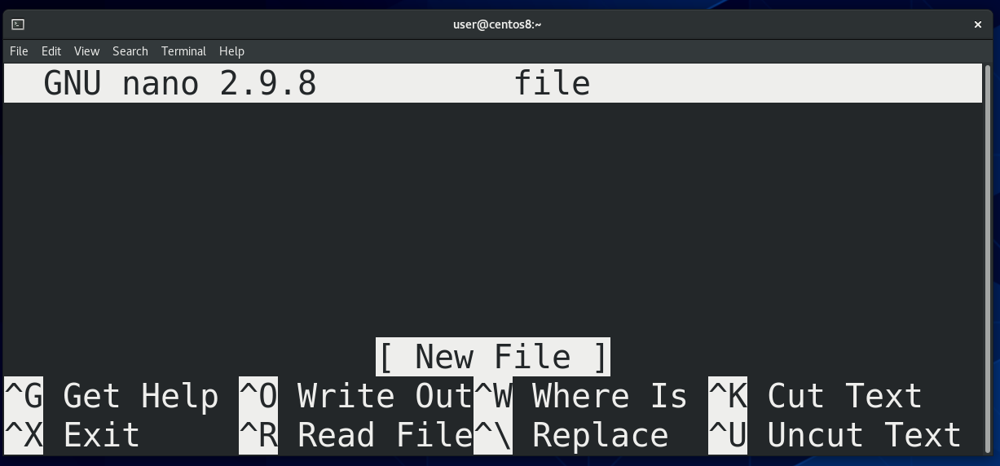
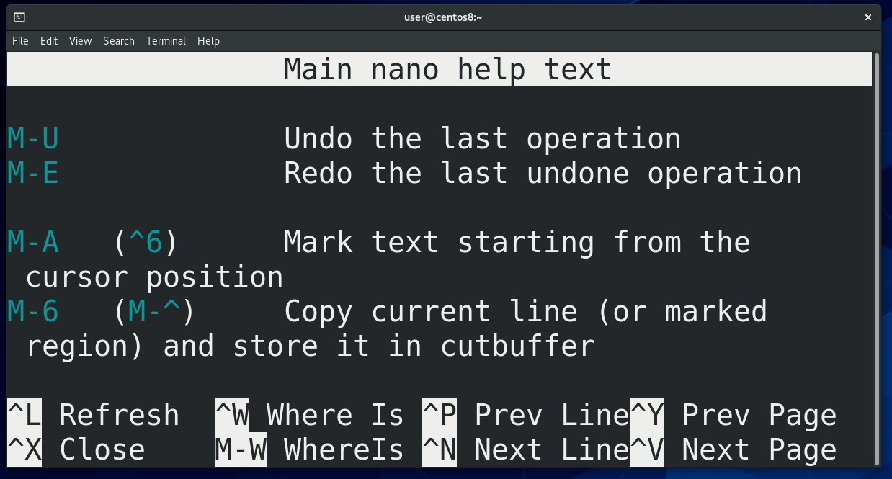
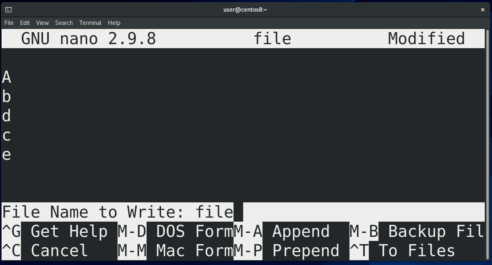
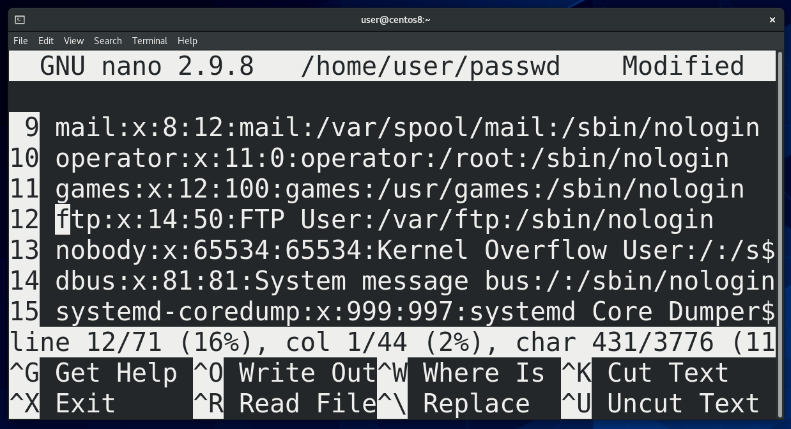
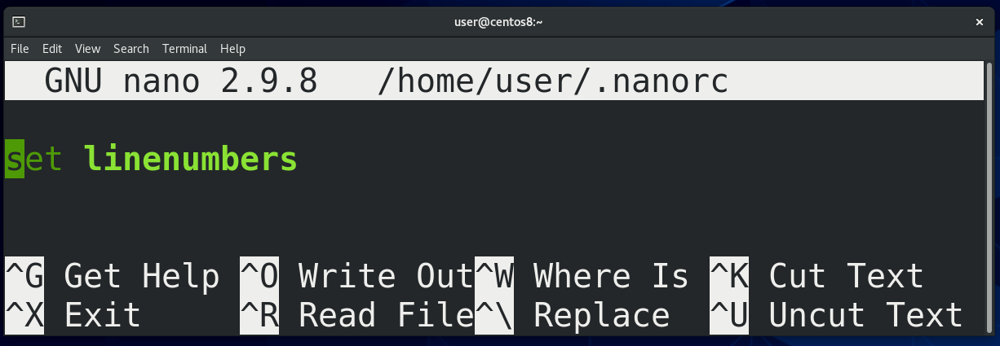
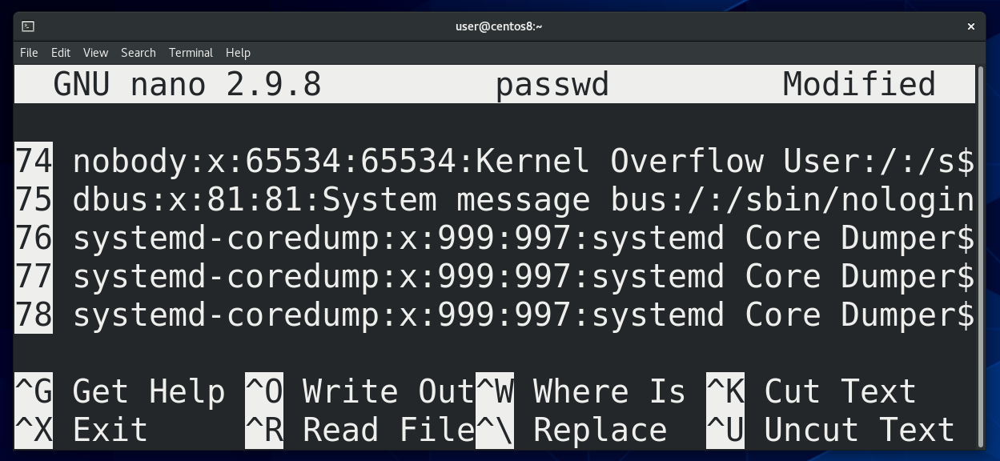
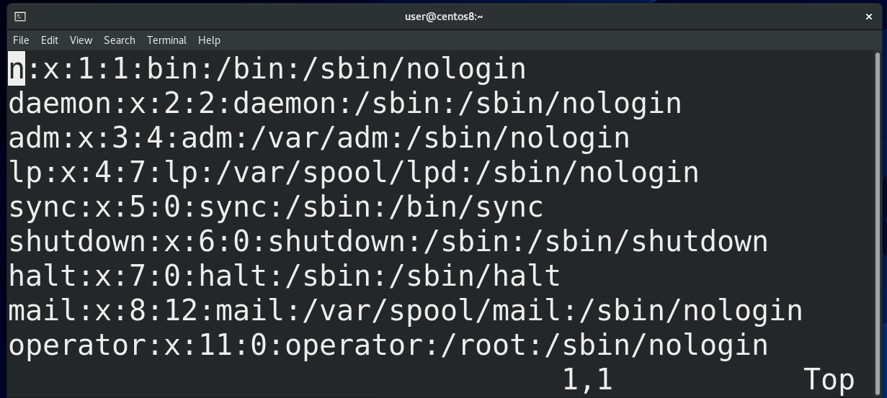
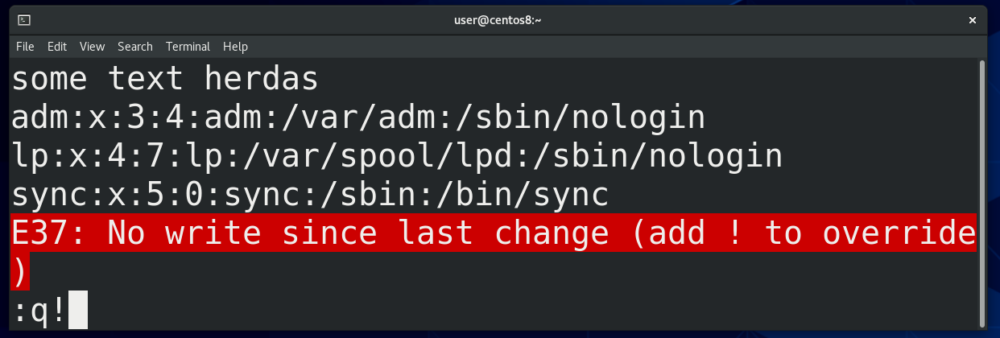

Для редактирования текстовых файлов вам нужен текстовой редактор. Самые известные – vi (и его современная реализация vim), emacs и nano. Объяснением одного nano не обойтись - хоть он и попроще, но очень важно уметь работать с vi и от этого никуда не деться. nano не всегда предустановлен, а без умения работы с vi может сложиться ситуация, что вы и nano не сможете установить. Нет, теоретически, можно и без vi обойтись, но это потребует у вас много времени - легче научиться хотя бы базово работать с этой программой. И не то чтобы vi хуже или сильно сложнее – большинство админов и программистов как раз таки предпочитают vim. Я рассмотрю обе программы, чем пользоваться – решайте сами. Но уметь работать с vi нужно в любом случае.

Начнём с nano. Программа простая – вы пишете nano и имя файла, который вы хотите создать или изменить - nano file. Открывается программка и здесь вы можете вводить текст, изменять его. Для перемещения используются стрелки. Чтобы быстро перемещаться между словами можно зажать Ctrl и использовать стрелки, чтобы перейти в начало строки – Ctrl+A, чтобы в конец – Ctrl+E. Внизу есть подсказки по горячим клавишам. Значок рядом с буквами(^ - карет) обозначает Сtrl, например, Ctrl+G для небольшого гайда.

В гайде кроме знака Ctrl также встречается М – это не буква М, а клавиша мета. Скорее всего, у вас на клавиатуре её нет, поэтому её заменяет либо Alt, либо клавиша Win. Допустим, комбинация Alt-U. Как видите, внизу есть подсказка – Ctrl+X - закрыть это окно.

Разбирать все горячие клавиши я не буду, но давайте пройдёмся по основным. Начнём с сохранения – написали какой-то  текст, хотим сохранить. Нажимаем Ctrl+O – внизу появляется поле, где можно указать новое имя для файла, либо оставить то имя, которое мы указывали, когда запускали nano. Нас это имя устраивает, поэтому нажимаем Enter и видим, что внизу появилась надпись, где сказано, сколько линий у нас в файле. Чтобы выйти – Ctrl+X. Если перед закрытием мы сделали какие-то изменения, то у нас появится вопрос – сохранить изменения или нет – тут пишем Y или N, или Ctrl+C, всё как указано в подсказке.

Давайте обратимся к файлу /etc/passwd - nano  /etc/passwd. Как видите, внизу надпись нас предупреждает, что этот файл невозможно редактировать – потому что у нас нет на это прав. Поэтому просто скопируем этот файл к себе в домашнюю директорию - cp /etc/passwd ~. C копией файла у нас не будет никаких проблем, так как эта копия принадлежит нам. Откроем копию файла - nano ~/passwd и убедимся, что теперь этой ошибки нет.

Нередко бывает нужно сориентироваться, в какой строчке мы сейчас находимся. Для этого нужно нажать Ctrl+C – появится подсказка – на какой линии вы находитесь, на каком символе этой линии и на каком символе файла в целом. Можно ещё нажать Alt+# (может различаться от дистрибутива, нужно смотреть в подсказке Ctrl+G) и слева появится нумерация строк. Но если мы закроем nano и заново откроем, то придётся заново включать нумерацию.

А давайте сделаем так, чтобы нумерация была всегда видна – для этого нужно подредактировать файл конфигурации nano – nanorc, который должен находится в домашней директории пользователя и должен быть скрытым, то есть имя должно начинаться с точки.  Пишем – nano ~/.nanorc. Я использую тильду слеш ( ~/ ), потому что не важно, где я нахожусь, тильда слэш всегда ведёт в домашнюю директорию, ну и название файла - .nanorc. Файл новый, потому что до этого мы никаких настроек nano не сохраняли. Пишем - set linenumbers  - сохраняем и выходим. Открываем файл – nano passwd – и вот теперь по умолчанию нумерация включена.

Теперь попытаемся найти строчку нашего пользователя user – нажимаем Ctrl+W и появляется надпись Search: - пишем user. Вариантов может быть несколько. Чтобы перемещаться между вариантами, нажимаем Alt+W.

Теперь попытаемся перейти сразу на какую-то строчку – пишем Ctrl+W, а потом Ctrl+T – и появляется строка с предложением ввести номер строки и символа. Можно просто написать номер строки и Enter, либо номер строки и символа через пробел – 13 6.

Часто бывает нужно вырезать или скопировать целую строку – нажимаем Ctrl+K, чтобы вырезать и Ctrl+U чтобы вставить. Можно переместиться в другое место и снова нажать Ctrl+U, чтобы вставить.  Очень удобно, когда нужно несколько похожих строк. Можно разом вырезать несколько строк – нажимаем Ctrl+K несколько раз, а потом при Ctrl+U вставляются все вырезанные строки. Чтобы отменить последние изменения, нажимаем Alt+U. 

Ладно, не будем переусложнять. Для начала вышесказанных горячих клавиш для работы с nano вполне хватит. Некоторые другие клавиши мы рассмотрим, когда непосредственно начнём работать с файлами. Теперь перейдём к vi. Я не буду также детально рассматривать vi, только пройдусь по самому необходимому. Сам я vi не пользуюсь без необходимости, но для желающих в интернете миллион гайдов и даже игра, объясняющая, как работать с vi https://vim-adventures.com/. 

Точно как и с nano, вы можете написать vi file, чтобы создать или изменить файл – vi passwd.  В vi есть несколько режимов – командный режим, режим ввода и режим последней строки. Когда вы открываете vi, вы оказываетесь в командном режиме – в этом режиме вы не можете писать текст, но можете выполнять команды, например - x – для удаления символа или два раза d для удаления строки. Backspace в vi не работает. Но стоит учесть, что Centos вместо vi открывает vim,  а в нём backspace работает (в режиме ввода). 

Чтобы перейти в режим ввода, можно использовать несколько клавиш - нажимаем i  маленькое - внизу появляется надпись INSERT - и начинаем писать ровно там, где был курсор. Чтобы выйти из режима ввода, нажимаем Esc. I большое, то есть Shift+i – начинаем писать с начала строки. a маленькое – начинаем писать после курсора, A большое – в конце строки. o – добавляем строку ниже и начинаем в ней писать, O – строка сверху. Напомню, чтобы удалить текст, используем baсkspace, либо переходим в режим команд, то есть нажимаем Esc, наводим курсор куда нужно и нажимаем x. Если хотим сохранить это безобразие, в командном режиме нажимаем Shift+Z+Z.

Чтобы перейти в режим ввода, можно использовать несколько клавиш - нажимаем i  маленькое - внизу появляется надпись INSERT - и начинаем писать ровно там, где был курсор. Чтобы выйти из режима ввода, нажимаем Esc. I большое, то есть Shift+i – начинаем писать с начала строки. a маленькое – начинаем писать после курсора, A большое – в конце строки. o – добавляем строку ниже и начинаем в ней писать, O – строка сверху. Напомню, чтобы удалить текст, используем baсkspace, либо переходим в режим команд, то есть нажимаем Esc, наводим курсор куда нужно и нажимаем x. Если хотим сохранить это безобразие, в командном режиме нажимаем Shift+Z+Z.

Не смотря на все эти махинации, vi, а точнее vim, очень любят в народе. Для задач администрирования функционала nano вполне хватает, но каждый сам решает, с каким редактором ему работать. И тем не менее, обязательно научитесь работать с vi, хотя бы базово – открыть файл, изменить какой-то текст и сохранить, либо не сохранить.