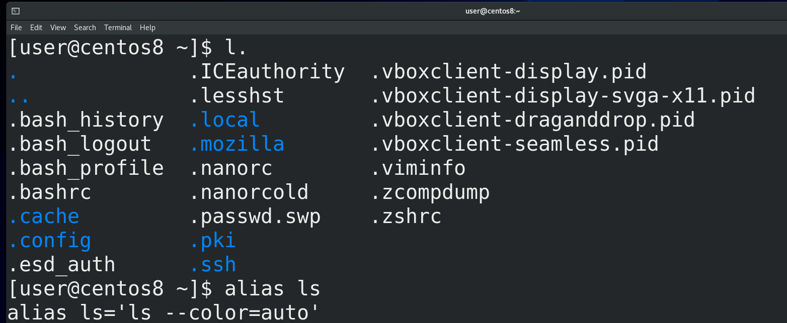
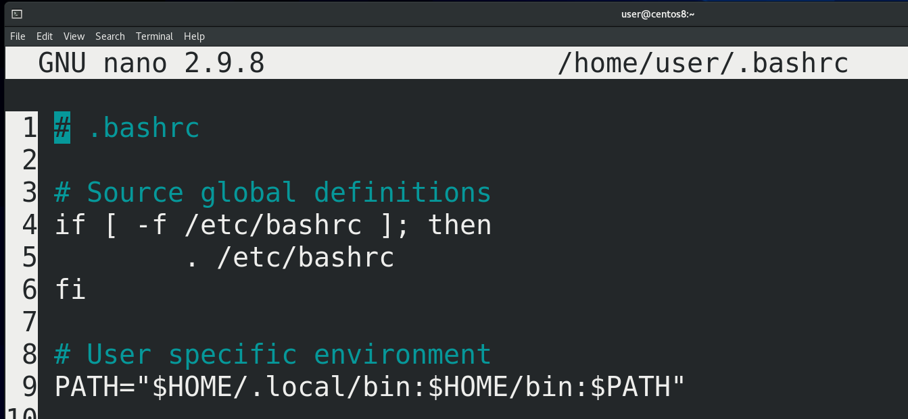
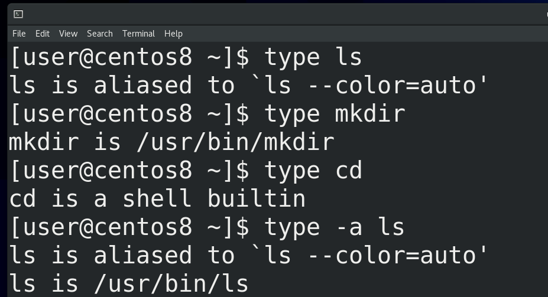



В теме "Текстовый интерфейс пользователя" я рассказал про интерпретатор командной строки bash. Давайте разберём, что же он умеет.


Тогда я упомянул, что bash умеет дополнять команды – допустим, вы пишете часть команды ( to, tou, touch file), нажимаете tab и bash дописывает команду или файл за вас. Если вариантов несколько – нажимаете tab два раза и видите все варианты. Но есть два типа дополнения – простое и продвинутое. В случае простого дополнения у вас просто дописывается сама команда или файл. Продвинутое дополнение может добавлять опции и значения.


Мы с вами на виртуалке поставили CentOS с графическим интерфейсом, то есть user-friendly версию, поэтому у нас сейчас стоит продвинутое дополнение. Из пройденных команд это можно увидеть по команде man – если написать man и нажать два раза tab, то bash скажет, что у нас больше 6 тысяч вариантов – всё это страницы документации, то есть, значения для man. Или, например, команда для архивации - tar – о ней мы поговорим в другой раз. Но, с точки зрения дополнения, если написать tar и нажать tab, то сперва появится дефис, а после двух нажатий tab появятся опции этой команды. В отличии от пройденных команд, где всякие ключи не обязательны, у tar ключи обязательны, поэтому bash сразу предлагает их написать.


Теперь давайте рассмотрим простой вариант дополнения. Обычно, когда стоит минимальная система без графического интерфейса, дополнение простое. Функционал продвинутого дополнения ставится с пакетом bash-completion. Давайте я удалю этот пакет и мы посмотрим что будет. Для этого я пишу:

```
sudo dnf -y remove bash-completion
```

и ввожу пароль моего пользователя. В рамках запущенной bash сессии ничего не изменится, но если открыть новое окно терминала – то тут у нас дополнение будет работать в урезанном виде. Например, пишу man, нажимаю tab -  а он мне предлагает файлы вместо страниц документации. Или пишу tar, нажимаю tab – опять же файлы. Сами команды и файлы будут дописываться - если написать to и два раза нажать tab, то мы увидим все команды, начинающиеся на эти буквы. Но сразу после команд при нажатии tab будут предлагаться файлы, и не важно, работает команда с файлами или нет. Поэтому установим обратно bash-completion:

```
sudo dnf -y install bash-completion.
```


Ещё в bash можно настроить алиасы. Алиасы дают возможность настроить какие-то свои команды на основе других. Если запустить команду

```
alias
```

можно увидеть список заданных алиасов для текущей bash сессии.

Я говорю bash сессия, но что это такое? Когда вы запускаете эмулятор терминала, у вас запускается bash сессия. Если вы запустите другое окно – будет другая сессия. Напишете bash – ещё одна сессия. Для каждой сессии bash запускается "с нуля", то есть он считывает файл настроек. Это значит, что если вы измените файл настроек, то в запущенном bash-е ничего не изменится. Но если написать bash или запустить новое окно, то есть запустить новую сессию bash, то новая сессия эти изменения увидит. Сейчас, на примере алиасов, разберёмся.



Так вот, команда alias показала нам текущие алиасы. Тут мы видим пару знакомых команд, связанных с ls и vi. И так, здесь написано, что команда l точка (l.) - это на самом деле команда ls -d .* --сolor=auto. ls показывает список файлов и директорий в текущей директории, ключ -d покажет сами директории, а не их содержимое, .* - все файлы и директории, у которых в начале названия есть точка, то есть скрытые файлы и директории. И --color=auto – раскрасить вывод. Так вот, если написать:

```
l.
```

мы увидим все скрытые файлы и директории в текущей директории. Если вы обратили внимание, у нас ls в принципе всегда раскрашивает вывод – а это потому что есть алиас на сам ls c опцией --color=auto. Тут же есть алиас на vi – то есть когда мы запускаем vi у нас запускается vim.


Давайте сами зададим какой-нибудь alias. Например:

```
alias vi=nano
```

Теперь у нас при запуске vi будет открываться nano – vi file. Или, допустим:

```
alias show="tail -5 /etc/passwd"
```

Обратите внимание, что я взял правую часть в кавычки, а в примере с nano я этого не делал. Сами подумайте, почему, если не знаете – попробуйте ввести без кавычек и проверить. Ну и если вам пока это сложно понять – спрашивайте в комментариях, я отвечу. Так вот, чуть ранее я говорил про bash сессии. И те алиасы, которые мы создали, сохранились только в текущей сессии. Это значит, что если запустить новое окно – то там наших алиасов уже не будет.



Если мы хотим, чтобы наши алиасы остались навсегда, мы должны их написать в файле настроек bash - ~/.bashrc, который находится у нас в домашней директории:

```
nano ~/.bashrc
```

Как вы видите, этот файл не пустой, здесь есть какие-то настройки. Некоторые строчки начинаются со знака решётки (#). Такие строчки называются закомментированными – как правило, программы такие строчки не считывают, они больше нужны для людей.


Обычно без разницы, где добавлять новые строчки, но для удобства давайте спустимся в самый низ и добавим там. Напишем комментарий:

```
# My custom aliases
```


Кстати, в nano можно нажать Esc+3 и nano сам добавит или уберёт знак решётки с текущей строки. Дальше я пишу свои алиасы, по одному на каждую строку:

```
alias show="grep user /etc/passwd"
```

и закрываю файл. В текущей баш сессии ничего не изменится, поэтому я запускаю новое окно и уже там эти алиасы видны и работают.


Алиасы нужны пользователям для упрощения работы, бывают сложные и длинные команды, которые вы часто должны вбивать. И чтобы облегчить себе жизнь, вы можете создать для себя алиасы. Но бывают случаи, когда вам нужен не алиас, а сама команда. Допустим, в системе есть алиас вместо vi запускать vim, или окрашивать вывод ls. А что, если мне нужно разок запустить обычный ls? Есть несколько способов это сделать – поставить обратный слэш перед командой - \ls, либо взять команду в кавычки – "ls", либо написать перед ней command - command ls.


Кстати, как вы, возможно, заметили, список алиасов от команды alias не малый, но в файле ~/.bashrc их не было. Файл .bashrc  распространяется только на моего пользователя, потому что он в моей домашней директории. Но есть файл /etc/bashrc, который распространяется на всех пользователей в системе. Допустим, если вы хотите создать alias, который бы работал у всех пользователей – создаёте его именно в этом файле. Но, если полистать этот файл, вы всё равно не найдёте те же алиасы на ls. Поэтому ещё одна задачка для вас – постарайтесь найти файл, в котором указаны алиасы, которые у нас есть по умолчанию. Всё что нужно чтобы найти – мы уже проходили.



Мы разобрались, что bash может запускать как команды, так и алиасы. Сами команды можно разделить на 2 типа – внешние и внутренние.  Какие-то команды встроены в bash, они называются внутренними – например, тот же cd. Но большинство команд лежат на файловой системе в специальных директориях и называются внешними. Чтобы как-то отличать, что это за команда – внутренняя, внешняя или алиас – есть команда type. Допустим:

```
type ls
type mkdir
type cd
```

В случае ls – это алиас, в случае mkdir bash показывает путь к программе, то есть это внешняя программа, а в случае с cd bash говорит, что это встроенная в оболочку команда. Но ведь ls – это алиас сам на себя, как понять, что там стоит за этим алиасом? Для этого можно использовать type с опцией -a:

```
type -a ls
```

Теперь мы видим, что ls – это /usr/bin/ls – то есть внешняя программа.

И так, мы узнали, что у нашего интерпретатора командной строки - bash – есть дополнения – простые и продвинутые. Также мы поговорили про алиасы, внутренние и внешние программы. Но bash может делать гораздо больше, поэтому будет несколько тем, посвящённых bash.
