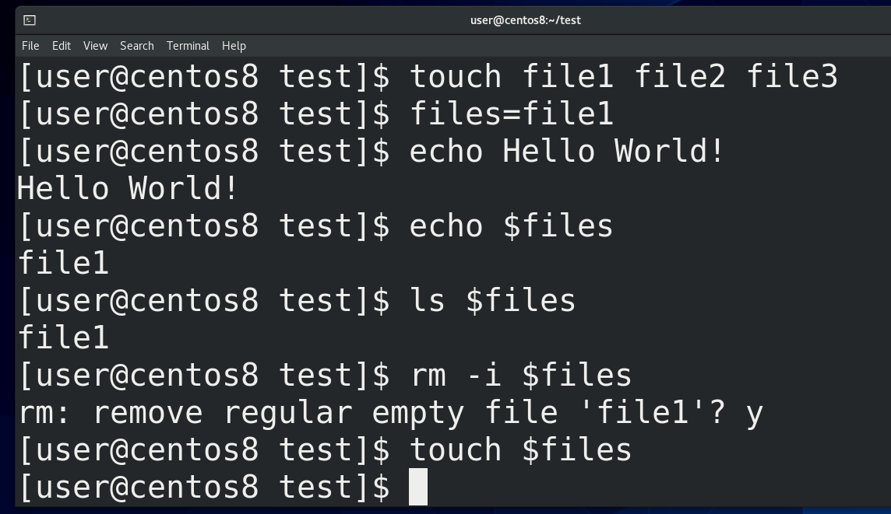
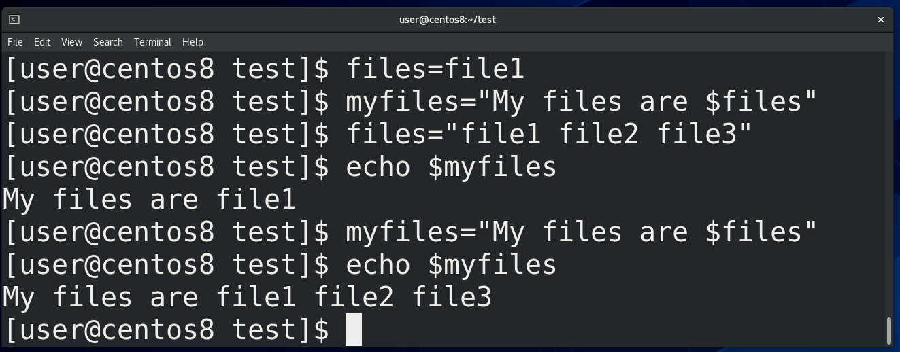
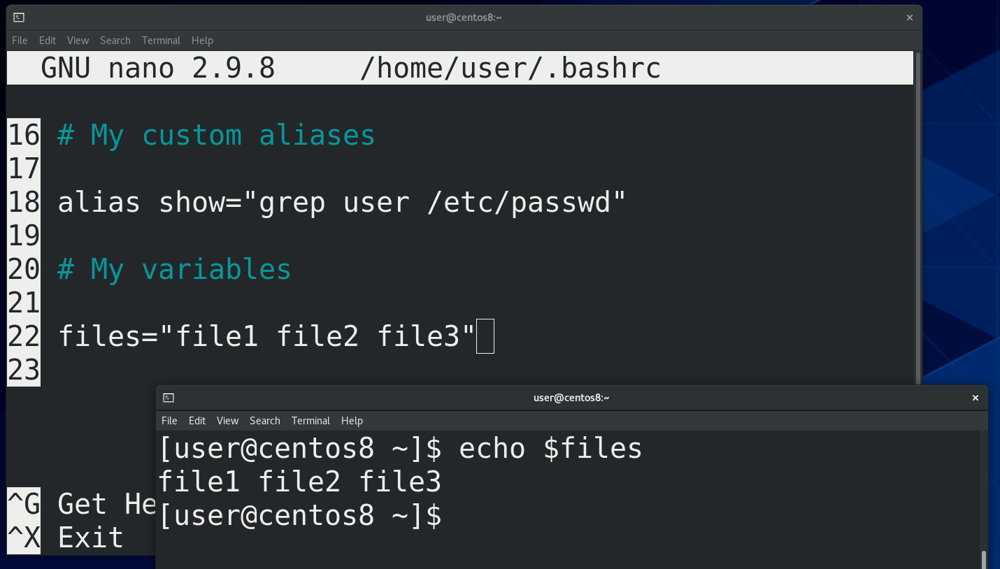
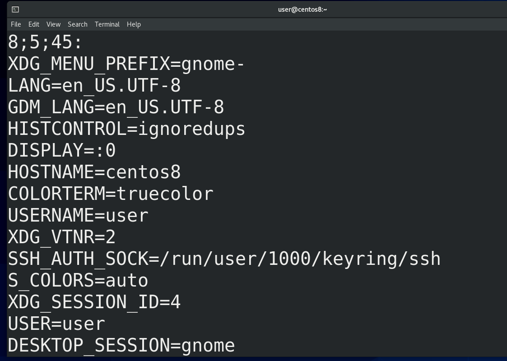
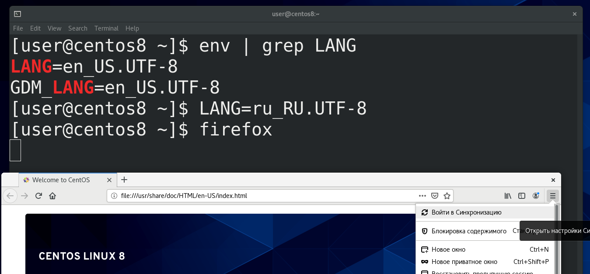
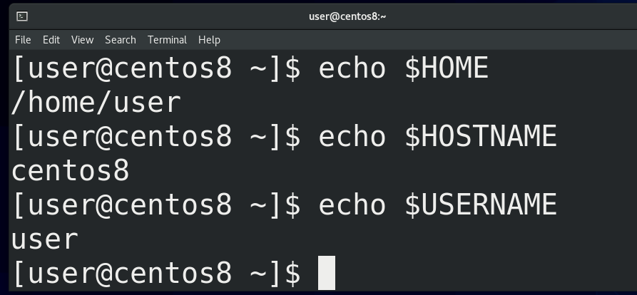
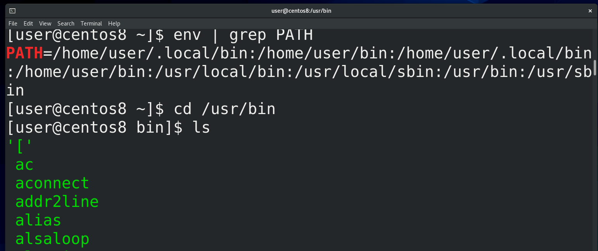
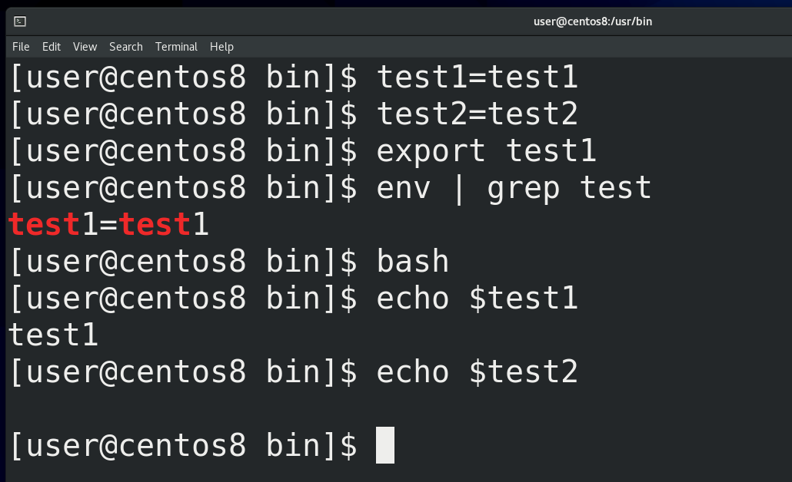




Когда мы говорим сегодня, мы подразумеваем 26 ноября. Если вы читаете эту тему завтра, то для вас слово сегодня будет значение 27 ноября. То есть, есть слово сегодня и оно может иметь различные значения. Постоянная часть, то есть слово сегодня – называется именем переменной или просто переменной, а та часть, которая меняется – 26 ноября или 27 ноября – называется значением переменной. Без переменных нельзя представить программирование и в bash-е они часто используются. Например, в эмуляторе терминала вы видите надпись user@centos8. Собственно user – это логин текущего пользователя, а centos8 – это имя системы. Если зайти другим пользователем или поменять имя системы, то  будут отображаться другие значения.

В bash переменные нужны для нескольких задач. Начнём с так называемых локальных переменных, которые также называются shell variables. Это переменные, которые мы сами создаём и нужны они нам для каких-то своих задач.



Для примера создадим переменную files. Я создаю 3 файла:

```
touch file1 file2 file3
```

и пишу:

```
files=file1
```

Обратите внимание, никаких пробелов, чтобы bash не подумал, что я запускаю программу files. И так, я создал переменную files и дал ей значение file1. Значение переменной я могу увидеть с помощью команды echo. Echo у нас выводит текст в stdout:

```
echo Hello World!
```

и используется во многих задачах, но о нём подробно поговорим в другой раз. Пока что выведем значение переменной c помощью echo: 

```
echo $files
```

files – имя переменной, а чтобы взять значение нужно перед именем поставить знак доллара. echo нам показал значение file1. Мы можем использовать эту переменную с другими командами, например, чтобы посмотреть: 

```
ls  $files
rm -i $files
```

или удалить файл. Но нужно понимать, что значение переменной – просто текст и с файлом он никак не связан. Просто bash превращает переменную в её значение, прежде чем запустить команду. В итоге в терминале получается команда:

```
rm file1
```

От того, что я удалил файл, значение переменной никуда не делось:

```
echo $files
```

поэтому я могу снова использовать эту переменную:

```
touch $files
```


Имя переменной может содержать цифры, но не может начинаться с неё:

```
file1=file1
1file=file1 (неправильно)
```

Также в имени переменной нельзя использовать специальные символы, точку, дефис и всё такое:

```
file.1=file1 (неправильно)
file-1=file (неправильно)
```

Но имя можно писать строчными, заглавными и их комбинацией:

```
pRiFfKi=2007
echo $pRiFfKi
```

И помните – всё это регистрозависимо. А в значениях переменных можно указывать всё что угодно, но если там есть пробелы и всякие символы – нужно брать значение в кавычки:

```
info="Some text here"
```



Можно при задавании значения переменной использовать значение другой переменной:

```
myfiles="My files are $files"
files="file1 file2 file3"
echo $myfiles
```


Как тут видно, мы указали знак доллара и это воспринялось как значение переменной. Если же мы не хотим, чтобы наши значения обрабатывались, чтобы они были просто текстом, то берём значения в одинарные кавычки:

```
myfiles='My files are $files'
echo $myfiles
```

либо экранируем знак доллара:

```
myfiles="My files are \$files"
echo $myfiles
```


Бывает удобно указывать в значении переменной какую-то команду. Для этого нужно начинать значение с символа доллар и указать команду в скобках:

```
lines=$(tail -5 /etc/passwd | head -2)
echo $lines
```

Либо использовать обратные кавычки:

```
lines=`tail -5 /etc/passwd | head -2`
```

но это устаревший метод. Ещё таким образом можно одни команды внедрять в другие, например:

```
head -2 $(grep -rl bash /etc/ 2> /dev/null)
```



Кстати, можно использовать tab для дополнения переменных. Так вот, те переменные, которые мы задали, существуют только в текущей bash сессии. Обычно локальные переменные используются во всяких скриптах, которые мы рассмотрим в другой раз, и в обычной работе с терминалом их используют не так часто. Но если вам всё же нужно, чтобы переменная работала и в других окнах, вы можете сохранить её значение в файле ~/.bashrc, как мы это делали для алиасов. Открываем файл:

```
nano ~/.bashrc
```

добавляем запись:

``` files="file1 file2 file3" ```

и сохраняем. В новых сессиях у нас теперь будет задана эта переменная:

```
echo $files
```



В противовес локальным переменным, которые используются в рамках текущей bash сессии или скрипта и не особо-то нужны другим программам, существуют переменные окружения – environment variables. С помощью команды env можно увидеть их список. Как вы заметили, все они указаны заглавными буквами. Такие переменные нужны для передачи каких-то значений различным программам.



Например, есть переменная LANG:

```
env | grep LANG
```

которая указывает язык для запускаемых программ. Сейчас стоит английский и, если я запущу, допустим, firefox, он запустится на английском языке. Если я поменяю значение этой переменной на русский:

```
LANG=ru_RU.UTF-8
```

и запущу firefox через ту же bash сессию – то увижу, что Firefox теперь на русском. То есть, с помощью таких переменных можно настраивать окружение.



Возвращаясь к env, тут есть пара переменных, которые могут нам пригодится в дальнейшем. Например, HOME – указывает на домашнюю директорию текущего пользователя, HOSTNAME на имя системы, USERNAME на имя текущего пользователя и т.п.



Ещё одна примечательная переменная – PATH:

```
env | grep PATH
```

Обратите внимание, что в этой переменной перечислены директории. Опустим директории /home/user/bin и /home/user/.local/bin , так как их у нас пока нет, и зайдём в /usr/bin:

```
cd /usr/bin
```

Здесь у нас огромное количество файлов – всё это исполняемые файлы, то есть программы. В прошлый раз я говорил, что команды, которые запускает bash – это либо алиасы, либо внутренние команды bash, либо внешние команды. Так вот, в переменной PATH перечислены директории, где искать эти внешние программы. То есть, когда я пишу mkdir, bash ищет во всех директориях PATH наличие такого файла и, если находит, запускает.

Так вот, в отличии от локальных переменных, переменные среды передаются дочерним процессам. Например, до этого мы поменяли значение переменной LANG и firefox при запуске прочитал значение этой переменной, потому что она переменная окружения. Мы можем превратить локальную переменную в переменную окружения, чтобы использовать её в дочерних процессах, с помощью команды export. Например:

```
files=file1
export files
```

либо разом:

```
export files=file1
```



Это хорошо видно на примере дочерних bash сессий. Например, создадим локальные переменные test1 и test2:

```
test1=test1
test2=test2
```

Одну из них экспортнём:

```
export test1
```

а другую нет. Тут же можем запустить env и увидеть, что здесь появился test1. Запустив другое окно мы test1 там не найдём, но если запустить дочернюю сессию bash:

```
bash
echo $test1
echo $test2
```

мы увидим, что у test1 здесь есть значение, а у test2 нет. Потому что дочерние сессии получают только значения переменных окружения. И чтобы задать переменную окружения на постоянно, опять же, нужно редактировать файл.

Мы с вами уже работали с файлом ~/.bashrc, и там можно задать переменную.  Но основное предназначение bashrc – настройка алиасов и всяких функций bash для эмулятора терминала. Правильнее говоря, в bashrc задаются настройки bash для интерактивной оболочки, в которой не нужно логиниться – то есть для эмулятора терминала. При запуске он у нас не требует логина и при этом нам нужно с ним вручную работать, то есть интерактивно. То есть, интерактивная оболочка без логина. А, скажем, firefox обычно мы запускаем не через эмулятор терминала, а через лаунчер. И для случаев, когда нам нужно использовать какие-то переменные независимо от эмулятора терминала, то есть независимо от интерактивной оболочки, нам нужен другой файл - ~/.bash\_profile. Но, на самом деле, во многих дистрибутивах этот файл при запуске также считывает настройки с ~/.bashrc, из-за чего технически без разницы, где добавлять переменные. Также в каких-то дистрибутивах этот файл обычно называет .profile. Так вот, переменную мы можем создать как в ~/.bashrc, так и в ~/.bash_profile, или вообще создать свой файл со всеми своими алиасами и переменными.


Но я этого делать не буду, просто добавлю свою переменную в ~/.bash\_profile:

```
nano ~/.bash_profile
```

``` #My variables ```

``` export TEST=test ```

Единственное что, этот файл считывается в момент моего логина, а значит недостаточно просто открыть новую bash сессию, нужно перезайти в систему. В этом плане ~/.bashrc удобнее. Ну и если мы хотим, чтобы наши переменные работали не только для нашего пользователя, но и для всех других пользователей, то настраивать эти переменные нужно в файлах /etc/profile и /etc/bashrc. А если  мы не хотим зависеть от bash-а, а использовать любую другую оболочку, то лучше указывать в /etc/environment.  

Так вот, мы с вами разобрались, что bash умеет работать с переменными, что эти переменные бывают локальными и переменными окружения и разобрали, где и как их задавать. Там где есть переменные, там же будут и условия, циклы и прочее, что, действительно, поддерживает bash. Всё это мы будем разбирать в другие разы.