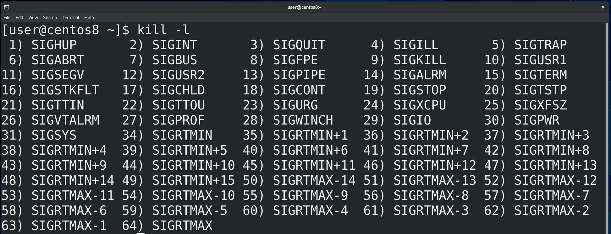
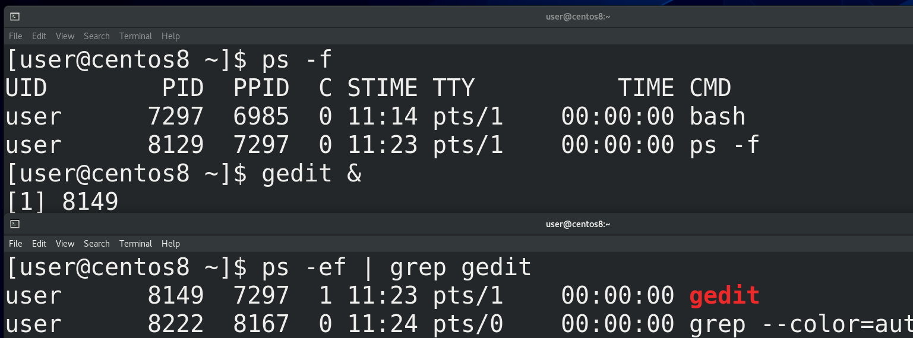
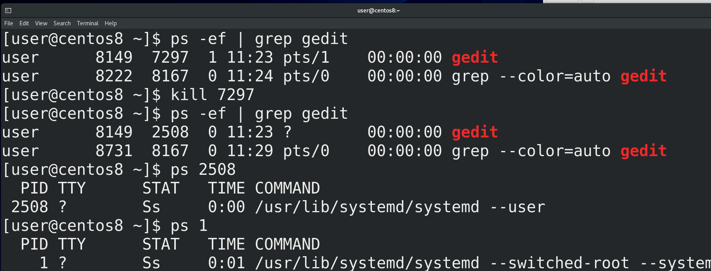

kill позволяет нам посылать сигналы. Судя по названию – в основном, чтобы убивать процессы. Для примера, откроем эмулятор терминала и выполним команду gedit - откроется блокнот. Потом найдём идентификатор процесса блокнота с помощью ps -ef | grep gedit и используем команду kill c нужным pid.  И вот - блокнот закрылся.

Давайте запустим kill -l и посмотрим список сигналов. До этого мы написали просто kill и номер процесса, из-за чего процессу послался сигнал по умолчанию – 15) SIGTERM. Это мягкий сигнал, который даёт процессу время закончить свои дела, прежде чем умереть. За это время процесс успевает попрощаться с дочерними и родительскими процессами. После смерти, дочерние процессы становятся процессами-сиротами, а их родителем становится процесс с номером 1. 

Для примера, откроем окно эмулятора терминала, там у нас появится новая bash сессия – ps -f. В этом окне я запущу блокнот с амперсандом в конце  - gedit &. Амперсанд нужен, чтобы выполнить команду в фоне, а не быть зависимым от эмулятора терминала. При запуске мы увидели id процесса блокнота. Можно посмотреть – ps -ef | grep gedit, где видно, что у процесса gedit родительским процессом является bash сессия в этом эмуляторе терминала.

Теперь давайте избавимся от родительского процесса – kill ppid. Блокнот все ещё запущен. Найдём его – ps -ef | grep gedit – и у блокнота изменился родительский процесс. Но я говорил, что процессы сироты забирает себе процесс с номером 1, а тут другой ppid. Если посмотреть этот процесс – ps ppid - и первой процесс – ps 1, то команды будут похожи – systemd. В большинстве unix-подобных систем сирот на себя берёт первый процесс, но то что мы видим сейчас – связано с изменениями, которые происходят в последние лет 10. Во первых, это пока не затронуло все дистрибутивы,  во вторых, это связано именно с пользовательскими сессиями и не так актуально на серверах. Про systemd мы ещё поговорим, я же просто объяснил, что бывает с дочерними процессами. 

Вернёмся к сигналам. Когда мы посылаем SIGTERM, процесс сам отвечает за своё завершение. Но что если процесс завис, ни на что не реагирует? На самом деле, в таких случаях лучше разобраться, с чем это связано. Есть способ по жёсткому избавиться от процесса, использовав сигнал – 9) SIGKILL. Но это очень опасный сигнал – резкое убийство процесса, без возможности завершить все дела, может повредить базу данных, файловую систему и т.п. Поэтому нужно быть крайне аккуратным с этим сигналом и лучше постараться найти причину проблемы и попытаться решить её, а не убивать процесс. Но всё же, если нет другого выхода – посылаем kill -9 pid. Можно ещё вместо номеров использовать сами сигналы – kill -SIGKILL pid.

Большинство сигналов нужны не столько администраторам, сколько разработчикам. Но пара занятных сигналов всё же есть, допустим - 19) SIGSTOP - о котором я говорил в прошлый раз. Потренируемся на том же блокноте. Чтобы постоянно не искать id процесса, я могу использовать команду pkill. Она сама ищет процесс по шаблону, но нужно быть осторожным, потому что в некоторых случаях у разных процессов могут быть совпадения и это может привести к плохим последствиям. Но так как блокнот запущен один, я пишу - pkill -19 gedit. И теперь блокнот ни на что не реагирует, как будто завис. Если я хочу чтобы он продолжил работу, я посылаю сигнал 18) SIGCONT – от слова continue – и он опять продолжает работать. 

И так, когда у вас начинает зависать система, смотрим top или htop, сортируем по cpu или memory, а потом решаем, что делать с процессом – пытаемся найти причину и решить. Допустим, у вас шёл бэкап базы данных на внешний сервер, а он отвалился от сети и теперь база данных начала грузить процессы. Легче всего будет вернуть в работу бэкап сервер. Это просто пример, возможно не самый хороший, просто объясняющий, что делать. Если процесс не такой важный и это какая-то мелочь, типа блокнота, можно попытаться ему послать сигнал с помощью kill, для начала тот же SIGTERM. Старайтесь избегать использования SIGKILL, это крайняя мера. 

Если у вас зависает графический интерфейс, попробуйте открыть виртуальный терминал – ctrl+alt+f3, f4  и т.п. и решайте проблему оттуда. Виртуальный терминал особо ресурсы не расходует, и, в случае тормозов, он работает получше графического интерфейса. Ещё одна проблема, которая может быть – ваша система намертво зависает и не реагирует абсолютно ни на что. Зачастую, это связано с проблемой нехватки памяти – возможно какой-то багованный софт съел всю оперативную память, отчего вся система зависла. Это называется OOM – out of memory – и различные компании предлагают свои превентивные меры против этой проблемы, достаточно погуглить oom killer linux. Но это всё превентивные меры, а если вы всё же столкнулись с проблемой, не спешите перезагружать систему. Вам поможет магическая кнопка [sysrq](https://ru.wikipedia.org/wiki/SysRq). На современных клавиатурах её не всегда пишут, но обычно это та же клавиша PrtSc. Эта клавиша позволяет напрямую посылать какие-то команды ядру.

Например, чтобы решить проблему out of memory, стоит нажать Alt+PrtSc+f, тогда ядро избавится от проблемного процесса, чтобы освободить память. Но это нужно предварительно настроить. Для этого создадим файл внутри директории /etc/sysctl.d с расширением .conf - sudo nano /etc/sysctl.d/10-sysrq.conf. Напишем в этом файле - kernel.sysrq = 1. Сохраним, затем выполним команду - sudo sysctl -p /etc/sysctl.d/10-sysrq.conf. Есть и другие способы, допустим, установка демона oom-killer (earlyoom, systemd-oom и т.п.), который будет решать проблему без ручного вмешательства. Но это отдельная тема.

Таким образом, мы разобрались с тем, где найти информацию по процессам, немного углубились в теорию и разобрали, как управлять процессами с помощью сигналов, какие есть превентивный меры – ulimit, oom killer-ы - и что делать, когда система тормозит или вообще зависла.