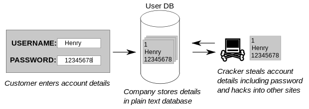
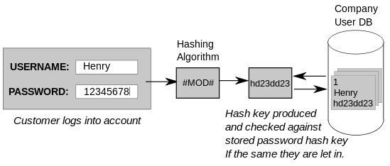
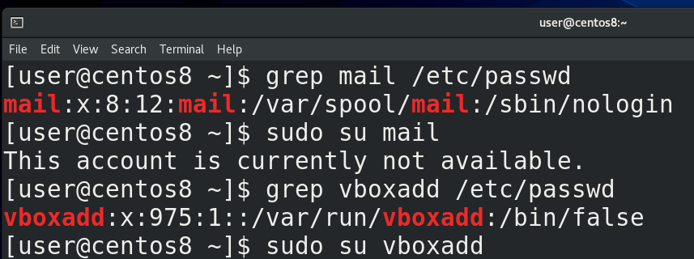
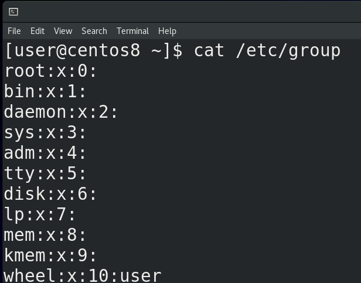
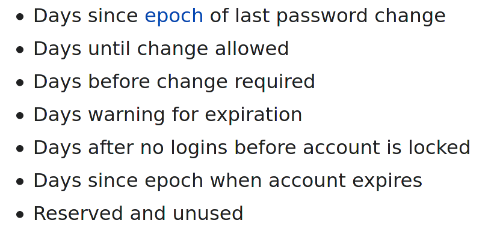
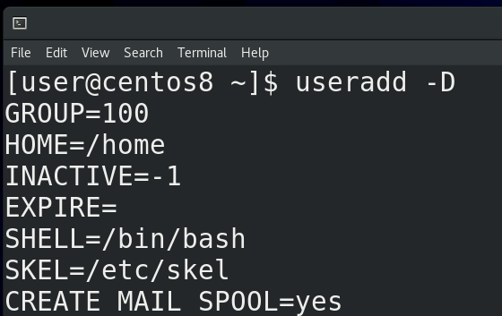
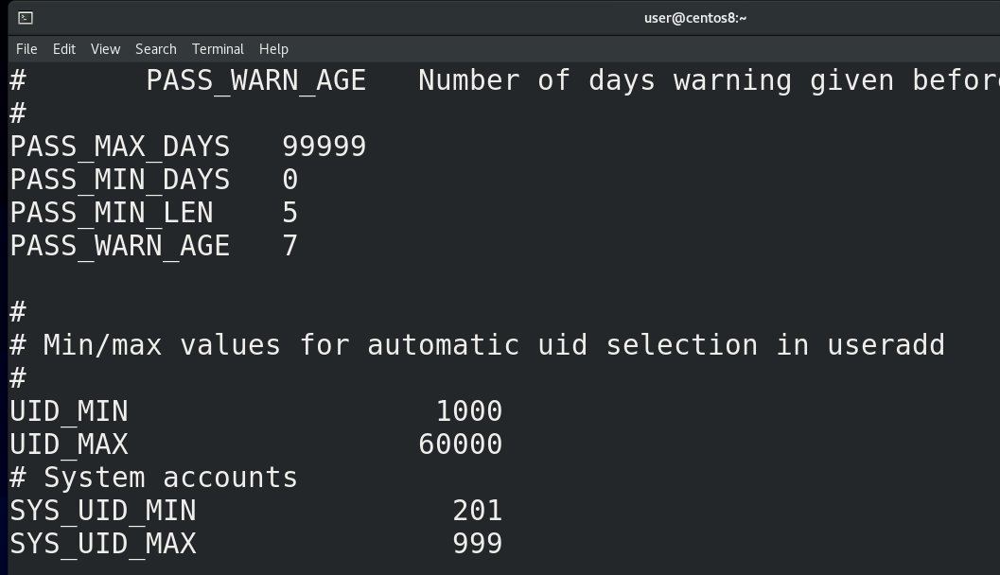
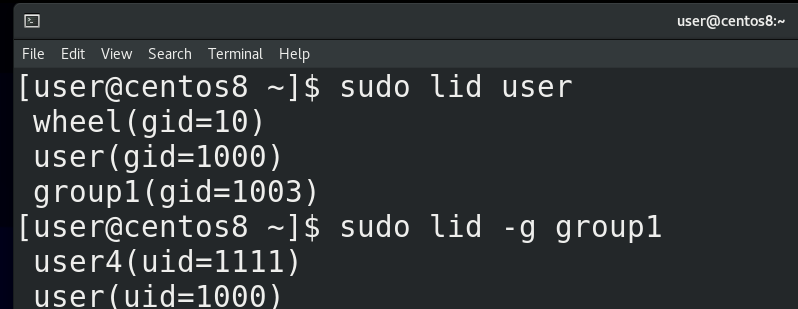




Мы с вами уже не раз обращались к файлу /etc/passwd, наконец-то пришло время разобраться, что же там написано:

```
cat /etc/passwd
```

Каждая строчка содержит информацию о каком-то пользователе. Двоеточие в данном файле выступает в роли разделителя – специального символа, который делит строку на столбцы. В первом столбце у нас логин пользователя, во втором – икс-ы. Очень давно здесь хранились пароли пользователей в хэшированном виде. Вообще, хэширование используется не только для паролей, но сейчас нас интересует именно хэширование паролей.



И так, что это вообще такое? Думаю все согласятся, что хранить пароли пользователя в открытом виде нельзя, иначе их с лёгкостью узнает любой пользователь с правами суперпользователя. Но система должна знать пароли, чтобы их подтвердить, когда вы логинитесь – поэтому пароли нужно преобразовать в какой-то нечитаемый вид. Но если это сделать так, чтобы можно было преобразовать обратно в читаемый вид – то опять же любой пользователь с правами рута сможет это сделать и получить первоначальный пароль.



Значит пароль нужно так преобразовать, чтобы никак нельзя было узнать первоначальный вид. И когда пользователь введёт пароль, можно будет преобразовать введённый им пароль тем же способом, получить ровно такое же значение, сравнить эти значения, и, если совпадают - пароль подходит. Но даже такой способ недостаточно безопасен – зачастую люди используют стандартные пароли и легко создать базу, где для каждого стандартного пароля будет его хэшированный вид. А потом можно будет попытаться найти в этой базе совпадающий хэш. Если пароль стандартный - это будет довольно просто. Поэтому при хэшировании к паролю ещё добавляют рандомные символы, называемые солью, благодаря чему даже два одинаковых пароля после хэширования будут выглядеть по разному. Но это всё криптография. Я объяснил очень поверхностно, опуская много деталей, а если кому интересно, можете почитать по [ссылке](https://habr.com/ru/post/345740/).

Учитывая, что в passwd есть полезная информация о пользователях, скрывать этот файл от всех пользователей как-то нежелательно, но и хранить тут пароли, пусть даже в хэшированном виде, тоже как-то не правильно. Поэтому пароли из /etc/passwd перенесли в другой файл - /etc/shadow, passwd сделали читаемым для всех, а shadow доступен только для рут пользователя.                                                                                                 


Пойдём дальше. Третий столбик – уникальный идентификатор пользователя – user id - uid. Очень многое строится именно вокруг uid-а, а не логина пользователя. У root пользователя идентификатор всегда ноль. Обычно для базовых сервисных пользователей uid-ы назначаются ниже 100, для каких-то дополнительных сервисных пользователей – до 999, а с 1000 начинаются uid-ы обычных пользователей.

Дальше идёт идентификатор группы - group id – gid. У каждого пользователя есть одна основная группа. И у каждой группы есть свой уникальный идентификатор. Здесь отображается идентификатор этой основной группы пользователя, для самих групп есть файл /etc/group.

После идентификатора группы идёт небольшой комментарий о пользователе – тут иногда пишут полное имя пользователя, его телефонный номер или какой-то комментарий. Как видите, для некоторых пользователей этот столбец не имеет значения.

Следующий столбец – домашняя директория пользователя. Мы привыкли, что обычно домашняя директория хранится внутри директории /home , но это не обязательно и те же сервисные пользователи используют в качестве домашней директории абсолютно другие пути. У суперпользователя домашняя директория - /root.



Ну и последний столбик – shell – оболочка пользователя. Допустим, у нашего юзера или рута оболочкой выступает bash. Есть ещё другие оболочки – zsh, csh и т.п. - у всех свои преимущества. У сервисных пользователей, как правило, вместо оболочки указан nologin – и если кто-то попытается залогинится этими пользователями - увидит текст о том, что нельзя. И этот текст можно заранее прописать в файле /etc/nologin.txt. В некоторых случаях вместо оболочки можно встретить /bin/false – тоже не позволяет логинится, но работает немного по другому принципу. /bin/false – программа, которая ничего не делает и просто выдаёт ошибку – обычно нужна для каких-нибудь скриптов. И если это указать в /etc/passwd – при логине пользователя с /bin/false он просто получит ошибку и всё.


Зачастую при работе может понадобится узнать uid пользователя или группы, в которых он состоит – и не обязательно для этого искать нужные строки в /etc/passwd – можно использовать утилиту id:

```
id
id user
id user2
```



Что касается групп - давайте заглянем в /etc/group. Тут синтаксис похож на passwd – тот же разделитесь в виде двоеточия, но меньше столбцов. Однако первый столбец – это не имя пользователя, а имя группы. Вы, возможно, заметили, что имена пользователей и групп совпадают. При создании какого-то пользователя по умолчанию создаётся группа с таким же названием – личная группа пользователя (User Private Group – UPG). Это сделано в целях безопасной, но удобной совместной работы с файлами. Станет понятнее, когда пройдём права на файлы.

Дальше у нас x – как и в passwd, речь про пароль, который хранится в хэшированном виде в файле /etc/gshadow. Как и у пользователей, у групп можно поставить пароль с помощью утилиты gpasswd

```
gpasswd
```

И потом, с помощью этого пароля, кто-то из другой группы может временно получить права этой группы, используя утилиту newgrp:

```
newgrp
```

Но это очень специфичная задача и я пока не видел реальных примеров использования.

Потом у нас идентификатор группы – gid. А в конце – список пользователей в этой группе, через запятую. Пока что у нас тут пусто, только в группе wheel есть пользователь user.


Ну и давайте ещё заглянем в файл /etc/shadow:

```
sudo cat /etc/shadow
```

Тут у нас хранится информация о пароле пользователя и всё, что относится к паролю:

- пользователь;
- пароль в хэшированном виде, причём в начале указывается хэш функция, например, $6$ - это sha512 – то есть каким алгоритмом был хэширован пароль. Также тут вместо пароля может быть * или ! или два восклицательных знака – может зависеть от дистрибутива. Обычно это означает, что аккаунт заблокирован. Как правило, это относится к сервисным или новым аккаунтам, у которых нет паролей.



Дальше у нас идёт информация о том, когда менялся пароль, когда заблокируется и всё такое.


Эту информацию не очень удобно читать из файла – легче использовать утилиту chage:

```
chage -l user
```



До этого мы уже создавали пользователя с помощью команды:

```
useradd user2
```

Как мы заметили, у пользователей есть много разных настроек, а значит useradd откуда-то взяла настройки по умолчанию. Настройки по умолчанию можно увидеть при помощи ключа -D:

```
useradd -D
```

Сразу скажу, что первый параметр – GROUP - будет игнорироваться, для каждого пользователя создаётся его личная группа. Настройки по умолчанию распределены в двух файлах - /etc/default/useradd и /etc/login.defs. Если первый файл – сугубо параметры утилиты useradd, то login.defs содержит параметры для многих утилит, работающих с пользователями и группами.


И так, в файле /etc/default/useradd у нас несколько параметров:

- GROUP – если мы не захотим создавать личную группу пользователя, то группа по умолчанию будет группа с gid 100 – это группа users;
- HOME – это внутри какой директории создастся домашняя директория пользователя. Т.е мы создаём пользователя user2 и для него создаётся директория user2 внутри директории /home.
- INACTIVE – это через сколько дней после устаревания пароля заблокируется аккаунт: -1 – никогда, 0 – сразу же, как устареет пароль, ну или указываете количество дней.
- EXPIRE – когда аккаунт заблокируется. Указывается как год, месяц, день (ГГГГ-ММ-ДД).
- SHELL – какой интерпретатор будет по умолчанию, в данном случае /bin/bash;


- SKEL – путь к шаблонной директории, которая используется при создании пользователя. Тут у нас есть .bash_profile и .bashrc. Если вы хотите, чтобы у всех новых пользователей в домашней директории были какие-то файлы или директории, достаточно положить их в /etc/skel.
- CREATE\_MAIL_SPOOL – создаёт специальный файл, куда будет попадать входящая почта для пользователя.



Теперь что касается /etc/login.defs:

```
cat /etc/login.defs
```

- MAIL_DIR – директория, где создастся файл для входящей почты. Вообще тут есть разные варианты, но давайте пока не будем трогать почту.
- PASS\_MAX_DAYS – максимум дней, разрешённых на один пароль. Скажем, если поставить 30 – нужно будет менять пароль каждый месяц.
- PASS\_MIN_DAYS – минимум дней, необходимых для смены пароля. Допустим, если поставить 7 – то можно будет менять пароль максимум раз в неделю. Это нужно, если вы хотите защититься от того, чтобы ваши пользователи повторно не использовали старый пароль. Допустим, у вас может стоять политика, чтобы у пользователя пароли не совпадали как минимум с 10 предыдущими паролями. Без минимального времени смены пароля он может просто разом 10 раз ввести новые пароли и потом старый. Так что этот параметр защищает от таких любителей одного пароля.
- PASS\_MIN_LEN – минимальная длина пароля. Естественно, руту плевать на этот параметр, а вот юзеры должны будут придумать пароль указанной длины.
- PASS\_WARN_AGE – за сколько дней до устаревания пароля пользователю выйдет предупреждение о том, что ему стоит сменить пароль.
- UID\_MIN и UID_MAX – минимальный и максимальный uid, который будет выдан пользователю, если конечно вручную не указать другой uid. Максимальное значение примерно 65000.
- SYS\_UID\_MIN и SYS\_UID_MAX – uid-ы для сервисных пользователей.
- CREATE_HOME – создавать ли домашнюю директорию при создании пользователя.
- USERGROUPS_ENAB – тот самый параметр, отвечающий за создание приватной группы пользователя. Без этого параметра группа по умолчанию будет та, что указана в файле /etc/default/useradd.
- ENCRYPT_METHOD – SHA512 – алгоритм, по которому хэшируются пароли для /etc/shadow. На самом деле для login.defs есть много других параметров, но пока что нам этого достаточно.


Теперь, зная всё это, давайте рассмотрим утилиту useradd. При простом добавлении:

```
useradd user3
```

всё будет ровно с теми параметрами, которые мы рассматривали в файлах useradd и login.defs. Если же мы хотим сделать как-то по своему, то давайте я возьму пару параметров для примера, а остальное вы сами протестируйте.


И так, sudo useradd и ключ -b – base dir – это собственно директория, внутри которой создастся домашняя директория пользователя, как параметр HOME в useradd. Допустим, если я укажу:

```
sudo useradd user4 -b /home/company/it
```

то внутри этой директории /home/company/it создастся директория user4. Но нужно заранее создать эту директорию /home/company/it:

```
mkdir -p /home/company/it
```

Если у меня уже есть какая-то директория для пользователя и я не хочу её создавать, я могу указать её с ключом -d:
 
```
sudo useradd -d /home/olduser user4
```

Ключ -c – для комментария. Ключ -g основная группа пользователя. Как мы говорили, если этот ключ не указывать, то создастся приватная группа пользователя и она станет основной группой этого пользователя. Если же мы хотим существующую группу – то указываем после ключа -g:

```
sudo useradd user4 -g groupname
```

Ключ -G большое – для дополнительных групп. Допустим, если вы хотите, чтобы пользователь кроме основной группы был также в группах wheel и users2:

```
sudo useradd user4 -g users -G wheel,users2
```

Вы можете сами задать uid для будущего пользователя:

```
sudo useradd user4 -u 1111
```


Теперь посмотрим, что у нас получилось:

```
sudo useradd user4 -b /home/user/it -с “User Userovich” -g users -G wheel,user2
grep user4 /etc/passwd /etc/group
id user4
```

Как видим, всё так, как мы указывали. Но пока этого не достаточно – пока мы не зададим пароль пользователю, аккаунт будет недоступен.


Для создания пароля используем команду passwd:

```
sudo passwd user4
```

Можете также использовать утилиту chage, чтобы настроить времена для пароля:

```
chage user4
```


Если вы уже создали пользователя, но хотите изменить какие-то параметры – допустим, поменять комментарий, добавить в группу, переместить домашнюю директорию, поменять uid и т.п. - используйте утилиту usermod. Например, я хочу перенести домашнюю директорию пользователя и добавить его в группу:

```
sudo usermod user4 -d /var/user4 -m -aG user
```

Ключ -d указывает на новую домашнюю директорию, но без ключа -m текущая домашняя директория не перенесётся на новое место. Что касается -aG, то G указывает дополнительные группы, но без ключа -a все текущие группы пользователя сбросятся и останется одна группа user.


Чтобы удалить пользователя, используется команда userdel. Но без ключа -r после удаления пользователя останется его домашняя директория, личная группа и почтовый ящик, а с ключом всё это удалится:

```
sudo userdel -r user2
```


Что касается групп – всё примерно также – команды:

```
groupadd
groupmod
groupdel
```

Для примера, давайте добавим группу group1:

```
sudo groupadd group1
```

У группы можно назначить администратора и пользователей с помощью команды gpasswd:

```
sudo gpasswd group1 -A user -M user4,root
```

А администратор группы может добавлять и удалять пользователей из группы уже без всяких прав суперпользователя:

```
gpasswd -a user group1
gpasswd -d root group1
```



Чтобы посмотреть, какие группы у пользователя и какие пользователи в группе, можно использовать команду lid:

```
sudo lid user
sudo lid -g group1
```


Мы много чего разобрали – файлы /etc/passwd и /etc/group, где хранится информация о пользователях и группах, /etc/shadow, где хранится информация о паролях, файлы /etc/default/useradd и /etc/login.defs, где прописаны параметры для новых пользователей, а также различные утилиты для создания новых пользователей и групп, изменения их параметров, паролей и т.п. И хотя мы не стали задерживаться на различных ключах – для вас это практика – создавайте пользователей и группы с различными параметрами, если что не понятно – откройте маны – там многое объясняется. А если какие-то трудности – обращайтесь, вместе разберёмся.
