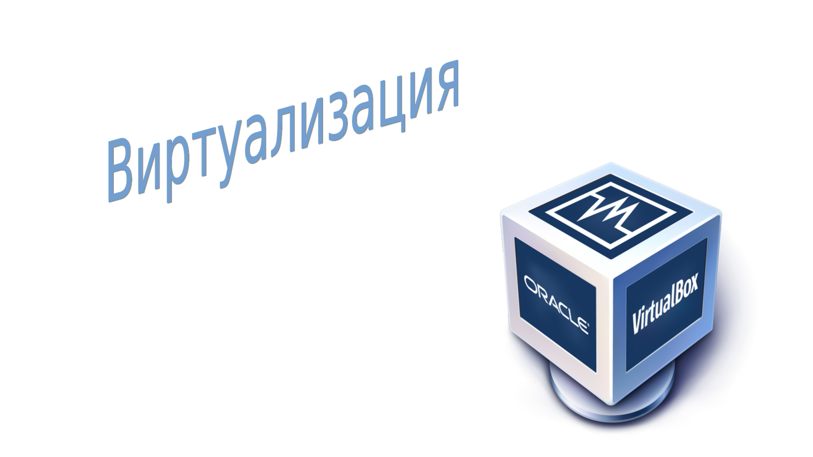
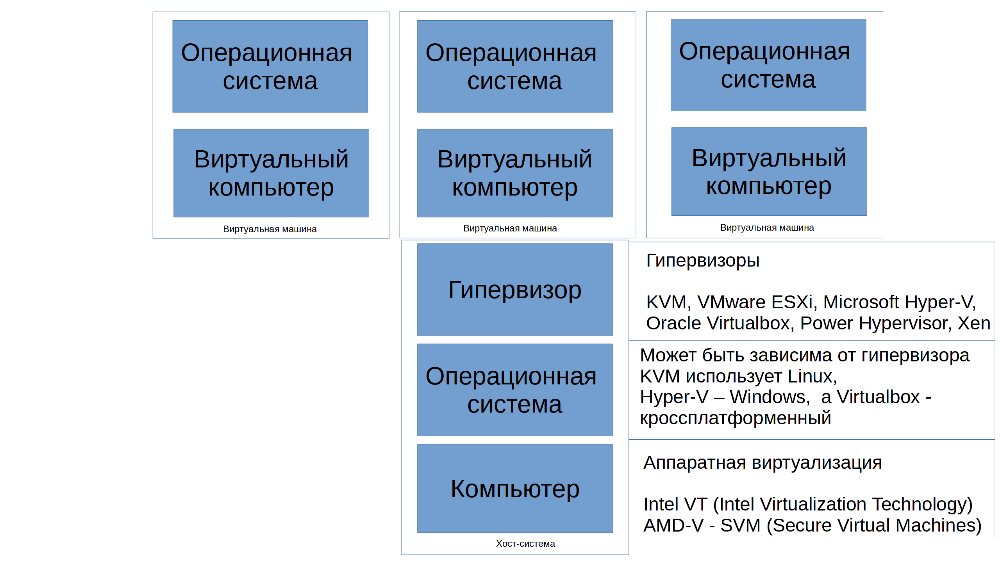
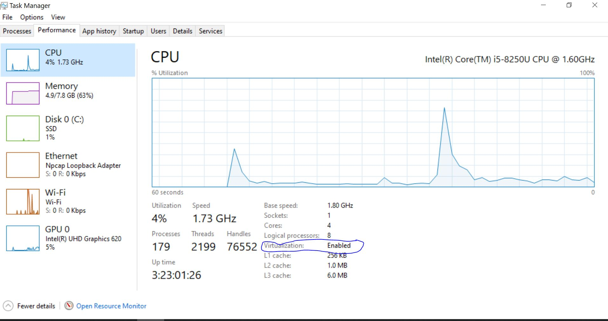

Основа современной IT инфраструктуры состоит из 3 элементов – безопасность, отказоустойчивость и производительность. 
                                                                                    
- Безопасность требует, чтобы на одной операционной системе выполнялась одна задача – допустим веб-сервер или почтовый сервер. Это позволит легче контролировать уязвимые места и смягчить потери в случае какой-либо угрозы. Запомните, хорошая безопасность строится не только на превентивных мерах, но и на мерах смягчения. Когда безопасность дала сбой и вам нужно уберечь как можно больше, лучше потерять одну систему, чем несколько.

- Отказоустойчивость требует наличия нескольких копий одного сервиса на различных компьютерах, что позволит сервису работать без перебоев при проблемах с одним компьютером,  электричеством в здании или даже стихийным бедствием в городе. 

- Производительность требует оптимального использования ресурсов и возможность быстрого масштабирования, чтобы сервис не использовал лишние ресурсы во время простоя и не падал во время пиковых нагрузок. 

Всё это звучит страшно как для администратора, так и для кармана начальника. Но есть технологии, которые позволяют упростить и удешевить всё это в разы. Одна из таких технологий – виртуализация, которой пользуются практически все. Она позволяет запускать несколько виртуальных компьютеров с полноценными операционными системами внутри одного реального компьютера.



Для виртуализации используются специальные программы, называемые гипервизорами. Для её работы требуется операционная система и процессор, поддерживающий виртуализацию. Большинство современных процессоров поддерживает эту технологию. Операционная система, на которой запускается гипервизор, называется хост-системой или хостом, а “виртуальные компьютеры”, запущенные на гипервизоре – виртуальными машинами, виртуалками или гостевыми машинами. 

Есть множество реализаций гипервизоров, которые отличаются функционалом и ценой. Нам, для обучения линуксам, вполне подойдут и бесплатные варианты – к примеру, VirtualBox. Но, прежде чем установить гипервизор, стоит убедиться, поддерживается ли на вашем компьютере виртуализация и включена ли она. 



Если на вашем компьютере Windows, запустите диспетчер задач, во вкладке производительность выберите CPU и ищите строчку Виртуализация. При значение «Enabled» всё нормально, ваш компьютер поддерживает виртуализацию и она включена. Если «Disabled» – то нужно зайти в BIOS и включить виртуализацию. Я дам [ссылку](https://remontka.pro/enable-virtualization/), как это сделать, так как этот процесс может различаться в зависимости от компьютера. Если у вас на компьютере GNU/Linux, то я все же рекомендую использовать виртуальные машины для обучения. Чтобы убедиться, поддерживается ли виртуализация вашим компьютером на GNU/Linux, выполните команду ( lscpu | grep Virtualization ). Если команда выдала ответ – то всё хорошо, если нет – попробуйте проверить в BIOS, по ссылке выше.

```
lscpu | grep Virtualization
Virtualization:                  VT-x
```

После этого идём на сайт virtualbox.org –> [Downloads](https://www.virtualbox.org/wiki/Downloads) – выбираем «Windows hosts» и ждём, пока всё скачается, а затем устанавливаем гипервизор, следуя настройкам по умолчанию. После установки гипервизора, скачиваем с сайта «VirtualBox Extensions Pack» и устанавливаем.


После всех манипуляций перезагружаем компьютер.   Если у вас GNU/Linux, VirtualBox  можно скачать и установить как из репозитория, так и с сайта. Дополнительный шаг на Linux – добавить вашего пользователя в группу vboxusers ( sudo usermod -aG vboxusers username ). Здесь username – логин вашего пользователя.

```
sudo usermod -aG vboxusers username
```
