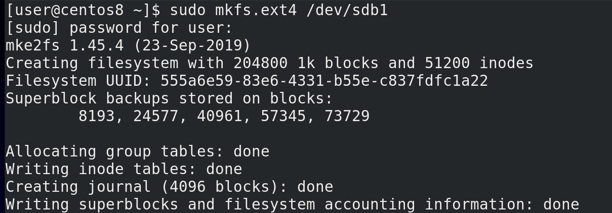
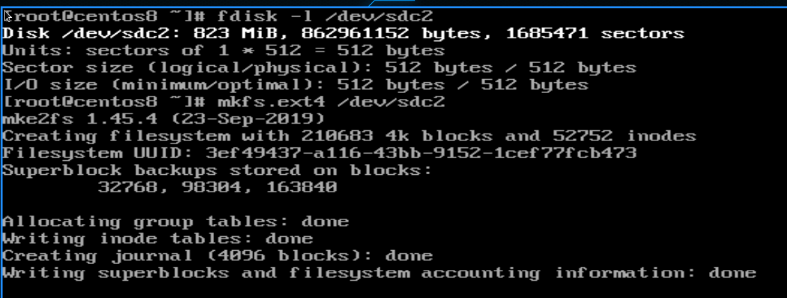
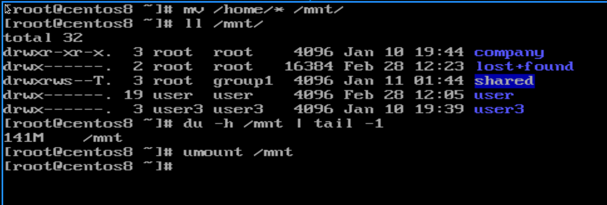
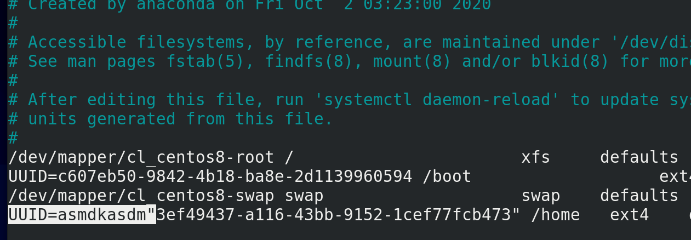
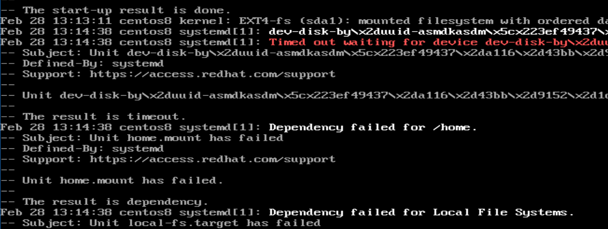
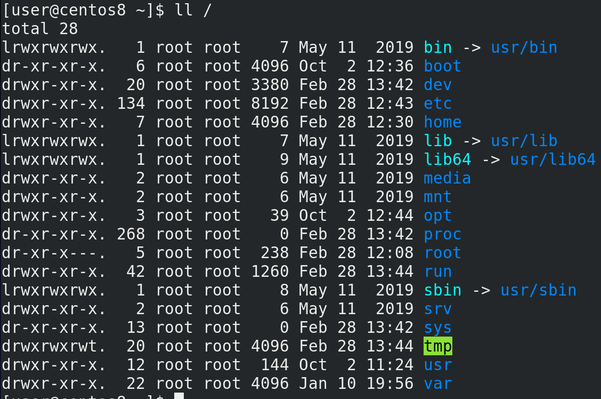




Кое-какое представление о файловых системах у нас сложилось, пора уже приступать к делу. Для начала, давайте запишем файловую систему. В этом нам поможет утилита mkfs. Всякие настройки по умолчанию для файловой системы ext4 лежат в файле /etc/mke2fs.conf:

```
head /etc/mke2fs.conf
```

Тут у нас размеры блоков, инод и всё такое.



И всё что нам остаётся сделать для создания файловой системы – написать команду mkfs точка, желаемый тип файловой системы, а потом раздел или диск:

```
sudo mkfs.ext4 /dev/sdb1
```

Программа создаст файловую систему и покажет нам информацию о ней – сколько блоков какого объёма поместилось в  файловой системе, какое количество инод, идентификатор файловой системы, где сохранились бэкапы суперблока - того самого, где хранятся метаданные самой файловой системы.


Всякие детали о файловой системе можно посмотреть с помощью tune2fs и указанием раздела с нужной файловой системой:

```
sudo tune2fs -l /dev/sdb1
```

Но в большинстве случаев с этим всем не нужно заморачиваться. По умолчанию всё настроено так, чтобы работать из коробки для большинства случаев. А если файловая система вам нужна для каких-то более серьёзных задач, то нужно изучать документацию. Пойдём дальше. Ну, есть у нас файловая система, а что с ней делать? Её нужно куда-то прицепить, точнее, примонтировать в какую-то директорию. Собственно, всё зависит от ваших задач. Задачи могут быть разные – скажем, отделить файлы пользователей от системы, чтобы можно было переустановить операционную систему, не стерев ваши файлы. Тут нужно отделить директорию /home. Или, допустим, вы хотите на сервере отделить файлы с данными от файлов операционной системы. Или, например, отделить директорию с логами, чтобы в случае какой-нибудь проблемы они внезапно не забили весь диск логами, от чего система вообще может перестать нормально работать. И это только ряд задач, на деле причин может быть много. Но, давайте, например, вынесем файлы пользователей на новую файловую систему.

Если я возьму и просто примонтирую новую файловую систему в /home, то я перекрою существующие файлы пользователей и вместо них будет чистая файловая система и директория /home окажется пустой. Это не дело, нужно сначала перенести файлы пользователей на новую файловую систему. А это не такая простая задача – если я сейчас сижу от имени пользователя,  пусть даже не видно, но я работаю с файлами в домашней директории своего пользователя. Т.е. графический интерфейс подгрузил всякие файлы настроек и всячески использует мою домашнюю директорию, например, браузер может писать кэш, баш сохраняет историю и т.п. А пока файлы используются, перемещать их не стоит – можно случайно повредить их. Поэтому нужно завершить все процессы, использующие директорию /home и все поддиректории.


Во первых, для этого мне нужно разлогиниться. Но как мне тогда работать? Правильно, через виртуальный терминал. Нажимаем правый Ctrl+F3 (это зависит от гипервизора, на реальном железе Alt+Ctrl+F3) и заходим в виртуальный терминал из под рута. Дальше убеждаемся, что никакой процесс не использует файлы в директории /home, в этом нам поможет утилита lsof, показывающая открытые файлы, с ключом +D, чтобы проверить во всех субдиректориях:

```
lsof +D /home
```

У меня тут пусто, но если у вас какие-то процессы используют файлы, желательно их завершить, вы знаете как.


Дальше стоит проверить размер директории /home – хотя надо было ещё при создании разделов. Для этого используем утилиту du:

```
du -h /home
```

Как видите, тут файлов на 140 мегабайт, а наш раздел sdb1 почти на 200:

```
fdisk -l /dev/sdb1
```

Хоть тут и хватает места, у меня дальше начинается другой раздел, а значит в будущем я не смогу увеличить размер раздела и файловой системы, по крайней мере без кучи махинаций. Поэтому лучше изначально разделы распределить так, чтобы у каждой файловой системы хватало места с запасом. Но при этом, если нет необходимости, не занимайте всё свободное место на раздел – увеличить раздел и файловую систему всегда можно, если есть свободное место, а вот уменьшить размер файловой системы зачастую проблемно, а на xfs пока вообще нет такой возможности.



Но у меня есть раздел sdc2 на 800 мегабайт:

```
fdisk -l /dev/sdc2
```

его и будем использовать. Опять же, нам нужна файловая система:

```
mkfs.ext4 /dev/sdc2
```


Теперь мне нужно перенести файлы из директории /home на новую файловую систему. А чтобы это сделать, мне нужно временно примонтировать новую файловую систему. Для таких целей даже есть специальная директория - /mnt. Я просто пишу:

```
mount /dev/sdc2 /mnt/

```

т.е. какую файловую систему монтировать в какую директорию. Чтобы убедиться, что всё сработало, я использую утилиту df:

```
df -h
```

Самая последняя запись - /dev/sdc2 примонтирован в /mnt.



Окей, пора переносить файлы:

```
mv -v /home/* /mnt
```

Проверяем, всё ли нормально:

```
ll /mnt /home
du -h /mnt | tail -1
```

Вроде всё ок – файлы перемещены. Теперь пора отмонтировать новую файловую систему и примонтировать в /home. Чтобы отмонтировать - umount /mnt.


Но прежде чем пойдём дальше, есть ещё одна деталь. То как мы примонтировали сейчас, не означает, что после перезагрузки операционная система также примонтирует. Ей нужно об этом сказать, чтобы в будущем она всегда монтировала sdc2 в /home. Для этого есть файл /etc/fstab:

```
cat /etc/fstab
```

И в нём нам нужно достоверно компьютеру сказать, какую файловую систему куда нужно монтировать. А так как мы выяснили, что sda sdb и sdc – имена, которые могут меняться, то нельзя указывать их. Вместо них мы можем использовать идентификатор файловой системы. Помните, при создании мы видели такой? И чтоб не искать его, можем воспользоваться утилитой blkid:

```
blkid /dev/sdc2
```

Второй столбик – UUID – это наш идентификатор файловой системы. Если мы форматнём эту файловую систему, будет другой UUID.


И теперь нам нужно переписать этот UUID в файл /etc/fstab. Но.. тут же много символов? Хотя… мы же знаем, что у нас в системе куча утилит для работы с текстом. Воспользуемся одной из них – cut. И так, blkid делит столбцы по пробелам, значит пробел наш делитель. При этом, нам нужен второй столбец. Значит:

```
blkid /dev/sdc2 | cut -d' ' -f2
```

И мы получили нужную строку. Теперь нужно записать её в файл /etc/fstab. Но прежде чем делать эксперименты с реальными файлами, лучше их забэкапить:

```
cp /etc/fstab{,.bkp}
ls /etc/fstab*
```

Теперь выполняем команду blkid, но вывод добавляем в fstab:

```
blkid /dev/sdc2 | cut -d' ' -f2 >> /etc/fstab
```

Тут будьте очень внимательными, обязательно два символа больше, чтобы не перезаписать файл.


Теперь осталось дописать строку:

```
nano /etc/fstab
```

И так, файловая система указана. Можно ориентироваться на примеры выше. После UUID-а указываем точку монтирования - /home. Количество пробелов не важно. Дальше указываем тип файловой системы – ext4. После этого – опции монтирования. Допустим, чтобы в inode не писалась информация о последнем доступе к файлу – это сильно сократит частоту записи на жёсткий диск – напишем defaults,noatime, через запятую, без пробела. А по умолчанию можно оставить defaults. На самом деле, defaults тут чтобы поле не пустовало, мы могли бы убрать defaults и оставить только noatime, но я решил оставить, чтобы показать пример нескольких опций. По [ссылке](https://ru.wikipedia.org/wiki/Fstab) вы можете найти различные опции монтирования, там же можно найти информацию, что включает в себя defaults. Дальше две цифры. Первая – dump – для создания резервной копии файловой системы. Хотя для работы этого нужна утилита dump, которая сейчас практически не пользуются. Но, в целом, есть такая возможность, и если стоит 1, то будет сниматься дамп, а в большинстве случаев здесь указывается 0 – т.е. без дампа. Вторая цифра – проверка файловой системы.

Во время работы на файловой системе могут накапливаться ошибки, и всякие внештатные ситуации, как, например, при внезапном отключении компьютера, могут создавать ошибки. Да, журналирования частично решает проблемы, но не полностью. Поэтому файловые системы желательно иногда проверять на наличие ошибок и исправлять, для этого есть утилита fsck. Но проверять целостность файловой системы во время работы нельзя, это может её повредить. Её нужно предварительно отмонтировать. Но это не всегда просто – как вы отмонтируете корень, где у вас система? Да и чтобы не заниматься этим вручную, это можно автоматизировать, чтобы при включении компьютера конкретная файловая система проверялась на ошибки и они исправлялись. Тут значение может быть 0 – это не проверять. 1 стоит ставить только для файловой системы, где лежит корень, так как исправление ошибок на нём более приоритетно. Для проверки всех остальных файловых систем можно указать 2. После чего сохраняем и выходим.


И теперь, когда система знает куда монтировать sdc2, можно просто написать:

```
mount /dev/sdc2
```

или

```
mount /home
```

Теперь можем вернуться к графическому интерфейсу – Ctrl+F1 и залогиниться. Опять напишем df -h и посмотрим, что куда примонтировано. Как видите, файловая система sdc2 примонтирована в директорию /home.  И если бы что-то не работало, мы бы просто не смогли залогиниться.

И так, при включении компьютера операционная система смотрит в fstab, видит какую файловую систему куда и как монтировать и делает это. Но что, если файловая система недоступна? Допустим, какие-то проблемы с диском или самой файловой системой, а может опечатка в fstab. В таких случаях операционная система не загружается полностью, а предлагает нам посмотреть и исправить ошибку. Игнорировать проблемы с файловой системой и загрузиться операционная система не может, если это не указано в fstab. Представьте, что на этой файловой системе есть какие-то важные файлы, допустим файлы приложения. И если у нас система запустится, запустит приложение, но оно не увидит свои файлы – приложение может создать кучу проблем. Во избежание такого операционная система не даст запустить всю систему, если ей не удаётся примонтировать какую-то файловую систему.



Давайте воссоздадим такую ситуацию и попытаемся её решить. Для этого давайте испортим запись в fstab:

```
sudo nano /etc/fstab
```

Добавим здесь перед UUID какие-нибудь буквы, типа мы опечатались, и перезагрузимся:

```
reboot
```



Как видите, система не смогла запуститься и предложила нам командную строку. Во первых, вводим пароль от пользователя root. Чуть выше командная строка рекомендует посмотреть логи:

```
journalctl -xb
```

Немного полистаем вниз и увидим красную строчку – Failed to mount /home – т.е. не получилось примонтировать /home. Чуть выше написана причина – не найдено устройство.


Но прежде чем исправлять, представим, что дело не в нашей опечатке, а какая-то проблема с файловой системой. Для этого выполним проверку файловой системы с помощью утилиты fsck:

```
fsck /dev/sdc2
```

А для файловой системы xfs используется утилита xfs_repair.  Сейчас у меня ошибок нет, но если бы были, программа бы о них сказала и предложила бы пути решения.



Также, у многих возникает вопрос – а какие директории стоит выносить на отдельные файловые системы:

```
ll /
```

Идеальной схемы нету, где-то что-то имеет смысл отделять, а где-то это просто усложняет. Мы разобрали, зачем это для /home. Вскоре мы разберём, зачем это может понадобится для /boot. Какие-то директории, например dev, proc и sys – мы их уже разбирали – в них и так виртуальные файловые системы. В /etc важные для загрузки операционной системы настройки, тот же fstab – и вынести /etc на отдельный раздел очень сложно и бесполезно. /media и /mnt обычно пустые директории, куда временно монтируются всякие флешки и cd диски, поэтому их выносить бессмысленно. В /opt обычно лежит проприетарный софт, на домашних компьютерах его выносить на отдельный раздел обычно не нужно, а на серверах сильно зависит от самого софта – иногда, для удобства, стоит отделять файлы приложения от файлов системы – это позволит легче бэкапить приложение, переносить его на новые системы и т.д. Это в целом касается приложений на серверах, которые могут использовать в качестве директории с данными  /opt, /home, а то и отдельную директорию в корне, например /srv. Домашнюю директорию рута - /root – выносить бессмысленно, там обычно ничего примечательного. В /run – еще одна виртуальная файловая система. Про /tmp мы упоминали, тут у нас всякие процессы и пользователи могут создавать временные файлы при работе. И в большинстве случаев имеет смысл вынести /tmp в виртуальную файловую систему – можете почитать по [ссылке](http://vasilisc.com/tmp-on-tmpfs). Касаемо /usr всё сложно – раньше имело смысл вынести /usr, чтобы сделать его read only – то есть доступным только для чтения. В таких случаях во время обновления или установки программ её перемонтировали для записи, а потом обратно в read only, что позволяло обеспечить безопасность, так как если нет возможности изменить файлы – то всяким вирусам будет посложнее. Но в современных дистрибутивах происходят изменения и вынести /usr если и можно, то всё равно не рекомендуется. А read only можно сделать весь корень, при определённых условиях. В директории /var лежат динамические файлы, которые меняются, например логи, файлы базы данных, сайты и т.п. В этом и суть директории – если вы хотите обезопасить систему и сделать её read only, то директорию, в которой что-то постоянно меняется стоит вынести в отдельную файловую систему. При этом монтировать /var можно с определёнными опциями, например noexec – чтобы нельзя было запускать программы в этой файловой системе. Но тут, конечно, нюансы – у вас тут может лежать сайт в директории /var/www, где может требоваться запускать какие-то файлы сайта. Поэтому имеет смысл выносить не весь /var, а его определённые субдиректории – например, /var/log, где лежат логи. В целом рекомендуется выносить директорию /var/log на отдельную файловую систему, потому что бывают случаи, когда какие-то сервисы начинают внезапно писать очень много логов. И если /var/log вместе с корнем в одной файловой системе, то когда закончится место на файловой системе, начнут появляться проблемы.

Всё это – базовые операции при работе с файловыми системами – мы знаем, как её создать, как её примонтировать, как сделать так, чтобы она монтировалась при включении компьютера. И мы для примера переместили /home на раздел одного из дисков. И, хотя, казалось бы, в целом проделать это всё не сложно, но когда речь идёт о терабайтах данных, все эти махинации могут занять много времени, при этом сервисы, использующие эти данные, будут недоступны для пользователей. Время – это деньги, и пока вы будете перемещать данные на новые диски большего объёма, бизнес будет терять деньги. Поэтому админ должен заранее определить – сколько места понадобится на те или иные файловые системы, какие из них в дальнейшем могут потребовать больше места, какого рода файлы будут храниться – большие или маленькие, в зависимости от этого подкорректировать размеры блоков файловой системы и рассчитать необходимое количество инод. И всё это сделать ещё на этапе установки операционной системы.  Но как бы идеально вы не рассчитали, в жизни не всё идёт по плану, поэтому есть более гибкие системы, о которых мы поговорим в следующий раз.
