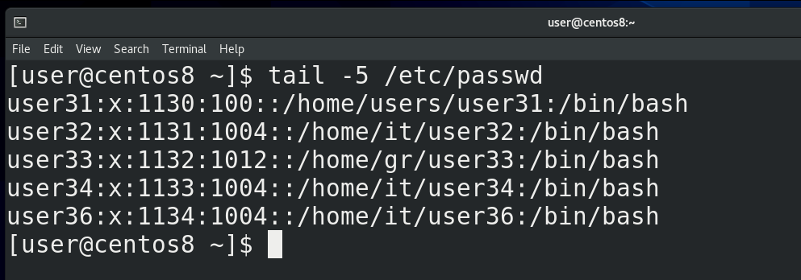
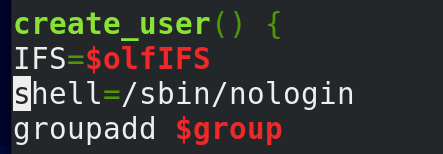
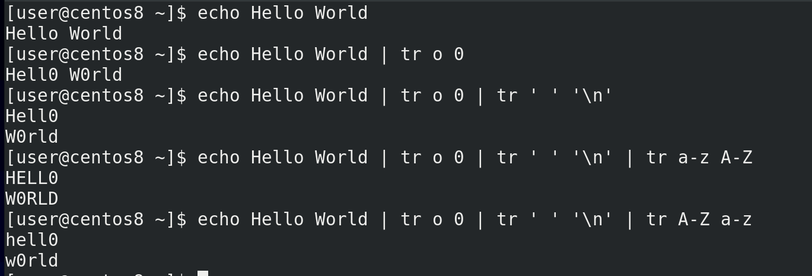
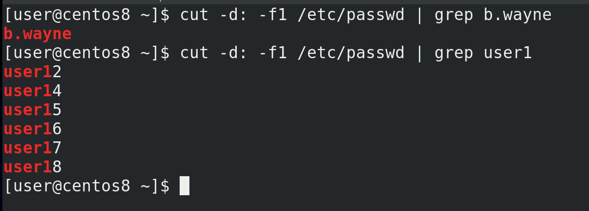
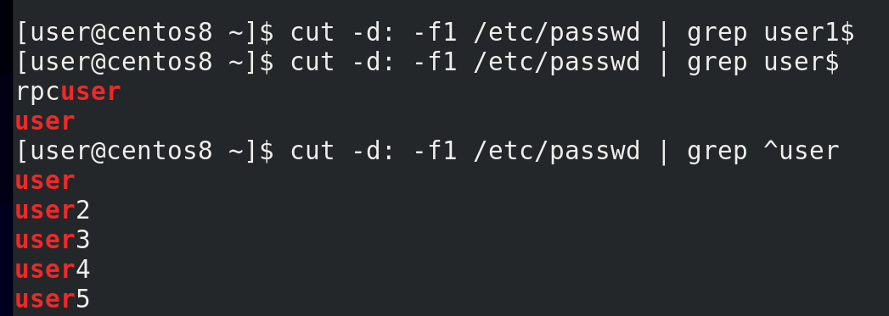

В прошлый раз мы с вами разбирали циклы и функции. Если посмотреть список
созданных циклом пользователей - tail /etc/passwd, можно заметить ошибку – у всех
пользователей оболочкой является bash, хотя так должно быть только у определённых
пользователей.

Оболочка в нашем скрипте задаётся переменной shell и значение по умолчанию – nologin.
При выполнении цикла запускается функция create_user, где есть условие, что если группой
является it или security, указать значение переменной shell - bash - shell=/bin/bash. Функция у нас
выполнится, создастся один пользователь, а при итерации значение переменной так и останется
bash. Собственно поэтому у всех пользователей оболочкой остался bash.

Чтобы решить эту проблему, мы можем занести переменную shell в начало функции,
чтобы при каждой итерации переменная получала значение nologin.

Касательно списка пользователей. В прошлый раз мы создали максимально простой
файл, там были логины пользователей и группы, что легко было использовать в нашем скрипте.
Но не всегда данные так хорошо подстроены под нас – вряд ли какой HR будет присылать нам
файл в таком виде. Да и в большинстве реальных задач у вас есть файлы с большим количеством
информации и вам нужно из этих файлов достать только нужное. Это чуть сложнее
автоматизировать, но довольно увлекательно. В целом это называется парсингом – когда мы
берём данные, структурируем их, чтобы в дальнейшем эти данные можно было использовать
для других задач.

Для примера я подготовил excel файл со списком пользователей.

Такой файл не прочтёшь в командной строке - cat users.xlsx, так как это не просто
текстовой файл. Но зачастую есть инструменты, которые позволяют превратить нечитаемые
файлы в более подходящие форматы. Форматов много, ситуации разные, всё я вам показать не
смогу, но с помощью гугла вы сможете найти многие решения. Давайте рассмотрим наш пример.
И так, у нас есть excel таблица. Когда речь о каких-то таблицах, то обычно стоит попробовать
превратить файл в csv формат.

К примеру, это умеет делать программа libreoffice – свободный офисный пакет программ.
Хотя можно найти и установить более лёгкие альтернативы. Команда такая — libreoffice --
headless --convert-to csv users.xlsx. Теперь посмотрим полученный результат - cat users.csv. Как
видите, получился обычный текстовой файл, при этом это таблица, в которой делителем
выступает запятая. Получить данные отсюда будет гораздо проще.

И так, основы работы с таблицами. У таблицы есть две составляющие – столбцы и
строки. Зачастую, в столбце у нас списки, а в столбике данные по определённому объекту.
Например, второй столбец – это список имён, а вторая строка – вся информация про одного
пользователя.

Мы уже знаем команду cut чтобы брать данные по столбцам. Тут у нас делителем
выступает запятая. Допустим, выведем список всех департаментов - cut -d, -f5 users.csv. Добавим
ещё информации о пользователях - cut -d, -f2,3,5 users.csv.

Но первая строчка нам не очень нужна и будет мешать, поэтому нужно как-то начать со
второй. Вспоминаем команду tail — с ключом -n она позволяет выводить текст с определённой
строчки - cut -d, -f2,3,5 users.csv | tail -n +2. Вот, собственно, это наши будущие пользователи и
группы. Но для начала эту информацию надо превратить в более удобный вид.

Например, посмотрим на департаменты – все они содержат заглавные буквы. Мы знаем,
что Linux – система регистрозависимая. У нас уже есть группа it - grep -w it /etc/group, но
команда groupadd IT создаст абсолютно другую группу, чего нам не нужно. Для удобства лучше
держать все логины и группы в строчных буквах. То есть, мне нужно преобразовать все
заглавные буквы в строчные.

Для этого мы можем использовать команду tr – translate. С помощью этой команды мы
можем одни символы преобразовывать в другие, удалять какие-то символы и много всего
интересного. Например, заменим o на 0 - echo Hello World; echo Hello World | tr o 0. Или заменим
пробел на символ переноса строки - echo Hello World | tr o 0 | tr ‘ ‘ ‘\n’. Заменим все строчные
буквы на заглавные - echo Hello World | tr o 0 | tr ‘ ‘ ‘\n’ | tr a-z A-Z. Или наоборот - echo Hello
World | tr o 0 | tr ‘ ‘ ‘\n’ | tr A-Z a-z.

Хотя есть более правильный способ это сделать - echo Hello World | tr ‘[:upper:]’
‘[:lower:]’. Более правильный, потому не во всех локалях буквы A и Z первая и последняя
соответственно. Ну да ладно, вернёмся к нашей задаче. Превратим все заглавные буквы в
строчные - cut -d, -f2,3,5 users.csv | tail -n +2 | tr ‘[:upper:]’ ‘[:lower:]’. Ну и для удобства можем
все запятые заменить на пробелы - cut -d, -f2,3,5 users.csv | tail -n +2 | tr ‘[:upper:]’ ‘[:lower:]’ | tr , ‘
‘.

Сохраним это в переменной - users=$(cut -d, -f2,3,5 users.csv | tail -n +2 | tr ‘[:upper:]’
‘[:lower:]’ | tr , ‘ ‘). Обратите внимание – если просто писать echo $users - то bash подставляет
значение переменной в строку, при этом используя переменную IFS, где разделителем является
сначала пробел, потом табуляция и только потом перевод строки. Поэтому у нас эти четыре
строки начали разделяться пробелом, а не переводом строки. Это легко решить, если взять
переменную в кавычки - echo “$users”.

И так, у нас есть переменная, в которой содержится имя, фамилия и группа пользователя.
Зачастую, в компаниях логин пользователя представляет из себя комбинацию имени и фамилии.
Сделаем так, чтобы логин начинался с первой буквы имени, потом точка, а затем фамилия.
Например, b.wayne. У нас в скрипте уже есть цикл, который построчно считывает список,
поэтому для теста используем одну из строк - echo “$users” | head -1. И так, для полученияпервой буквы имени, всё также используем cut, но с опцией -c1 – первый символ - echo “$users” |
head -1 | cut -c1. Для получения фамилии cut c делителем в виде пробела - echo “$users” | head -1 |
cut -d’ ‘ -f2. Теперь объединим выводы этих команд с помощью echo - echo $(echo “$users” | head
-1 | cut -c1).$(echo “$users” | head -1 | cut -d’ ‘ -f2). Можно было бы предварительно превратить
выводы команд в переменные, а уже потом объединять. Но, в целом, команда не такая сложная,
да и head тут лишний, в конечном счёте мы будем работать с каждой строкой отдельно.

И так, логин мы получили, а группа и так в доступном виде. Теперь давайте добавим это
в наш скрипт. Скопируем команду для получения списка пользователей - cut -d, -f2,3,5 users.csv |
tail -n +2 | tr ‘[:upper:]’ ‘[:lower:]’ | tr , ‘ ‘ - и заменим в скрипте cat $file на эту команду. Заменим
users.csv переменной $file. Скопируем команду для получения логина пользователя и вставим
как значение переменной user. Заменим переменную users на line и уберём head - user=$(echo $
(echo “$line” | cut -c1).$(echo “$line” | cut -d’ ‘ -f2)). Заменим значение переменной group -
group=$(echo “$line” | cut -d’ ‘ -f3). И так, вроде переменные user и group должны получить свои
значения, остальные команды трогать не нужно.

Разве что заменим значение переменной file - file=/var/users.csv. Вы, по желанию, можете
добавить, чтобы excel файл конвертировался при запуске скрипта. А пока скопируем сам файл -
sudo cp users.csv /var/.

Давайте протестируем - sudo ./myscript; tail /etc/passwd. Как видите, все пользователи
создались, группы соответствующие, оболочки тоже.

Но задумайтесь вот о чём – если мы генерируем логины на основе имени и фамилии, в
компании могут появиться тёзки, однофамильцы, какая-нибудь Clara Kent. Наш скрипт это
проигнорирует, а команда useradd откажется создавать пользователя, так как такой логин уже
есть. Поэтому такое вам задание – сделайте так, чтобы скрипт определял, есть ли уже такой
логин, и, в случае чего, логин второго пользователя был немного другим, допустим, полное имя
и фамилия, либо какое-то число в конце.

Скорее всего, вы будете определять по списку текущих пользователей. Наверняка вы
обратитесь к файлу passwd, будете использовать cut и grep - cut -d: -f1 /etc/passwd | grep b.wayne.
Но такого grep-а может не хватить. Обратите внимание, я ищу пользователя user1 - cut -d: -f1
/etc/passwd | grep user1. Такого пользователя нет, но grep всё равно выдал мне результат, а
скрипту главное результат. grep ищет соответствие, а все результаты содержат в себе user1. Мне
нужно как-то сказать grep-u, что строчка в выводе должна заканчиваться на user1.

Для этого я могу использовать символ $ в конце искомой строки, то есть grep user1$ - cut -
d: -f1 /etc/passwd | grep user1$. Теперь он ничего не нашёл. Но попробуем найти просто user$ - cut
-d: -f1 /etc/passwd | grep user$. Как видите, опять несоответствие – есть некий rpcuser, в нём
содержится слово user и оно заканчивается на него. Теперь мне нужно указать, чтобы строка
начиналась на user – для этого можно использовать символ ^ - он называется карет. Указывая его
перед выражением - cut -d: -f1 /etc/passwd | grep \^user, мы говорим grep-u, что строка должна
начинаться на эти символы.

И так, указывая карет перед выражением, а доллар в конце - cut -d: -f1 /etc/passwd | grep
\^user$, мы говорим grep-у, что строка должна начинаться и заканчиваться на слове user. Таким
образом, с помощью карет и знака доллара мы использовали так называемые регулярные
выражения. Это специальный язык, с помощью которого мы можем более гибко работать с
текстом. Регулярных выражений много, их можно применять по разному. Это большая тема,
которую мы разберём в другой раз. Однако, в случае с grep, если мы ищем точное совпадение,
можно использовать ключ -w - cut -d: -f1 /etc/passwd | grep -w user.

Подводя итоги, сегодня мы с вами взяли excel файл, вытянули оттуда данные,
преобразовали эти данные в нужный нам вид и использовали в нашем скрипте.