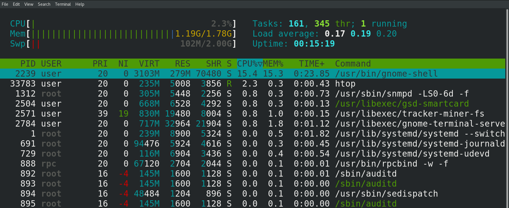
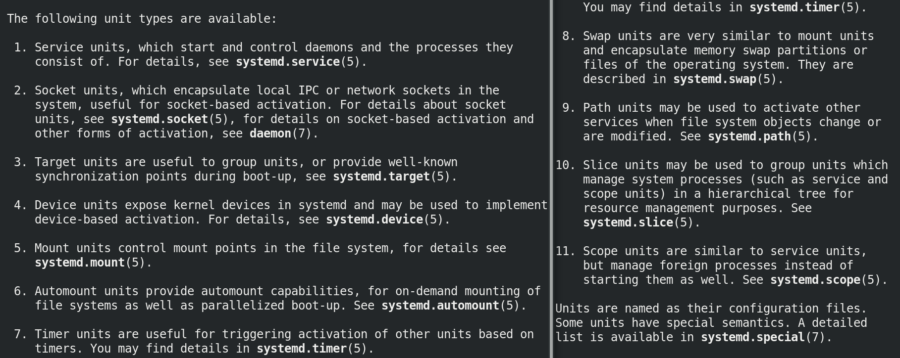
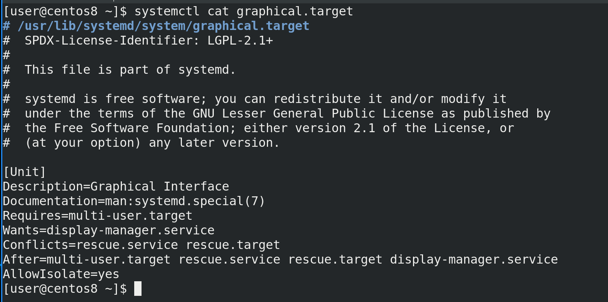
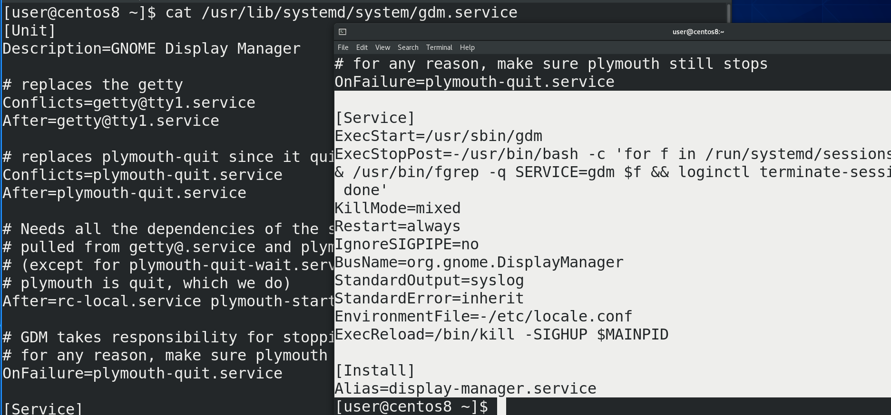
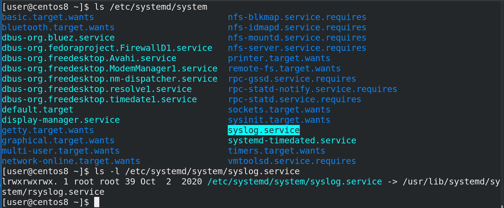

Мы с вами помним: когда запускается программа - появляется соответствующий процесс. Но если посмотреть список процессов на свежезапущенной операционной системе, мы увидим более сотни процессов, хотя я всего лишь запустил эмулятор терминала, bash и htop. Значит, всё остальное было запущено другими программами. 

То окно, в котором я залогинился - это ведь тоже какая-то программа, благодаря которой я и могу войти в систему. И вот этот графический интерфейс - тоже какая-то программа. Если я открою браузер и зайду на какой-то сайт - я может и не думаю об этом, но чтобы я смог зайти на этот сайт, сработала ещё одна программа, которая отвечает за работу с сетью. Т.е. чтобы я мог выполнить какие-то простые действия, должны работать какие-то программы.

Они всегда работают на фоне и помогают пользователям удобно пользоваться операционной системой. Все эти программы, которые работают на фоне, называются демонами, или даймонами - и тут отсылка не к библейским демонам, а к древнегреческой мифологии. Что-то типа ангелов хранителей. 

Т.е., чтобы я мог нормально работать, должны работать демоны. Но чтобы они работали, их должен кто-то запустить. Этим занимается специальная программа - система инициализации. Есть различные реализации этой программы, мы с вами рассмотрим systemd, которая используется во многих популярных дистрибутивах, в том числе Centos и RHEL.

В прошлый раз мы остановились на том, что ядро вместе с initramfs запускает программу /sbin/init - ls -l /sbin/init. /sbin/init олицетворяет систему инициализации, и, как видите, сейчас она показывает, что системой инициализации является systemd. 

Система инициализации - man systemd - это первый процесс, запускаемый в пользовательском пространстве. У него PID - 1. Мы упоминали про процесс с pid 1, когда говорили о процессах - если убить родительский процесс, у дочернего процесса родителем станет процесс с номером 1. Так вот, после запуска система инициализации должна запустить демоны. Но это не просто список программ, которые нужно запустить - какие-то программы нужно запускать раньше, чем другие, какие-то программы могут конфликтовать и всё такое. А что делать, если какая-то из программ не запустилась? Нужно же ещё дать возможность пользователям при желании решать, какие программы запускать при включении, какие не запускать. Все эти задачи и стоят перед системой инициализации.

systemd, кроме того, что является системой инициализации, также отвечает за многое другое, например, за управление сервисами, логами, сетью и т.п. Нужно понимать, что роль системы инициализации, как и говорит название - запуск операционной системы, чтобы всё начало работать как надо. На этом полномочия системы инициализации заканчиваются. Но systemd позиционирует себя как системный и сервисный менеджер, он связывает и заменяет многие компоненты операционной системы. Из-за чего, с одной стороны, многое друг с другом интегрировано, легче разрабатывать и администрировать, а с другой - сложнее заменить один компонент на другой и появляется зависимость дистрибутивов от systemd. 

Очень сложно заменить systemd на что-то другое - придётся многое переделывать. Это противоречит философии Unix-а - пишите программы, которые делают одну вещь и делают её хорошо. В итоге сообщество пользователей разделилось на сторонников и противников использования systemd. Я всё это к тому, что пусть вас не пугает большой функционал systemd, он нацелен на большее количество задач, чем просто инициализировать систему. Поэтому что-то мы рассмотрим сегодня, а что-то останется на потом.

Демонов много, они по разному запускаются, по разному останавливаются, что-то нужно перезапускать в случае ошибки, что-то не нужно, что-то нужно раньше запустить, что-то позже. Т.е. к ним нужен как массовый подход, чтобы удобно было ими управлять, так и индивидуальный. Поэтому демонов оборачивают в так называемые сервисы. Сервис - что-то типа инструкции по эксплуатации демона. В сервисе указано, как запускать демон, как его останавливать, с какими другими демонами он связан и т.п. Какие-то сервисы приходят вместе с операционной системой, другие сервисы появляются при установке программ, а что-то вы можете и сами написать. Например, если вы работаете в компании, где программисты написали какую-то программу, а вам нужно обеспечить работу этой программы на серверах, то это, скорее всего, ваша задача - написать сервис, чтобы программа нормально стартовала при запуске операционной системы, нормально завершалась и всё такое. 

И так, мы разобрали, что такое сервис. systemd работает с unit-ами, а сервисы - один из типов таких unit-ов. Есть ещё другие типы юнитов - например, юниты устройств, юниты монтирования и т.д. Но нас сейчас интересуют сервисные юниты и таргеты. Таргеты - это тоже юниты, представляющие из себя группу юнитов. target - от слова цель - говорит о конечном результате, достигаемом с помощью группы юнитов. Допустим, чтобы у нас был графический интерфейс, чтобы я мог открыть браузер и зайти на сайт, послушать музыку и т.п. - одного сервиса недостаточно. А вот если я возьму группу сервисов, отвечающих за графический интерфейс, сеть, звук и т.п. - то это будет готовый результат, который я хочу - т.е. это графический target. 

И если мы посмотрим вывод команды systemctl get-default, то мы как раз увидим, что systemd по умолчанию грузит таргет с названием graphical.target. А с помощью команды systemctl list-dependencies graphical.target мы как раз увидим, какие юниты  нужны для этого таргета. Как видите, графический таргет предполагает использование multi-user таргета, а внутри него огромное количество других юнитов. На серверах, по умолчанию, вместо графического таргета используется multi-user - примерно тоже самое, но нет графического интерфейса, что позволяет сэкономить ресурсы.

И если мы захотим, чтобы у нас тоже было как на серверах, чтобы всё работало, но без графического интерфейса, мы можем поменять таргет по умолчанию, с помощью команды sudo systemctl set-default multi-user.target. Ну и заметим мы это только при запуске. А пока вернём как было - sudo systemctl set-default graphical.target. 

Как видите, при выполнении этих команд у нас создаются и удаляются символические ссылки. И тут участвуют 2 директории - /etc/systemd и /usr/lib/systemd. Когда вы устанавливаете какую-то программу или в целом операционную систему, то все файлы юнитов попадают в директорию /usr/lib/systemd. Допустим, посмотрим файл graphical таргета  - systemctl cat graphical.target. Тут у нас описание юнита, путь к документации. Ну и как видите, тут написано Requires=multi-user.target, т.е. для загрузки графического таргета требуется загрузка multi-user таргета. Также тут написано Wants=display-manager.service. Display manager - это та программа, которая у нас спрашивает логин при входе в систему, ну и она же грузит рабочее окружение. Wants означает, что если этот сервис есть, то нужно его загрузить, а вот если он не грузится, или нету такого сервиса, то ничего страшного, таргет всё равно прогрузится. Если проблема с Requires то таргет перестанет грузиться. Также у нас тут Conflicts - то есть этот таргет не может одновременно работать с этими сервисами и таргетами, и что запуск этого таргета остановит работу указанных здесь сервиса и таргета. After означает порядок, после каких сервисов и таргетов грузится этот юнит.

Ну и AllowIsolate означает, можно ли использовать этот таргет как состояние, к которому можно перейти с помощью команды systemctl isolate. Т.е. таргеты - это группа юнитов, и, в случае с graphical.target или multi-user.target, их можно использовать как состояние загрузки операционной системы - т.е. с графическим интерфейсом или без, но всё же есть все нужное для работы. Но есть, например, таргет сети - network target - опять же, группа юнитов, нужная для работы сети, но на него переключаться бессмысленно, так как это не готовое состояние операционной системы, в котором можно работать, а просто группа юнитов. Для примера, есть resсue.target - это состояние системы, при котором большинство демонов не работает, и это нужно для решения каких-то проблем, допустим, когда система не грузится. 

Сделаем sudo systemctl isolate resсue.target и, как видите, теперь у меня система просит root пароль для перехода в режим восстановления. Вводим пароль и смотрим htop - как видите, процессов очень мало.

Ну и чтобы вернуться обратно, я делаю systemctl isolate graphical.target.

В старых системах инициализации эти состояния, к которым можно было переходить, назывались runlevel-ами. Они были пронумерованы - от 0 до 6. Среди которых 0 это shutdown, 6 это restart, 1 это аналог rescue таргета, 3 это аналог multi-user таргета, 5 - аналог графического таргета, ну и оставшееся это промежуточные состояния. Были директории с соответствующими номерами, в которых лежали скрипты, которые выполнялись при переходе на определённый runlevel. Собственно, это и было основой системы инициализации. Это просто полезно знать, потому что некоторые люди до сих пор говорят о ранлвлах, могут на собеседовании спросить, ну и вы вполне можете наткнуться на другую систему инициализации. Я не буду сравнивать системы инициализации, но, если вам интересно, у Семаева есть ролики про различные системы инициализации, плюс можете почитать по [ссылке](https://losst.ru/sistemy-initsializatsii-linux).

Мы поговорили о таргетах - группах юнитов. Теперь же давайте посмотрим на какой-нибудь определённый сервисный unit - допустим, gdm - тот самый дисплейный менеджер —  cat /usr/lib/systemd/system/gdm.service. Тут у нас кроме секции Unit появились ещё две секции - Service и Install. В секции [Service] у нас есть информация о том, как сервис запускает демон - ExecStart, т.е. просто запускает команду /usr/sbin/gdm. А вот ExecStopPost запускает команду после остановки сервиса. Как видите, это какой-то скрипт, и вы можете в нём разобраться. Все опции я разбирать не буду, по большей части у разных сервисов могут быть свои опции, знать всё наизусть не надо, всегда можно обратиться к документации. Что может быть интересно так это секция [Install]. Как видите, тут написан Alias=display-manager.service. 

У нас есть две команды - systemctl enable и systemctl disable. Если мы хотим, чтобы какой-то сервис запускался при включении операционной системы, мы запускаем команду systemctl enable и имя сервиса - sudo systemctl enable gdm. Как видите, никакого вывода не было, потому что этот сервис уже был включён. Если мы хотим убрать из автозапуска этот сервис, делаем - sudo systemctl disable gdm. В выводе написано, что удалён файл /etc/systemd/system/display-manager.service. Если опять сделаем enable - sudo systemctl enable gdm - то увидим, что создалась символическая ссылка display-manager.service, которая ведёт на файл gdm.service. Т.е. такое вот название символической ссылки, на основе того, что было написано в Alias в секции Install. Ну и можно посмотреть, включён ли сервис, с помощью команды systemctl is-enabled gdm. 

Что ещё интересно - символическая ссылка создаётся в директории /etc/systemd/system. Если в /usr/lib/systemd у нас файлы этих сервисов, то в /etc/systemd преимущественно символические ссылки, означающие, что данный сервис включён. Ну и если у нас какие-то свои сервисы, написанные нами вручную, то правильнее всего считается класть их именно в /etc/systemd. 

Подводя итоги. Для нормальной работы операционной системы нужны программы, работающие в фоне - демоны. Для запуска демонов при включении компьютера нужна система инициализации, одной из которых является systemd. systemd много чего умеет, помимо запуска демонов. Для правильной работы с демонами используются сервисы. systemd для этого использует service unit-ы и target unit-ы - т.е. группы юнитов. Чтобы сервисы запускались при запуске операционной системы, они должны быть enabled, что мы делали с помощью команды systemctl enable, ну или наоборот — чтобы убрать из автозапупска — systemctl disable. Таким образом операционная система запускает все нужные программы при включении. 

Теперь, объединяя эту и предыдущую тему, вы имеете представление, что именно происходит при запуске компьютера и операционной системы.  