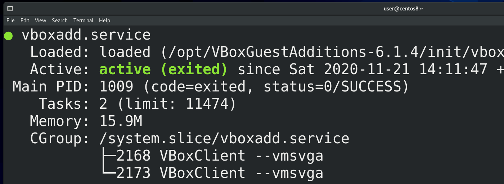
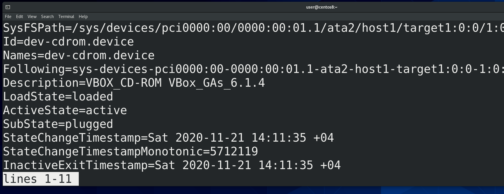

Как мы разобрались в прошлый раз, при запуске компьютера система инициализации запускает всякие сервисы, которые работают в фоне. По большей части работа системного администратора заключается в том, чтобы следить за состоянием операционной системы, устанавливать и настраивать всякие сервисы. На серверах крутятся всякие сервисы, допустим, тот же веб сервер,  где крутятся сайты. 

systemd, как сервисный менеджер, позволяет управлять этими сервисами. Для примера возьмём сервис под названием sshd. Вы часто будете встречать сервисы с буквой d в конце - она означает daemon, то есть демон программы ssh. Базовые операции - это остановить, запустить и перезапустить сервис - то есть sudo systemctl stop sshd, sudo systemctl start sshd и sudo systemctl restart sshd соответственно. Как понятно из названия, restart останавливает и запускает сервис заново. Обычно перезапускают сервис, когда изменяются какие-то настройки демона. Нужно его заново запустить, чтобы он перечитал свои настройки. Для каких-то сервисов это не проблема, но бывают важные сервисы, в которых даже секундная остановка вызывает проблемы. Для таких сервисов существует возможность перезапустить основной демон, при этом не затронув текущие процессы. Для этого используется опция reload - sudo systemctl reload sshd.

Как мы помним, systemctl enable sshd даёт возможность запускать сервис автоматом при включении компьютера. Мы можем сделать systemctl disable sshd, если не хотим, чтобы сервис стартовал при включении. И тем не менее, другие программы и пользователи могут запустить этот сервис при необходимости. Если же мы хотим, чтобы этот сервис нельзя было запустить, мы можем его замаскировать, с помощью команды systemctl mask sshd. Как видите, создаётся символическая ссылка, ведущая на /dev/null - то есть, при попытке запустить сервис ничего не произойдёт. Но это касается только сервиса, если мы вручную запустим программу, она будет работать. Ну и с помощью unmask - sudo systemctl unmask sshd - мы можем сервис размаскировать.

Также мы можем посмотреть статус этого сервиса с помощью команды status - systemctl status sshd. В строчке Loaded мы видим путь до основного файла сервиса. Дальше 2 раза видим слово enabled. Первый enabled говорит о том, что сервис включён, т.е., он будет запускаться при включении компьютера. Перед вторым enabled написано vendor preset. То есть, имеется в виду, что этот сервис был включён по умолчанию ещё при установке программы или операционной системы. 

В строчке Active мы видим, что сервис работает. Если остановить сервис, здесь будет писаться inactive. 

Иногда, вместо active (running), можно увидеть active (exited) - systemctl status vboxadd. Собственно, ничего страшного в этом нет. Если это какой-то демон, который постоянно работает на фоне, systemd может отслеживать состояние процесса и говорить, что он работает, то есть running. Но иногда вместо полноценного демона за сервисом стоит какой-то скрипт, который запускается, выполняет свою работу, запускает какие-то программы и завершается. И вроде скрипт больше не работает, но свою работу он сделал. Поэтому так и выходит - вроде это и не демон, отслеживать нечего, но при этом то что нужно работает. 

Вернёмся к нашему sshd. Дальше у нас ссылки на документацию и PID основного процесса, который запустился при старте сервиса. Дальше Tasks - общее количество процессов - включая основной и его дочерние. Memory  - сколько  оперативки использует этот сервис. Дальше CGroup - контрольная группа, в которую входят процессы этого сервиса. С помощью контрольных групп на уровне ядра можно изолировать группу процессов и выделять им ограниченные ресурсы - сколько-то оперативки, сколько-то процессора и т.п. Эдакая виртуализация на уровне самой операционной системы. Чуть ниже в статусе мы видим логи. К ним мы ещё вернёмся.

Я не хочу ударяться в объяснение каждой из команд systemctl, типа systemctl cat sshd, show, edit и всё такое. Не все команды используются часто, многие специфичны. На что-то мы наткнёмся и разберём, что-то вы по работе разберёте, а с чем-то и в вовсе не столкнётесь.

Как мы упомянули в прошлый раз, systemd отвечает не только за сервисы. Если запустить команду systemctl --all, мы увидим информацию о всех unit-ах - а тут и сервисы, и таргеты, и устройства, и mount-ы, и всякое другое. С сервисами и таргетами мы разобрались, немного поговорим про другие юниты. 

Помните, когда мы говорили про ядро, мы упомянули udev? Программа, которая делает какие-то действия при виде устройств - даёт названия устройствам, создаёт ссылки в директории /dev, может передать ядру какие-то параметры для устройства, запустить какие-то программы и т.п. Так вот, udev - тоже демон, но, к тому же, он является частью systemd, генерирует юнит файлы для устройств, называемые device unit-ами. Это позволяет сделать связь между устройствами и другими сервисами.

Или, допустим, mount unit-ы. Для примера возьмём mydata.mount - systemctl show mydata.unit. При включении компьютера кто-то же должен примонтировать все файловые системы, указанные в fstab? Так вот, systemd генерирует специальные unit-ы на основе записей fstab и монтирует их. При этом он смотрит зависимости, скажем, отличает локальные файловые системы от сетевых и на основе этого формирует зависимости при создании юнитов. Есть ещё swap unit-ы - примерно тоже самое, но для swap разделов.

Про остальные unit-ы мы поговорим, когда будем разбирать темы, связанные с ними. А сегодня мы разобрали как работать с сервисами, как смотреть информацию о них, и в целом стали лучше понимать, чем же занимается systemd. 