

Для продолжения курса потребуются знания работы сети, а это огромный пласт знаний. По сетям в интернете материала, наверное, больше, чем по линуксам. Но я всё же постараюсь объяснить основы и по мере продвижения курса буду затрагивать различные детали работы сети, связанные с той или иной темой. Сразу предупрежу, что я очень сильно упрощаю, так как это не курс по сетям, я расскажу только то, что считаю необходимым на данном этапе.

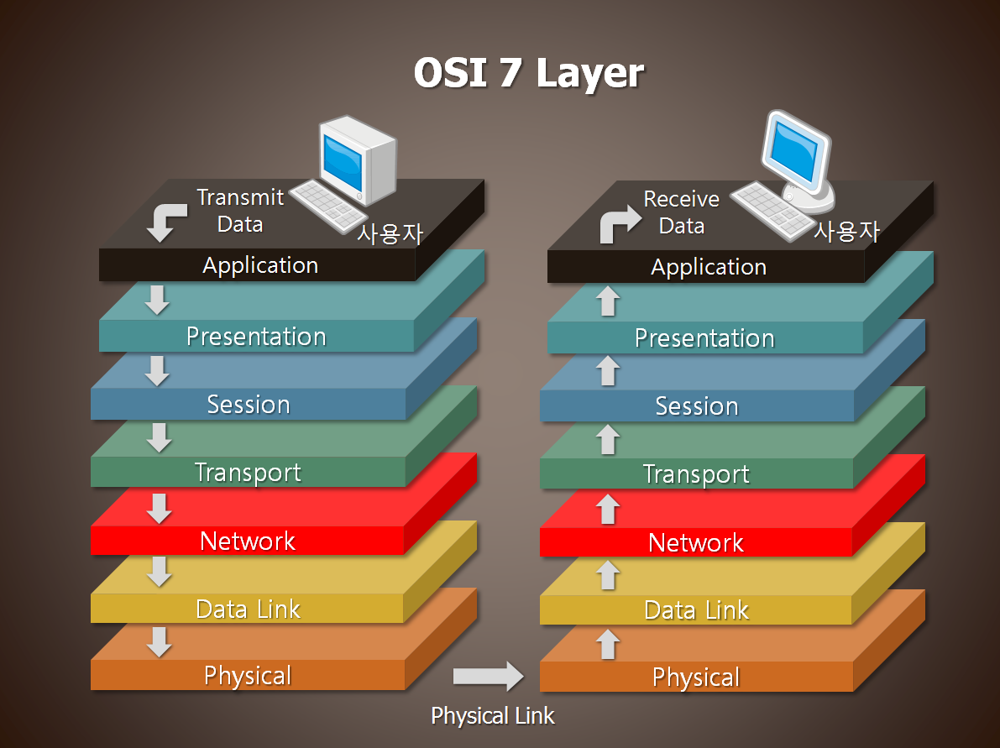

Если вы смотрите это видео в интернете, вы уже знаете, зачем нужна сеть. Разве что стоит отметить, что почти все компании имеют какие-то внутренние сервисы и для них организуется так называемая локальная сеть. Но мы ещё к этому придём. И так, для того, чтобы различные компьютеры с разными операционными системами и программами могли взаимодействовать между собой, существует универсальная сетевая модель, называемая OSI, которая определяет стандарты. Эта модель делит взаимодействие на шаги, так называемые уровни, и каждый уровень имеет свои правила. Набор этих правил определяет, как именно должно происходить взаимодействие и называется протоколом. Названия каких-то протоколов вы наверняка где-то видели - IP, DNS, HTTP. Хотя стандартная модель OSI предполагает 7 уровней, администраторы чаще всего работают со вторым, третьим, четвёртым уровнями и объединяют 5, 6 и 7 уровни в один, чаще всего называя седьмым.

Первый уровень - физический, предполагает стандарты и технологии для физического взаимодействия. Технологии бывают разные - ethernet, wifi, оптика. Для работы с сетью на каждом компьютере имеются сетевые адаптеры - чаще всего это ethernet адаптер, ну и wifi на ноутбуках.

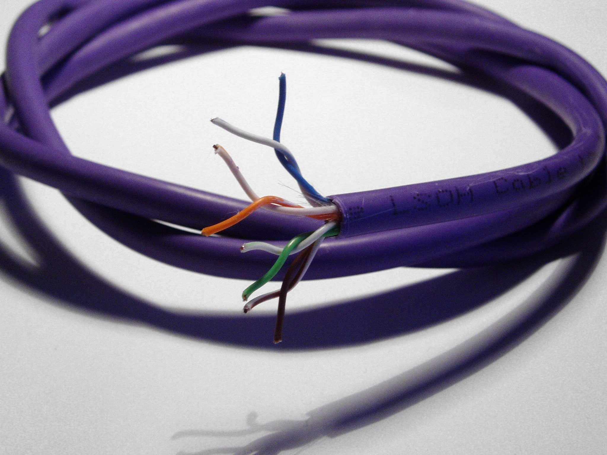

Скорее всего, по работе, вы будете взаимодействовать с ethernet-ом. Для соединения одного компьютера с другим используются кабели определённых категорий, чаще всего в наше время это cat 5. Он состоит из 8 медных проводов, по которым и ходят сигналы. Кабели скручены по два по определённому стандарту и такая пара проводов называется витой парой. И по работе нужно бывает обрезать эти кабели до нужной длины, вставлять их в коннектор и обжимать. Погуглите "обжим витой пары", посмотрите на ютубе, так как новичков часто спрашивают об этом на собеседованиях.

cat 5 поддерживает до 1 гигабита в секунду - 1 gbps. gbps означает gigabits per second. Скорость работы сети исчисляется в битах и чтобы понять пропускную способность в байтах просто делите на 8, так как 1 байт - это 8 бит. Т.е. cat 5 в идеале может передавать файлы со скоростью 1024/8 - 128 мегабайт в секунду. Но на самом деле чуть меньше, так как окружение всё таки влияет.

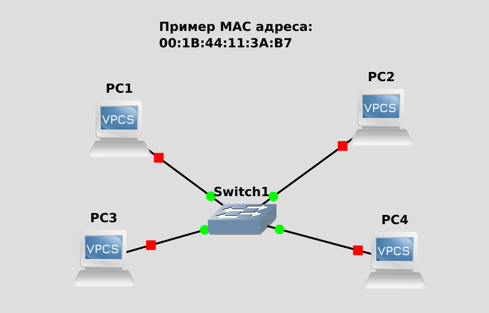

На втором уровне, который называется канальным, компьютеры могут различать друг друга. Для этого на каждом сетевом адаптере, на каждом порту есть специальный MAC адрес. Он выглядит как 12 букв и цифр, поделённых двоеточиями по два - 00:1B:44:11:3A:B7. Он уникальный и выставляется производителем адаптера ещё на заводе. Так как мак адрес позволяет опознавать другие компьютеры, можно подключать больше компьютеров друг к другу. Компьютеров может быть много, но нереально на каждом компьютере иметь сотни портов и прокидывать тысячи кабелей от одного компьютера к другому.

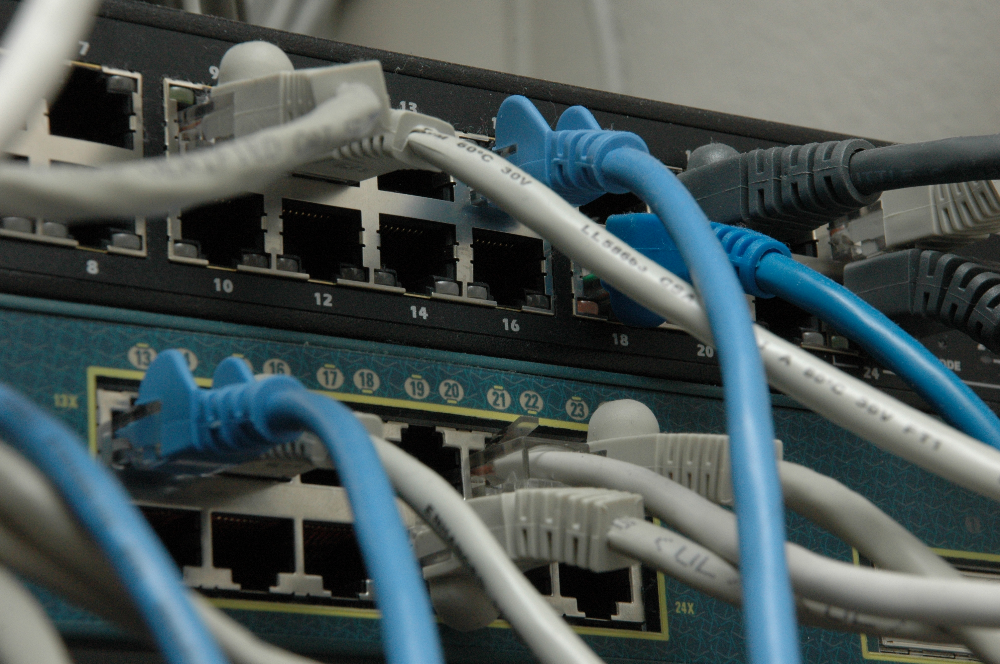

Чтобы связать несколько компьютеров в одну сеть чаще всего используются коммутаторы, в простонародье - свитчи. В простом варианте это устройства, имеющие кучу портов - от 4 до 96, если не говорить о каких-то редких. Если не хватает или устройства расположены на разных этажах - можно подключать несколько свитчей друг к другу. В свитчах есть как минимум таблица мак адресов - свитч запоминает, за каким портом находится какой мак адрес. Когда один компьютер хочет связаться с другим, он обращается к определённому мак адресу, свитч это видит и связывает два устройства через свои порты.

Но такой подход годится, когда компьютеров не слишком много - десяток, сотня, не более. Компьютеров может быть очень много, некоторые могут менять мак адрес, скажем, после замены сетевого адаптера, да и в целом работать с мак адресами не удобно. Поэтому мак адреса используются только в локальных сетях. Скажем, у вас дома, если у вас несколько устройств, или в небольших офисах, в отделах больших компаний и т.п. Представьте небольшой город. Каждое здание - это один компьютер. Локальная сеть - это уличные дороги, связывающие здания.

Так вот, третий уровень модели OSI - сетевой. И на нём вводится понятие IP адрес. У каждого компьютера в локальной сети есть IP адрес - как и у каждого здания в городе есть свой адрес. IP адреса позволяют взаимодействовать компьютерам, находящимся в разных сетях. На самом деле они и в локальных сетях используются, просто компьютер находит соответствующий мак адрес по IP. Есть различные версии протокола IP - ipv4 и ipv6. Более популярный и простой - ipv4 и мы поговорим о нём.

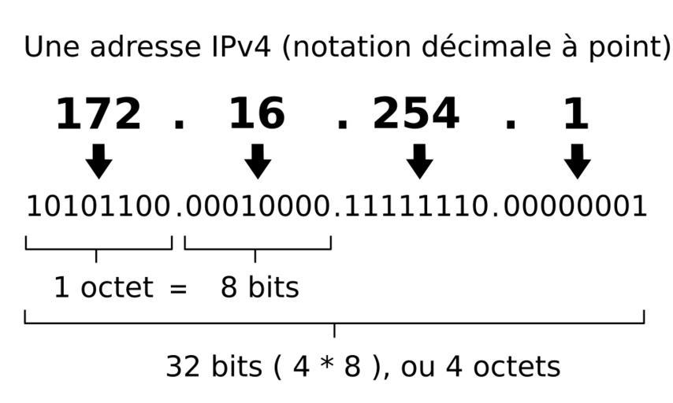

И так, IP адрес состоит из 4 чисел, разделённых точкой. Числа от 0 до 255. Т.е. технически IP состоит из 4 байт, каждый байт может уместить 8 бит, а каждый бит принять 2 значения. Итого 2 в 8 степени. Получается около 4 миллиардов адресов. Но этого не хватает - у одного компьютера может быть несколько адресов, у каждой виртуалки свои адреса, телефоны и прочие устройства - в общем, много всего. Но сеть позволяет сделать так, чтобы у разных компьютеров были одинаковые адреса, правда не в рамках одной локальной сети.

Скажем, у большинства населения по домам одинаковые IP адреса, допустим 192.168.0.100. Из примера с городом - в разных городах могут быть одинаковые адреса, скажем "улица Ленина, 20". В одном городе так делать не стоит, а в разных - без проблем.

Чтобы компьютеры могли понять, какой адрес находится в их сети, а какой в другой, есть маска подсети. Она указывается рядом с IP адресом. Она тоже состоит из 4 чисел, разделённых точкой, также имеющих значение от 0 до 255. Для примера возьмём самую популярную маску, скорее всего, используемую у вас дома - 255.255.255.0. Последнее число - 0 - говорит о том, что у вас в сети может быть 256 значений, т.е. 256 адресов. Но, на самом деле, первое и последнее значение зарезервированы. В данном случае 0 используется как адрес сети, как адрес самого города. А 255 - broadcast - способ обратиться ко всем компьютерам в этой сети. Скажем, если у вашего компьютера IP адрес - 192.168.0.100 с маской 255.255.255.0, то для него локальной сеткой будут компьютеры с адресами от 192.168.0.1 до 192.168.0.254, адресом сети будет 192.168.0.0, а броадкаст  адресом будет 192.168.0.255.  Кстати, нередко маску пишут как /24. Это означает, что первые три числа - 255, а это максимальное значение 8 бит. 8+8+8 = 24.  Не будем усложнять тему подсетей на сегодня, поэтому продолжим.

Почему именно 192.168? Есть список зарезервированных IP сетей, выделенных для частного пользования в домах и компаниях. И придя в гости или в какие-то компании, вы будете натыкаться на схожие подсети и IP адреса.

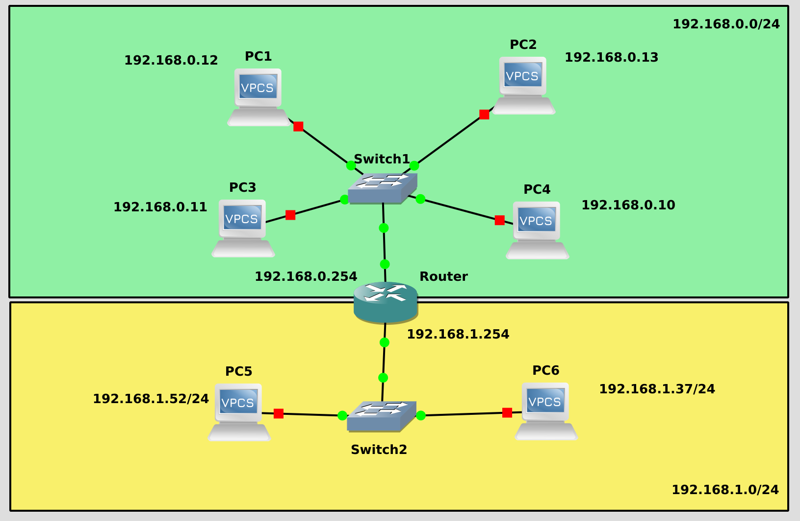

Так вот, допустим, компьютер видит, что какой-то IP адрес находится в другой сети, как он к нему обратится? Для этого есть такой механизм, как маршрутизация, в простонародье - роутинг. Обычно для этого используются маршрутизаторы или роутеры - как, например, ваш домашний роутер. Он находится с вами в одной сети, но у него есть выход и в другую сеть, благодаря чему он может связывать компьютеры вашей сети с компьютерами другой. Обычно роутерам дают граничные IP адреса - либо 1, либо 254, чтобы было понятнее, что это роутер. А на компьютере, при настройке IP адреса, также можно указать gateway - шлюз - и тут указывается адрес роутера. Если вы его указали - компьютер при необходимости связи с другой сетью будет обращаться к роутеру, а тот будет связываться с той стороной. Но роутер не будет передавать мак адреса, только IP адрес.

И интернет, в сильно упрощённом виде - это набор роутеров и свитчей - в домах стоят роутеры, которые подключены к роутеру вашего провайдера, а он соединён с роутерами других провайдеров. И все эти связи и формируют интернет. При этом, посмотрите на схему - у домашних компьютеров могут быть одинаковые адреса. Из интернета нельзя попасть в вашу домашнюю сеть - 192.168.0.0 - так как она зарезервирована для частного использования и любой желающий может её у себя поднять. Но при этом, у вашего роутера есть и внешний адрес, например - 5.5.5.5. И когда вы выходите в интернет, ваш роутер подменяет ваш адрес на свой внешний, чтобы вам могли ответить. Такая технология называется NAT - преобразование сетевых адресов. Скажем, если website увидит запрос от 192.168.0.100, то он не будет знать, кому посылать ответ. Но ваш роутер при запросе подменяет ip адрес, website видит адрес 5.5.5.5 и отвечает ему. А роутер перенаправляет ответ вам, так как при NAT-е он запоминает ваш запрос и ждёт на него ответ.

При этом, website или любой другой компьютер в интернете не могут напрямую обратиться к вашему компьютеру, опять же, потому что 192.168.0.0 - недоступен из интернета. Другие компьютеры могут обратиться к вашему внешнему адресу - 5.5.5.5 - но роутер сам по себе не будет перенаправлять запросы на ваш компьютер, так как это слишком опасно, в интернете много вредоносных программ. Да и NAT позволяет держать за одним внешним IP адресом множество компьютеров. Скажем, ваш телефон, компьютер, ноутбук и телевизор в интернет выходят с одного адреса. В компаниях так делают сотни и тысячи компьютеров. Безопасность и экономия IP адресов.

Внутри компании может быть множество сетей, например, сеть для серверов и сеть для пользователей. В таких случаях NAT обычно не используется, так как бывает нужно, чтобы и пользователи могли достучаться до серверов и сервера могли подключиться к компьютерам пользователей. Поэтому внутри компании не используют одинаковые IP адреса для сетей.

Так вот, всё это был уровень 3 модели OSI - layer 3 - или просто l3.  Первые три уровня формируют карту подключений - как дороги в городах. Есть дома, у каждого дома свой адрес, каждый дом находится в каком-то городе и, чтобы добраться из одного города в другой, надо поехать к выходу из города, оттуда доехать до другого города и потом до нужного дома. Компьютер - роутер - другой роутер - другой компьютер. Но суть сетей не в том, чтобы доехать куда-то, а в том, чтобы доставлять посылки, ну или по компьютерному - пакеты. Компьютеру один надо доставить пакет до компьютера два.

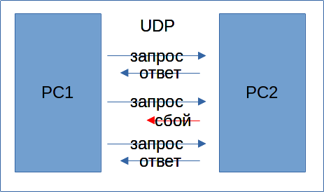

И тут мы добираемся до уровня 4 - транспортный. Посылки ведь бывают разные и их можно доставлять по разному. К примеру, в американских фильмах почтальоны у дома бросают газеты по утрам. Подует ветер, унесёт собака или ещё что - не страшно, всего лишь газета. Допустим, в сетях так работает доставка "пакетов времени" - NTP. Ваш компьютер может запрашивать у сервера текущее время и сервер отправляет вашему компьютеру ответ. И это происходит, допустим, раз в 10 минут. Но если вдруг ваш компьютер не получит ответ - небольшой сбой в сети - ничего страшного. Вы всё равно через 10 минут заново запросите. То есть пакет отправляется, но отправителю не нужно знать, доставился ли пакет или нет. Такой протокол доставки называется UDP.

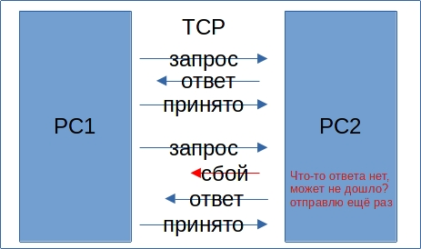

Но, зачастую, в пакетах может быть важная информация и потерять её не хотелось бы.  В таких случаях используют другой протокол - TCP. При TCP соединении отправитель должен убедиться, что пакет дошёл, для этого он ждёт подтверждения от второй стороны. И если в течении определённого времени ответа нет, он заново отправляет копию пакета.

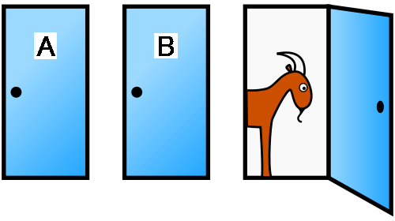

На этом же уровне мы с вами познакомимся с такой вещью, как порты. Не физические порты, а tcp или udp порты. Если компьютер - это дом, то порт - это квартира в этом доме. И абсолютно все дома - многоквартирные. Вы не можете просто принести пакет и положить в дом - курьер должен забрать от двери и доставить до двери. За каждой дверью живёт определённый человек, выполняющий определённую задачу. Допустим, когда вы заходите на сайт через браузер, ваш комп использует какой-то порт для отправки запроса. Браузер знает, что сайты выдаёт вебсервер, а он живёт на 80 порту. И курьер идёт в определённый дом с таким-то IP адресом и стучится в 80 дверь. Ждёт сколько-то. Если вебсервер действительно там живёт, то он отвечает курьеру, отдаёт ему пакет и курьер возвращает обратно ответ на тот порт, с которого был отправлен запрос. Если же никого за 80 дверью нет - грустный курьер возвращается ни с чем и браузер говорит, что не смог достучаться до вебсервера. Портов может быть 65 тысяч, при этом, обычно, для приёма используется 3-4 порта, а порты для исходящих запросов выдаются динамически и зависят от количества соединений.

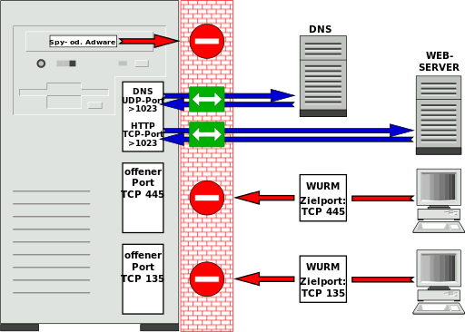

И тут же познакомимся с таким понятием, как фаервол. Вы можете не хотеть, чтобы кто-то кроме вас или определённые люди могли подключаться к каким-то портам вашего сервера. И вы можете поставить вахтёра, который будет встречать курьеров на входе в дом - если кто-то не будет соответствовать её правилам, она просто запретит курьеру входить. Правила обычно выглядят так - от каких адресов к каким портам есть доступ, или к каким нету. Такие фаерволы называются персональными и стоят в самой системе. Очень часто на роутерах ставят сетевые фаерволы - они уже проверяют на входе в сеть, всё равно что посты на въезде в город.

За tcp и udp портами уже находятся сами приложения - обычно это какие-то демоны в системе. Это уже 5, 6 и 7 уровни модели OSI. Один порт - одна программа, но у программы может быть несколько портов. Допустим, вебсервер использует как 80 порт, так и 443. Есть стандарты, какие программы за какими портами живут. Это можно поменять, но зная, что делаешь. Скажем, если поменять стандартные порты вебсервера, то браузеры не будут открывать сайты, пока не укажешь в браузере порт вручную. Но обычные пользователи этого не знают и откуда им знать, на какой порт вы поменяли?

На этом уровне уже работают программы, тот же самый вебсервер и браузер. Обе программы для взаимодействия используют протоколы, например, HTTP. Как и браузеры могут быть разные, так и программы на серверах, выступающие вебсервером. И именно использование единого протокола HTTP позволяет всем работать со всеми, независимо от браузера или вебсервера или операционной системы.

И так, мы с вами вкратце рассмотрели модель OSI. И когда один компьютер пытается послать что-то другому, этот процесс напоминает упаковку коробок и отправку. Для примера, вы хотите открыть какую-то страничку в интернете. Ваш браузер упаковывает ваш запрос в коробку, на которой пишет информацию согласно протоколу HTTP. Дальше ваша операционная система берёт эту коробку и наклеивает на него ещё одну наклейку, в которой добавляет информацию по протоколу TCP, с какого source порта был отправлен запрос и на какой destination порт. Потом добавляет ещё одну наклейку - с какого IP адреса был запрос и на какой. Потом ещё одну наклейку - с какого мак адреса и на какой. Потом компьютер преобразует полученный пакет в 0 и 1 и отправляет на свитч. Весь этот процесс называется энкапсуляцией. Свитч преобразует начало - и смотрит, на какой мак адрес нужно отправить - на роутер. Видит в таблице мак адрес роутера - 12 порт. Свитч отправляет на роутер. Роутер раскрывает начало и смотрит, а на какой адрес нужно отправить. Допустим, этот адрес роутеру неизвестен - он отклеивает наклейку l3 и клеит свою, заменяя ваш IP адрес на свой, для NAT-а, и оставляя вашу наклейку у себя в архиве.  Дальше отправляет на свой шлюз - другой роутер. Другой роутер тоже раскрывает, смотрит, не знает - отправляет на свой шлюз - третий роутер. Где-то в промежутке есть ещё свитчи и ещё роутеры и так десятки раз, пока не дойдёт до нужного сервера. В итоге доходит до нужного роутера, который видит нужный сервер в своей сети, он переклеивает наклейку с мак адресом и отправляет на нужный сервер. Сервер преобразует 0 и 1 в данные и видит свой мак адрес, понимает, что это ему. Начинает дальше отклеивать наклейки - видит, что запрос пришёл на его IP адрес. Снимает ещё одну наклейку - видит, tcp порт 80. За последними двумя шагами следит firewall - а можно ли доставлять пакеты на 80 порт с этого IP адреса? Если можно, пакет по итогу доходит до вебсервера. Потом вебсервер готовит ответ, распихивает по разным пакетам, начинает энкапсулировать и отправлять на свой роутер. И весь этот процесс происходит в доли секунд, прозрачно для пользователя, проходя огромные расстояния через сушу и океаны.

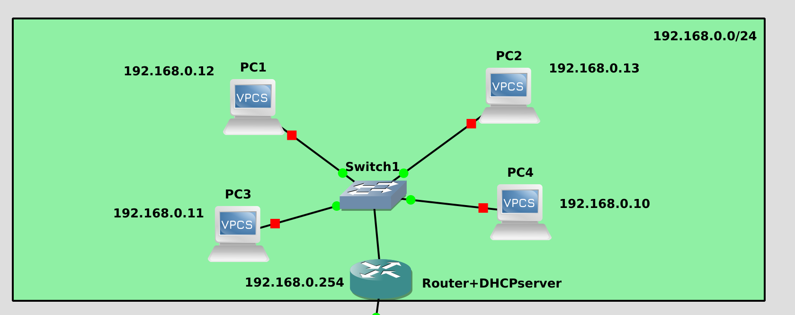

Ладно, как два компьютера общаются разобрались. Теперь стоит упомянуть два важных протокола, обеспечивающих удобство работы. Без них можно, но сложно. Начнём с DHCP. Это протокол позволяет выдавать IP адреса динамически. В отличии от MAC адреса, IP адрес не выдаётся на заводе, на каждом компьютере он настраивается отдельно. Но нельзя же каждому пользователю вручную писать свой адрес. Во-первых, это требует определённых знаний, во-вторых - просто неудобно, когда у вас большое количество компьютеров. Поэтому очень часто в сети есть DHCP сервер - им может быть и домашний роутер, и умный свитч, и даже отдельная виртуалка с линуксом. Когда какой-то компьютер подключается к сети, он отправляет всем в этой сети специальный запрос, мол есть ли в этой сети DHCP сервера? Этот запрос видит DHCP сервер и отвечает пользователю. DHCP решает, какой именно IP адрес выдать из свободных и даёт пользователю этот адрес, вместе с маской подсети, адресом шлюза и другими настройками. На серверах, обычно, IP адреса выдаются статически, т.е. вручную и на постоянно, а на компьютерах пользователей динамически. Т.е. эти адреса могут измениться при следующем включении.

Второй протокол - DNS - преобразует IP адреса в имена, имена в IP адреса и не только.  Вы же в браузере не пишете IP адреса гугла? У гугла серверов много, откуда вам знать и зачем вам помнить их IP адреса? В браузере вы пишете доменное имя, к которому хотите подключиться - google.com. При этом ваш браузер отправляет DNS запрос на специальные сервера. Они у вас также настраиваются при настройке сети, могут выдаваться DHCP сервером. Так вот, написали вы в браузере google.com - ваш браузер отправляет запрос с этим именем на прописанный в системе DNS сервер. DNS сервер либо знает этот адрес, либо обращается к другим DNS серверам, которые также могут обращаться дальше, пока не найдут ответ, кто же находится за этим именем. В итоге DNS возвращает вам IP адрес и ваш браузер отправляет HTTP запрос на этот адрес.

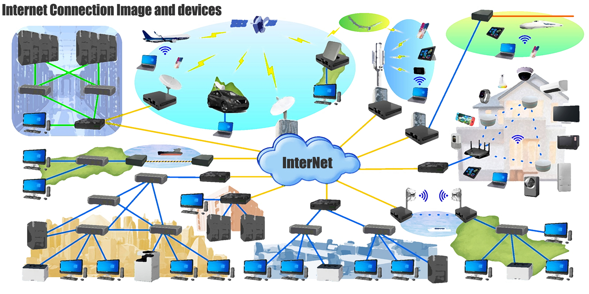

Сеть - громадный и сложный механизм, который для конечных пользователей упрощён до уровня выключателя. В средних и больших компаниях сеть администрируют целые отделы сетевых администраторов, которые изучают сети годами. Для администрирования линукс серверов такого объёма знаний не нужно, однако само понятие сервер предполагает, что к нему подключаются другие компьютеры - будь то в локальной сети или по интернету. И поэтому администратору нужны знания работы с сетью. С изучением дальнейших тем и опытом придёт более глубокое понимание.
