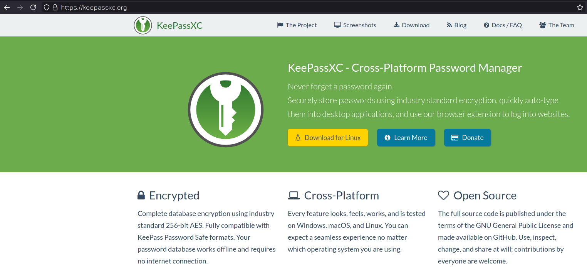
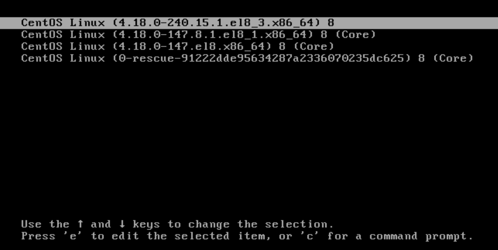
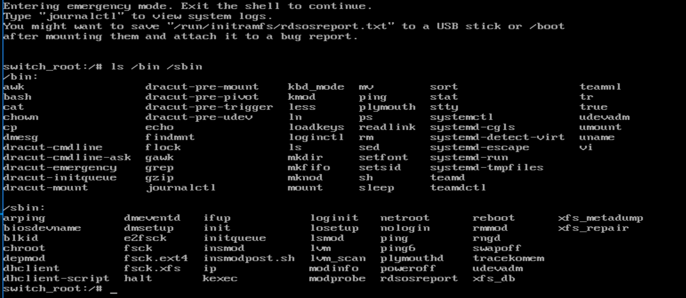





При работе вы можете сталкиваться с ситуациями, когда вам нужно восстановить доступ к системе. К примеру, потерялся пароль или предыдущий админ его не предоставил. Прежде чем начнём, небольшой совет - используйте парольные менеджеры, например, keepassxc. У вас может быть множество серверов, различные аккаунты на сайтах и везде требуется пароль. Придумать для различных ресурсов разные пароли и потом всё это запомнить - нереально. Использовать один и тот же пароль, каким бы сложным он не был - тоже не правильно - всегда есть риск утечки. А с парольным менеджером вы можете сгенерировать рандомные пароли для различных ресурсов и не беспокоиться, что кто-то где-то украдёт пароль и получит доступ ко всем системам. Но саму базу паролей надо бэкапить, иначе можете остаться без единого пароля.


Сейчас мы займёмся сбросом пароля root пользователя. В рабочей системе без прав суперпользователя это сделать невозможно, если не принимать во внимание всякие уязвимости. Поэтому пароль надо сбрасывать ещё до того, как система запустилась. Чтобы понять, как это сделать, вспомним процесс запуска операционной системы. Мы знаем, что пароли хранятся в файле /etc/shadow. Корень у нас монтируется ещё на этапе с временным корнем - initramfs - откуда берутся необходимые для монтирования модули. Дальше у нас запускается система инициализации. Надо вклиниться в промежуток после монтирования корня и до запуска системы инициализации. Это можно сделать несколькими способами - я сначала покажу самый простой и быстрый на мой взгляд, ну и потом разберу самый популярный в интернете.



И так, чтобы изменить процесс запуска, надо изменить настройки загрузчика grub. Для этого при запуске системы в меню grub на первом пункте нажимаем e - edit.


Спустимся на строчку с параметрами ядра linux. Здесь есть параметр ro - read only. Во время запуска основной корень предварительно монтируется в режиме чтения.


Заменим ro на rw - нам нужно, чтобы корень был доступен для изменений, всё таки мы собираемся изменить файл /etc/shadow. Также добавляем опцию init=/bin/bash - таким образом мы вместо системы инициализации запускаем bash, тем самым предотвращаем нормальный запуск системы и сразу получаем доступ к оболочке на незапущенной системе. Наши изменения в grub сохраняются только на текущую сессию и после перезагрузки всё сбросится, так что тут ничего страшного нет. Чтобы запуститься с новыми параметрами, нажимаем ctrl+x.


После этого нас встретит bash. Для начала я покажу все команды, чтобы было легче запомнить, а потом разберём, что и зачем. Пишем su -, затем load_policy -i /etc/selinux/targeted/policy/policy.31. В зависимости от обновления название последнего файла может отличаться - просто в директории policy нажимаете tab и баш дополняет нужный файл, он там обычно единственный. После этого пишем passwd - и вводим новый пароль дважды. Затем через виртуалбокс перезагружаем виртуалку.

```bash
su -
load_policy -i /etc/selinux/targeted/policy/policy.31
passwd
```


После запуска операционной системы проверим новый пароль - su - всё работает.


Теперь разберёмся с командами. Первое что мы ввели - su -. Это нужно, чтобы прогрузилось окружение пользователя. Если проверим bash, который у нас загружается в начале - echo $PATH - в нём только две директории в переменной PATH - /usr/local/bin и /usr/bin. Если мы напишем просто su - окружение останется, а значит в этой переменной останутся те же директории - echo $PATH. Из темы про su мы помним, что для загрузки окружения пользователя к su надо добавлять дефис - su -. После чего в переменной $PATH мы увидим новые директории.


Шаг с load_policy нужен на системах, где стоит selinux. Т.е. на RHEL и Centos-е это нужно, а на том же Debian или Ubuntu - нет, если конечно вы не поставили на них selinux. Зачем этот шаг вообще нужен? При запуске системы у нас не прогрузился selinux - getenforce. Как видите, selinux disabled. Когда selinux выключен, работать с файлами не стоит, иначе контекст сбрасывается. Смена пароля - изменение файла /etc/shadow. Посмотрим контекст этого файла - ls -lZ /etc/shadow. Сейчас контекст shadow_t. Для наглядности пропустим шаг с load_policy и сразу зададим пароль - passwd. После этого контекст файла пропадёт - ls -lZ /etc/shadow. Мы говорили, что Selinux блокирует процессам доступ к файлам, если контекст не совпадает. И в итоге из-за потерянного контекста при запуске система не сможет обратиться к /etc/shadow и поэтому не запустится.


Но тут ничего ужасного нет и мы можем исправить. Мы помним, что для восстановления контекста из конфига selinux есть утилита restorecon - restorecon -v /etc/shadow; ls -lZ /etc/shadow. Но, как видите, ничего не произошло - потому что у нас selinux не запущен. И вот тут нам нужна команда load_policy - она загружает политики - load_policy -i /etc/selinux/targeted/policy/policy.31. И вот после неё restorecon всё возвращает - restorecon -v /etc/shadow; ls -lZ /etc/shadow. И чтобы не терять контекст, мы сразу после su загрузили политики. Как бы вы не делали, просто проследите за тем, чтобы контекст файла был порядке.


Теперь попробуем разобрать популярные способы из интернета. Где-то что-то отличается по мелочам, поэтому я покажу что-то среднее. Так или иначе, везде нужно редактировать в grub-е строчку linux. Многие вместо вышеуказанных изменений пишут rd.break - тогда у нас процесс запуска останавливается ещё на initramfs.



В принципе, это полезная опция, которая позволяет решить некоторые проблемы, если не грузится корень. В initramfs обычно утилит мало - ls /bin /sbin, но их может хватить на базовые операции для решения проблем, скажем, для проверки и исправления проблем с файловой системой, lvm и т.п.


Настоящий же корень примонтирован в директорию /sysroot - mount | grep /sysroot. И, обратите внимание, что он примонтирован в режиме ro - read only. Поэтому мы изначально в grub меняли ro на rw. Тут же придётся перемонтировать - mount -o remount,rw /sysroot. Дальше нам необходимо перейти с временного корня на настоящий, для этого есть утилита chroot - chroot /sysroot. После чего надо залогиниться и задать новый пароль - su -; passwd.


И мы помним, что это действие сбрасывает контекст с файла /etc/shadow. И для решения этой проблемы советуют создать файл в корне - touch /.autorelabel - и перезагрузиться. При виде такого файла при запуске selinux восстанавливает контекст всех файлов. Но это долгий процесс и зависит от количества файлов в системе.


Правда у меня после создания файла контекст не восстановился и система отказывалась запускаться. Но если перезагрузиться и добавить в grub параметр autorelabel=1 -  контекст восстановится. Потом понадобится ещё одна перезагрузка и всё заново заработает.

Ещё вас может заинтересовать вопрос - значит, любой желающий, не зная пароль, может его сбросить? Насколько это безопасно? Тут два варианта. Если у человека есть доступ только к консоли виртуалки, то можно поставить пароль на grub - тогда в меню grub при попытке редактирования будет запрашиваться пароль. Но если у человека есть физический доступ к компьютеру, то единственный способ защититься - это шифровать диски, иначе злоумышленник просто загрузится в livecd. Можно конечно блокировать паролем загрузочное меню компьютера, но и это можно обойти просто вытащив диск и подключив к другому компьютеру.

Подведём итоги. Сегодня мы с вами разобрали, как восстановить доступ к системе, если вы не знаете пароль root-а или другого пользователя с правами sudo. Также мы научились останавливать процесс запуска ещё на этапе initramfs - а это очень важно для решения проблем.
