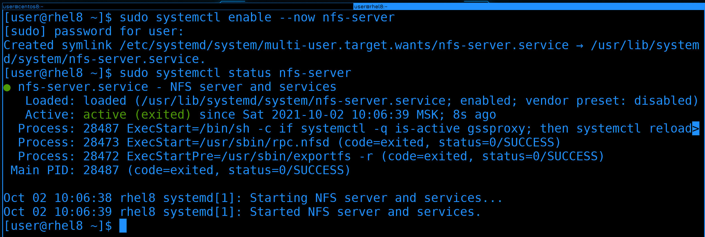
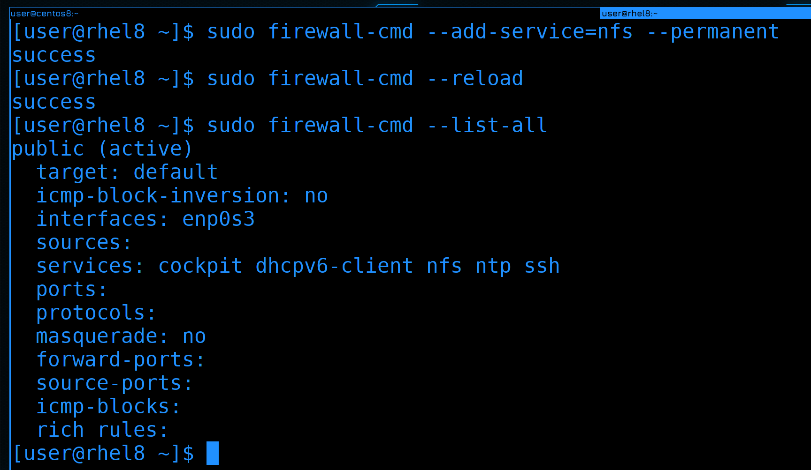
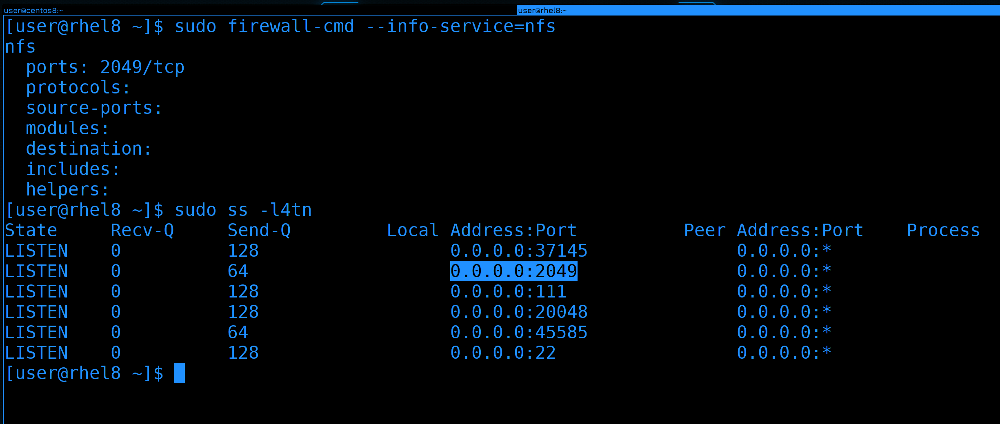
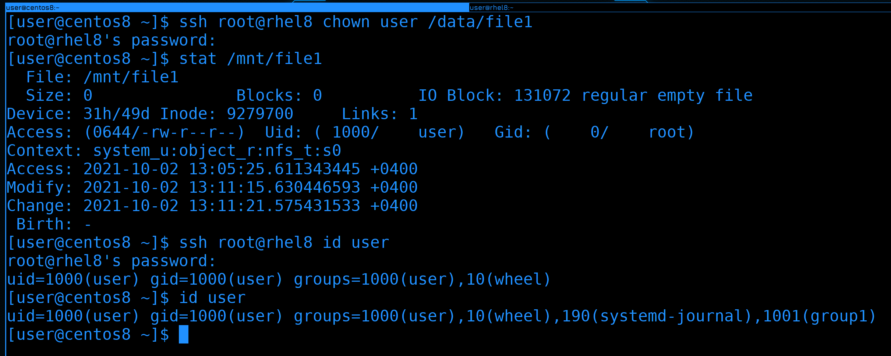
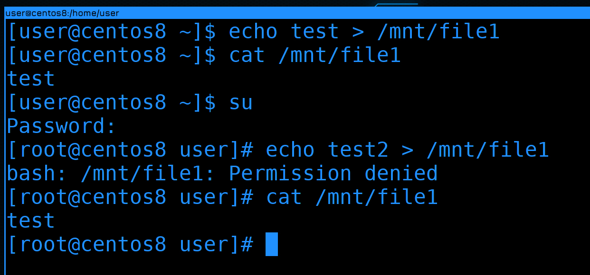
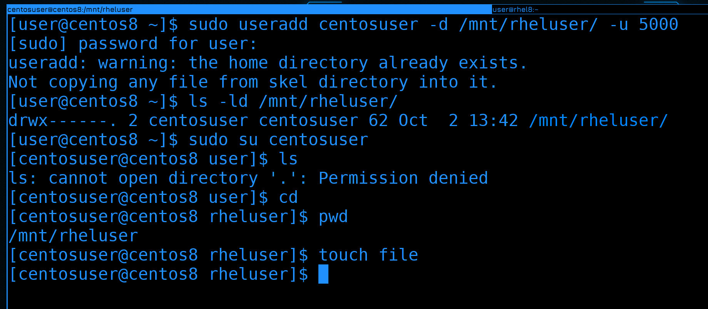
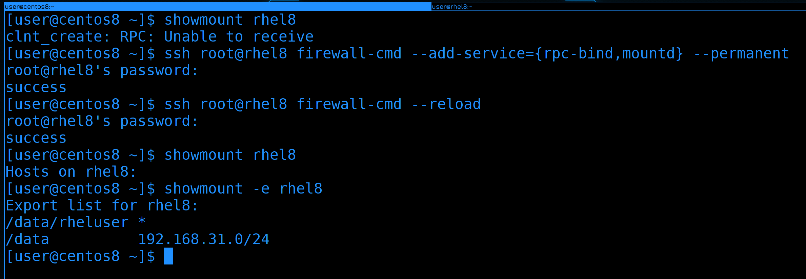
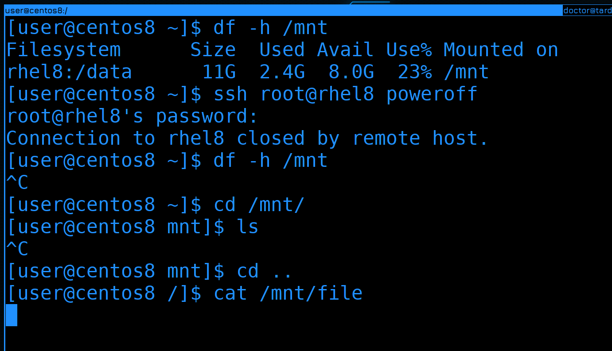
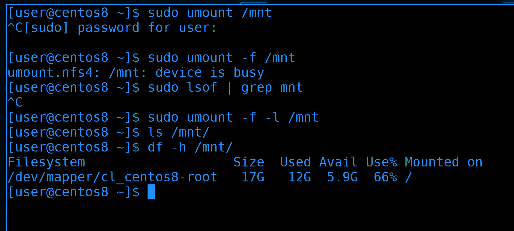



Почти в любой компании многое завязано на совместной работе с файлами. Люди постоянно пишут файлы, изменяют их и передают друг другу. Какие-то данные должны быть постоянно доступны внутри одного отдела, какие-то внутри всей компании, что-то изменяется ежеминутно, а что-то раз в год. И если бы приходилось каждый раз при каждом изменении копировать все эти файлы от одного компьютера к другому, особенно если компьютеров тысячи - то это был бы просто ужас. Это не единственная причина, в целом по разным задачам требуется, чтобы какие-то файлы были постоянно доступны на разных компьютерах. А если данные будут храниться где-нибудь на сервере, это также упростит процесс бэкапа, распределения доступов и многое другое.

В общем, всё это решают сетевые файловые системы. Грубо говоря, они позволяют работать с файлами, которые находятся на сервере, как с локальными. Например, заходя в директорию /home/user/documents вы будете видеть файлы, которые находятся на сервере, и вам не придётся постоянно копировать их туда-сюда. Сетевые файловые системы работают по протоколам и самые популярные это NFS и SMB. Они сильно отличаются и у каждого из них своё применение. Но эти протоколы почти всегда используются внутри локальной сети и почти никогда в интернете, так как это очень небезопасно.

Начнём с NFS - Network File System. Если вкратце - NFS работает с юниксовыми правами и без аутентификации. На самом деле можно настроить аутентификацию через Kerberos, но это отдельная тема. В основном NFS применяют между серверами, например, чтобы на нескольких серверах были одни и те же настройки и данные, а также для постоянного бэкапа и тому подобного. Там где обычные пользователи, особенно в Windows среде, это не очень годится, хотя тоже работает. Давайте установим NFS на RHEL-е и примонтируем на CentOS. 


Для начала установим пакет nfs-utils, в нём есть демон и прочие утилиты для работы с этой сетевой файловой системой :

```bash
sudo dnf install nfs-utils -y
```



После установки добавим сервис nfs-server в автозагрузку и одновременно запустим его, а потом глянем его статус:

```bash
sudo systemctl enable --now nfs-server
sudo systemctl status nfs-server
```

Вроде всё работает. 



Так как это сетевой сервис и к нему будут подключаться с других систем, нужно добавить его на файрволе. Там он есть как сервис и называется nfs. После добавления не забудем перезагрузить файрвол: 

```bash
sudo firewall-cmd --add-service=nfs --permanent
sudo firewall-cmd --reload
```

Для наглядности сделаем list-all, чтобы увидеть его в списке сервисов:

```bash
sudo firewall-cmd --list-all
```



И давайте просто для информации посмотрим, какой порт для NFS указан на файрволе - 2049/tcp:

```bash
sudo firewall-cmd --info-service=nfs
```  

И убедимся, что сервис слушает на этом порту. Для этого у нас есть утилита ss:

```bash
sudo ss -l4tn
``` 

Как видите, в списке есть 2049 порт. Я использовал 4 ключа - listen ipv4 tcp numbers - т.е. показать все порты, на которых сервер слушает по ipv4, по протоколу tcp - и показать номера портов, а не названия. 

Вся эта проверка была не обязательна, но если мы будем периодически использовать эти инструменты, мы их запомним и в дальнейшем они очень пригодятся при решении проблем.

Окей, пойдёмте дальше. Хотя мы и говорим сетевая файловая система, но нам не нужно для неё создавать раздел, форматировать его и т.п. Да, клиенты действительно монтируют её, как обычно монтируют файловые системы, но на сервере это всёго лишь обычная директория. Она может быть как в корневой файловой системе, так и на какой-нибудь другой, тут уже зависит от вас, как вы распределяете пространство. В целом, конечно, лучше держать всё это на другом диске с другой файловой системой, чтобы не зависеть от операционной системы. Если будут проблемы с этой операционной системой - просто отцепим диск и подключим к другой. Но для изучения сойдёт и корневая. 


Для начала создадим директорию /data в корне, название на ваше усмотрение. Ну и сразу создадим в ней пару файлов, они пригодятся нам чуть позже. 

```bash
sudo mkdir /data
sudo touch /data/file{1..3}
ll /data
``` 

Вот эту директорию мы будем раздавать по сети. В простонародье это называют шарой - от слова share. Но для начала это надо настроить.


Список расшаренных директорий указывается в файле /etc/exports. Раздавать можно несколько директорий и даже одну директорию можно раздавать с разными параметрами.  Сначала мы указываем локальную директорию, после пробела или табуляции пишем IP адрес или адрес сети, кому мы разрешаем подключаться и слитно к адресу в скобках указываем параметры, допустим, rw - read write. 

```
/data   192.168.31.5(rw)
```

В нашем случае мы разрешили компьютеру с адресом 31.5 монтировать директорию /data с возможностью изменять содержимое. К этому файлу мы ещё вернёмся, а пока продолжим. 


В случае с NFS не нужно перезапускать сервис, чтобы применились настройки,  но нужно выполнить команду exportfs:

```bash
sudo exportfs -av
``` 

Здесь ключ -a считывает всё написанное в /etc/exports и применяет, а -v - это verbose - т.е. просто для наглядности. 

Если запускать команду без ключей, то покажется то что сейчас раздаётся, а с ключом -s можно увидеть все параметры к этой шаре:

```bash
sudo exportfs
sudo exportfs -s
``` 


Окей, теперь попробуем примонтировать эту директорию на CentOS. На нём уже пакет nfs-utils есть, поэтому сразу запускаем команду mount:

```bash
sudo mount 192.168.31.205:/data /mnt
``` 

В качестве файловой системы указываем IP адрес двоеточие и расшаренная директория. Ну и указываем куда хотим примонтировать. Обратите внимание, что никакого пароля не нужно указывать.

Если посмотреть df, можно увидеть объём файловой системы и свободное пространство на сервере. Для сравнения, на локальной машине другие данные:

```bash
df -h /mnt
df -h /
``` 

Ну и также можно увидеть с какими параметрами мы примонтировали, если посмотреть команду mount:

```bash
mount | grep /mnt
``` 


Теперь перейдём к данным. И так, если посмотреть в /mnt, можно увидеть файлы. Т.е. я на CentOS-е в /mnt вижу файлы, которые находятся в /data на RHEL-е. Файлы пустые, поэтому cat ничего не показывает. 

```bash
ls /mnt
cat /mnt/file1
``` 

Но если я попытаюсь создать какой-то файл, у меня выйдет ошибка, что не хватает прав. 

```bash
sudo touch /mnt/file4
```

В NFS действуют юниксовые права, т.е. на основе UID-ов и GID-ов. Но, по-умолчанию, права рута игнорируются.


Для начала вспомним, что права на файлы в линуксах применяются не по логинам, а по идентификатору - UID-у: 

```bash
stat /mnt/file1
```

У file1 UID - 0, т.е. рут.



Но права рута не работают, поэтому давайте поменяем владельца файла. Отсюда у нас не хватит прав, поэтому сделаем это через ssh:

```bash
ssh root@rhel8 chown user /data/file1
```

Чуточку подождём и увидим, что у файла поменялся владелец - теперь он показывается как user. Но это лишь потому, что и на сервере у пользователя user UID - 1000, и у локального пользователя user UID - 1000. 



Давайте проверим права, попробуем записать что-то в файл:

```bash
echo test > /mnt/file1
cat /mnt/file1
```

Как видите, всё прошло успешно, в файле появилась строка. Теперь попробуем сделать тоже самое от рута. Я специально не использую sudo, потому что перенаправление работает работает от моего юзера, а не от рута. Т.е. если я использую sudo, в файл текст будет добавляться не от рута, а от user-а, поэтому это не показатель. Заходим от рута и пытаемся изменить файл:

```bash
su 
echo test2 > /mnt/file1
```

И снова получаем ошибку. Так почему же права рута игнорируется? Всё дело в том, что без этого пользователь рут на любой из систем, куда примонтирована шара, смог бы сделать с файлами всё что угодно, у него были бы все права на все файлы внутри шары. Он смог бы, допустим, создать файл с setUID-ом и повысить себе привелегии на любой из систем. А это опасно - если кто-то получил доступ к одному из ваших серверов, то так он может и на других повысить себе привелегии. Ну или какой-то из ваших сотрудников благодаря этому получит доступ туда, куда ему нельзя заходить. 


Не стоит это отключать, но о существовании такой возможности вы должны знать. В /etc/exports вы можете добавить параметр no_root_squash к нужной шаре: 

```
/data   192.168.31.5(rw,no_root_squash)
```

Обратите внимание, что параметры указываются через запятую, без пробелов. Чтобы заново расшарить директорию с новыми параметрами, нужно использовать ключ -r: 

```bash
sudo exportfs -rv
```


Ну и теперь можно на CentOS-е работать с файлами от рута:

```bash
echo test2 > /mnt/file1
cat /mnt/file1
```


Чтобы закрепить тему прав, на сервере создадим нового пользователя rheluser с uid-ом 5000. И пусть его домашняя директория будет внутри /data:

```bash
ssh root@rhel8 useradd rheluser -m -b /data/ -u 5000
```

Теперь давайте проверим права на новую директорию внутри /mnt:

```bash
ls -ld /mnt/rheluser
```

Обратите внимание, что вместо владельца и группы директории указано 5000, т.е. UID. Всё потому, что на локальной системе нет пользователя с таким идентификатором.



Давайте создадим локального пользователя с другим логином, но тем же самым UID-ом. И в качестве домашней директории укажем ему директорию того пользователя на сетевой шаре:

```bash
sudo useradd centosuser -d /mnt/rheluser/ -u 5000
```

Теперь, если проверить права на ту же директорию, вместо 5000 мы увидим локального пользователя. Т.е. система по UID-у сопоставляет файл с владельцем:

```bash
ls  -ld /mnt/rheluser
```

Давайте попытаемся залогиниться новым юзером:

```bash
sudo su centosuser
cd 
pwd
touch file
```

Теперь можно зайти к себе домашнюю директорию и работать как обычно, при этом файлы этого пользователя будут храниться на сервере. Но для этого нужно, чтобы эта файловая система была предварительно примонтирована. 


А чтобы при каждом включении нам не приходилось монтировать вручную, нам на клиенте, т.е. на CentOS, надо добавить запись в /etc/fstab: 

```
rhel8:/data /mnt nfs defaults,nofail 0 0
```

Давайте вместо адреса укажем имя хоста, хотя можно и по IP адресу. Ну и в качестве типа файловой системы указываем nfs. Раньше в опциях монтирования стоило указывать дополнительный параметр _netdev, чтобы эта файловая система при включении монтировалась только после после того, как заработает сеть. Сейчас это не нужно, потому что systemd сам за этим следит. Но на всякий случай добавим опцию nofail. Если сеть будет недоступна, операционная система не запустится в нормальном режиме, а с ключом nofail ошибка монтирования проигнорируется. В определённых случаях нельзя давать операционной системе запуститься, если какая-то важная файловая система не примонтировалась, а в каких-то случаях это не критично. 


Чтобы убедиться, что с fstab всё нормально, попробуем примонтировать с помощью него. Предварительно шару следует отмонтировать, а потом использовать команду mount -a, чтобы примонтировать всё из fstab:

```bash
sudo umount /mnt
sudo mount -a
```

Как видите, у меня возникла ошибка, что доступ запрещён. Это потому что rhel8 у меня прописан как ipv6 адрес, а его я в exports не указывал. Давайте поменяем hosts файл и пропишем ipv4 адрес, после чего попробуем перемонтировать. На этот раз всё примонтировалось успешно.


Теперь давайте вернёмся к файлу exports и разберём пару опций, но я не буду лезть в дебри и показывать какие-то специфичные настройки. На данном этапе нам это не нужно, а если вам интересно, посмотрите man по exports. 

И так, до этого мы расшарили директорию /data для адреса 31.5. Что, если мы хотим эту же директорию  расшарить для всей сети 31.0, но с другими параметрами? Можем поставить пробел и написать другой IP адрес или адрес сети с другими параметрами:

```
/data           192.168.31.5(rw,no_root_squash) 192.168.31.0/24(rw)
```

Но ещё раз обратите внимание, что скобки слитны с адресом. Если поставить пробел - то параметры будут применяться для любых адресов. И так, у нас для 31.5 есть параметр no_root_squash, т.е. он может от рута работать с этой файловой системой, а другие хосты в этой сети могут работать только обычными юзерами, без рут прав. Вообще, желательно, внутри /data создать различные директории, задать им соответствующих владельцев и так шарить, иначе в самой директории /data с её владельцем рутом никто не сможет создавать новые директории и файлы, только читать. 

```
/data/rheluser  *(ro)
```

Каждую шару надо указывать с новой строки. Это может быть и отдельная директория и директория внутри существующей шары. Так вы можете более гранулярно монтировать, т.е. не всё содержимое /data видеть на клиентах, а только необходимое для данного хоста. В данном случае /data/rheluser раздаётся на все компьютеры с правами read only. Даже если на уровне файлов у клиента будет доступ для изменения, nfs любые попытки изменить файлы будет пресекать. 


После изменений не забываем переэкспортировать файловые системы:

```bash
sudo exportfs -rv
sudo exportfs -s
```

Давайте разберём ещё пару нюансов. То что мы обсуждали насчёт NFS, в основном относится к его текущей версии - NFS 4. Где-то теоретически вы можете наткнуться ещё на 3 версию, и вот между версиями есть большая разница. Например, сегодня мы на файрволе открыли порт 2049 и этого хватило, чтобы клиент мог примонтировать шару. Раньше бы этого могло не хватить, потому что nfs изначально разрабатывался с учётом сервиса rpcbind. 

RPCbind это специальный сервис, который слушает на порту 111. Грубо говоря, он позволяет клиентам не думать о том, к какому именно порту нужно подключаться. Условно, если вы хотите подключиться к SSH, вам не обязательно знать, на каком именно порту он работает. Условный SSH каждый раз работает на каком-то рандомном порту. И ваша программа за вас посылает запрос на RPCBind на порт 111 и спрашивает, а как достучаться до SSH. А там rpcbind ведёт учёт всех портов и направляет на нужный. Идея интересная, но не всегда удобная, особенно с точки зрения файрвола. Сейчас этот сервис редко где используется, 

Так вот, некоторые функции NFS разбросаны по разным портам. В 4 версии NFS большинство функционала включено в сам протокол, но во 2 и 3 нет. Например, функция блокировки файла. Но даже для NFS 4 RPCbind может быть полезен. В частности для получения информации о шарах.  



К примеру, мы знаем, что на rhel есть nfs сервер, но не знаем, что за директории там раздаются. И по каким-то причинам мы не можем на него зайти и проверить всё. Мы хотим со стороны клиента узнать, что же там на сервере шарится. Для этого есть команда showmount:

```bash
showmount rhel8
```

Как видите, она выдаёт ошибку "RPC: unable to receive". Т.е. не получает ответ от RPC. 

Чтобы решить эту проблему, надо на файрволе сервера разрешить rpc-bind и mountd. Сделаем это прямо отсюда, через ssh:

```bash
ssh root@rhel8 firewall-cmd --add-service={rpc-bind,mountd} --permanent
ssh root@rhel8 firewall-cmd --reload
```

И теперь команда showmount показывает экспортнутые директории на сервере:

```bash
showmount -e rhel8
```



Ну и ещё один нюанс. Предположим NFS сервер вышел из строя или клиент потерял сеть. В общем, просто потерялась связь между клиентом и сервером, в то время как файловая система примонтирована. Давайте создадим такую ситуацию - выключим rhel, пока примонтирована шара:

```bash
df -h /mnt
ssh root@rhel8 poweroff
```



Если теперь попробовать зайти в директорию или хоть как-то взаимодействовать с файлами, то процесс не будет выдавать результата, он просто не может зайти в эту директорию. Если какой-то процесс работал с файлами внутри этой директории, то он просто зависнет в ожидании ответа. И в такие моменты лучшее решение - попробовать восстановить связь, иначе придётся убивать процессы. Но если у вас нет никаких важных процессов и вы просто забыли отмонтировать, то обычная попытка отмонтировать тоже будет зависать. В таких случаях вы можете попробовать насильно отмонтировать с ключом -f:

```bash
sudo umount -f /mnt
```

Но, как видите, у меня даже это не работает, пишет, что устройство занято. Попробуем найти процесс с помощью lsof и убить его:

```bash
sudo lsof /mnt
```

И даже lsof у меня перестаёт отвечать. 

В таких случаях можно попытаться найти процесс в списке процессов или использовать ключ -l с umount: 

```bash
sudo umount -f -l /mnt
```

Тогда файловая система для нас отмонтируется, но где-то в памяти всё ещё останется, пока всё не исправится или пока мы не перезагрузимся. 

Давайте подведём итоги. Сегодня мы с вами разобрали NFS - одну из сетевых файловых систем, которая много где используется. Её легко поставить и настроить, но будьте осторожнее с доступами, так как для подключения к ней не нужны никакие логины и пароли.