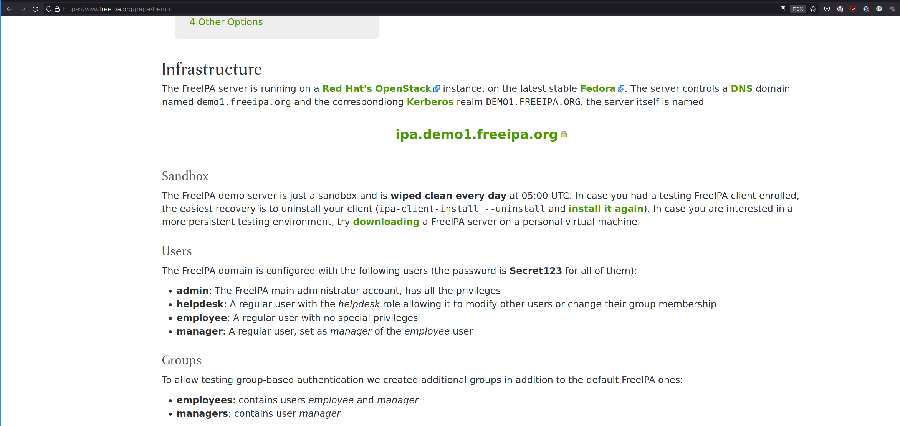
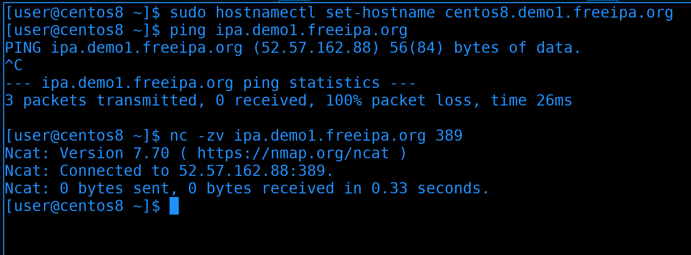
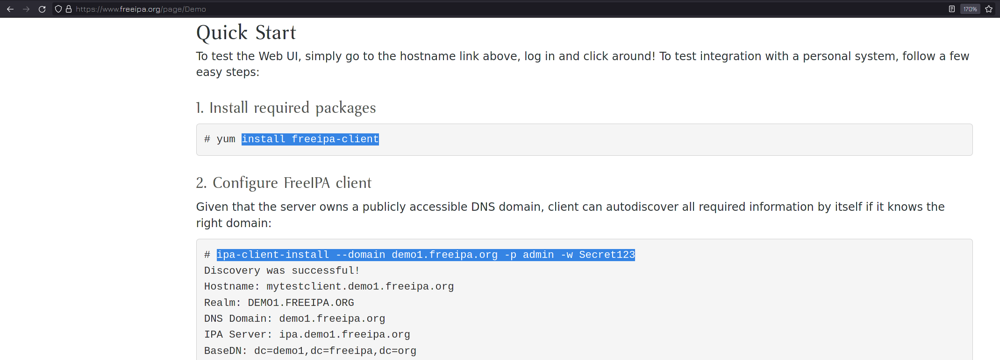
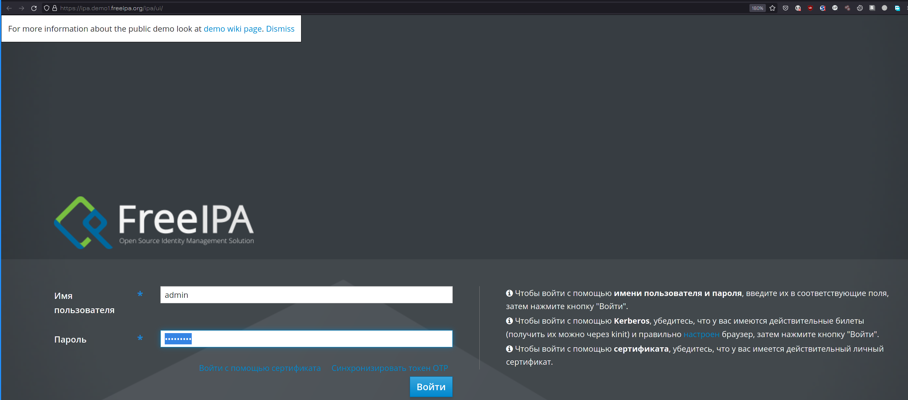
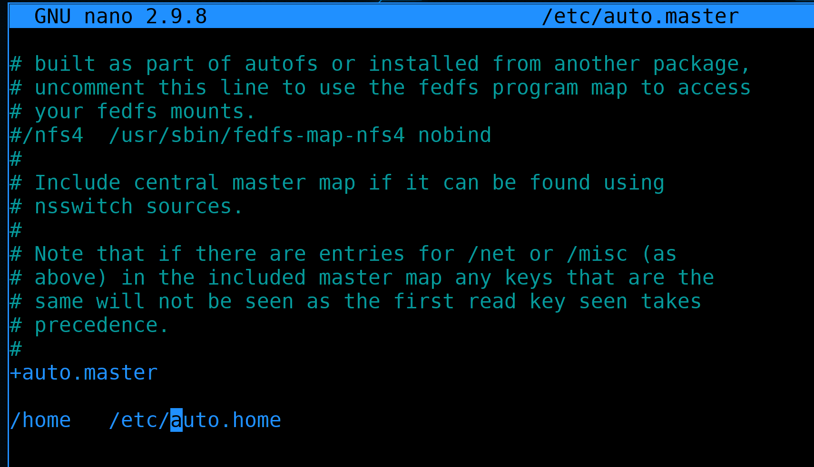
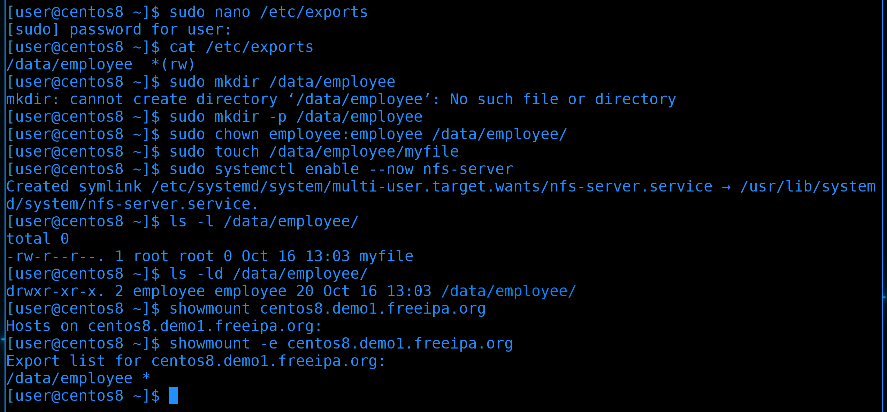
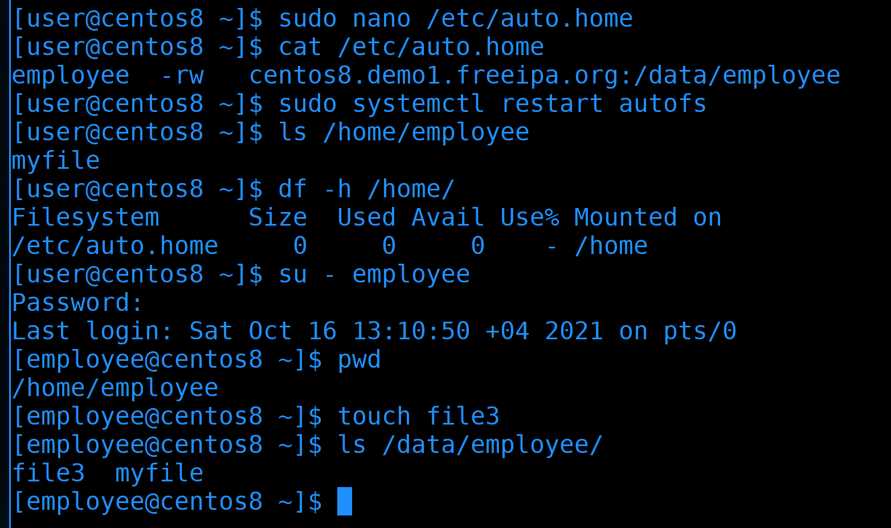
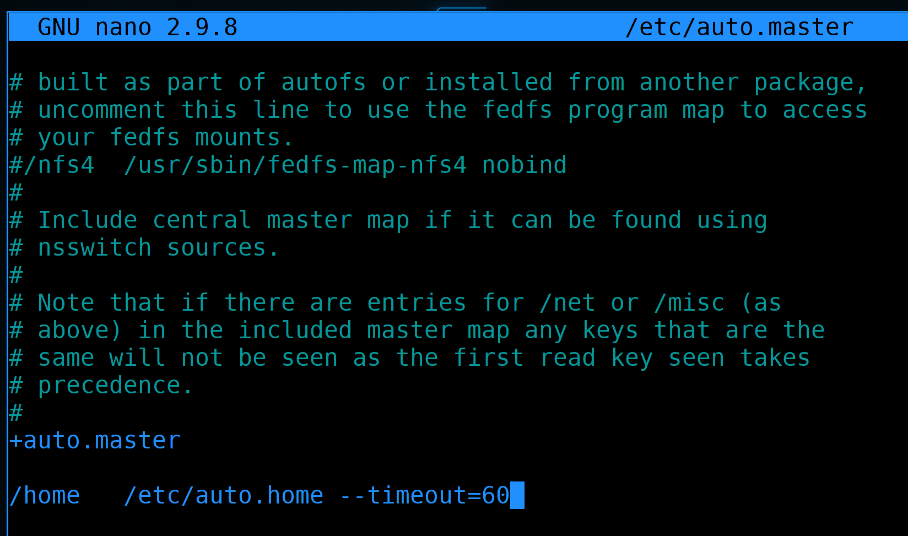



В некоторых средних и крупных компаниях, там где много людей, привязка данных к компьютеру усложняет работу. Пользователи часто меняют места, кто-то переходит с одного отдела в другой, кто-то хочет сесть подальше от кондиционера, да и в целом есть такая практика периодически менять места. И постоянно из-за этого таскать и переподключать компьютеры пользователей дело неблагодарное. Большинство данных хранится на файловых серверах, у пользователей в домашних директориях не так много файлов. Поэтому можно просто цеплять домашние директории по сети и, тогда, за какой-бы компьютер человек не сел, везде будут его настройки и файлы. Даже когда компьютер выйдет из строя, вам достаточно будет подключить новый компьютер, а не возиться с восстановлением данных. Как пример, это также удобно в современных учебных заведениях, где в каждом классе есть компьютеры - тогда учителя и студенты могут спокойно ходить из одного кабинета в другой и работать со своими файлами.

Это всё очень здорово, но, нужно учитывать, что выход из строя сети или сервера приведёт к полной остановке работы людей, так как их домашние директории перестанут быть доступны. Есть, конечно, более надёжный механизм - репликация, т.е. как это делает rsync. Вместо того, чтобы монтировать директории по сети, они будут просто синхронизироваться с сервером. Правда из-за этого нужно будет тратить место и на сервере, и на компьютерах. Но сегодня мы разберём именно первый случай, без репликации, т.е. просто автомонтирование домашних директорий. Стоит отметить, что данную тему я рассматриваю из-за экзамена, который требует умения настраивать только клиентскую часть. Я хотел бы рассмотреть и настройку сервера, но это требует знания многих тем, которые не касаются экзамена и которые мы пока не прошли. Когда-нибудь мы до них доберёмся, но пока сконцентрируемся на этой теме. 

#### FreeIPA


Вкратце, как это работает: есть специальный сервер - FreeIPA, на котором работают и связаны между собой несколько протоколов - Kerberos, LDAP, NFS и многое другое. Kerberos отвечает за безопасную аутентификацию пользователей по сети, а LDAP за хранение информации о том, что кому разрешено, т.е. за авторизацию. Сам FreeIPA - сервер, который объединяет всё это и даёт удобный веб интерфейс для управления. 



Наша виртуалка будет клиентом. Так как у нас своего сервера нет, поэтому мы воспользуемся [демо сервером](https://www.freeipa.org/page/Demo), который доступен для всех. По ссылке есть краткое руководство, как настроить клиент. В качестве клиента я буду использовать Centos. Советую предварительно сделать снапшот виртуалки, а потом, после всех тестов, его восстановить. 



Для начала стоит изменить hostname нашей виртуалки, чтобы он содержал домен:

```bash
sudo hostnamectl set-hostname centos8.demo1.freeipa.org
```

Затем убедимся, что наша виртуалка видит сервер:

```bash
ping ipa.demo1.freeipa.org
```

ping на имя ipa.demo1.freeipa.org показывает IP адрес, значит DNS резолвит, правда этот сервер не пингуется. Но это не значит, что сервер недоступен. Можем проверить доступность какого-нибудь сервиса, допустим, LDAP, который работает на 389 порту:

```bash
nc -zv ipa.demo1.freeipa.org 389
```

И в выводе мы видим Connected, значит соединение прошло успешно. Значит с сетью проблем нет.



Дальше, следуя гайду, нужно выполнить две команды - установить freeipa-client и настроить его. 


Установим freeipa-client с помощью dnf:

```bash
sudo dnf install freeipa-client -y
```


После чего запустим настройку:

```bash
sudo ipa-client-install --domain demo1.freeipa.org -p admin -w Secret123
```


В какой-то момент программа спросит, хотим ли мы указать ntp сервер - отвечаем no, т.е. просто нажимаем enter. Дальше она соберёт всю информацию и уточнит, уверены ли мы, что хотим продолжить с такими параметрами. Пишем yes и нажимаем enter.


В итоге мы увидим сообщение, что команда завершилась успешно.



Дальше можем перейти по ссылке [ipa.demo1.freeipa.org](https://ipa.demo1.freeipa.org/ipa/ui/), где находится веб интерфейс для управления сервером FreeIPA. Вводим логин admin и пароль Secret123. Можете потыкать интерфейс и посмотреть, что к чему, но, пожалуйста, уважайте труд других людей и ничего не портьте. 


Также зайдите во вкладку "Узлы", где вы увидите  в списке адрес вашего клиента.


Теперь вернёмся к нашей виртуалке. И так, на сервере freeipa есть 4 настроенных пользователя, которые могут логиниться на любом клиенте. ipa клиент так настроил нашу систему, что мы теперь можем видеть этих юзеров почти как локальных:

```bash
id admin
id helpdesk
id employee
id manager
```

Обратите внимание, что у всех этих пользователей uid-ы имеют длинное значение, а у admin нет. Т.е. у нас есть локальный юзер admin и он пересекается с пользователем admin на сервере, т.е. это не тот же самый юзер. Чтобы увидеть серверного, придётся добавить собачку и домен:

```bash
id admin@demo1.freeipa.org
```


Можем даже попробовать залогиниться этими пользователями, у всех пароли Secret123.

```bash
su - employee
```

Как видите, я залогинился, но пользователь остался без домашней директории, так как нет такой директории. 

#### autofs

И теперь мы можем приступить к сути нашего урока: нужно, чтобы при логине пользователя или когда кто-то обращается к этой директории, она автоматом монтировалась. Можно было бы прописать где-нибудь в fstab, но если у нас много пользователей, директорию каждого прописать нереально. Да и от того, что они просто так висят примонтированными, тоже ничего хорошего, шары постоянно обращаются к серверу, используют сеть и оперативку. Поэтому и нужно автомонтирование.


Мы, кстати, говорили об автомонтировании, когда разбирали systemd. У него есть юниты automount, которые этим и занимаются:

```bash
sudo systemctl list-units --type automount
```

Разве что autofs, который мы будем сегодня разбирать, немного пофункциональнее.


И так, сперва стоит установить пакет autofs:

```bash
sudo dnf install autofs
```

Пакет уже установлен. Давайте проверим, может и сервис работает?

```bash
systemctl status autofs
```

Нет, сервис выключен. Давайте добавим его в автозапуск и запустим:

```bash
sudo systemctl enable --now autofs
```


Настройка autofs поделена по файлам:

```bash
ls /etc/auto*
```

Все они лежат в директории /etc. Основной файл - /etc/auto.master, он уже ссылается на другие файлы:

```bash
cat /etc/auto.master
```

autofs очень гибкий и его можно настроить как для сетевых файловых систем, так и для локальных. Сейчас нас интересует только NFS. 

И так, в auto.master мы должны указать, для какой локальной директории какой шаблон autofs-а. Домашняя директория пользователя employee ссылается на /home/employee. 



Открываем /etc/auto.master и добавляем строчку:

```bash
sudo nano /etc/auto.master
```

```
/home /etc/auto.home
```

Здесь мы указали, что всё что касается монтирования внутри директории home - указано в файле /etc/auto.home.


Теперь открываем файл /etc/auto.home и указываем:

```bash
sudo nano /etc/auto.home
```

```
employee -rw ipa.demo1.freeipa.org:/home/employee
```

Давайте поясню. В auto.master мы указали, что /etc/auto.home касается директории /home, а значит в самом /etc/auto.home не нужно писать полный путь - /home/employee, достаточно просто прописать employee, и так понятно, что это внутри /home. -rw мы указали, чтобы шара монтировалась в режиме read write. Ну и дальше мы указываем адрес nfs сервера и путь к самой директории пользователя на сервере. Теперь, если кто-то зайдёт в директорию /home/employee в неё примонтируется NFS шара. 


Сохраняем файл и выходим. Дело остаётся за малым - перезапустить сервис autofs и залогиниться пользователем employee. Но мы опять видим ошибку - нет такой директории. Наша конфигурация должна была сработать, но вот оказывается на демо сервере не включен NFS:

```bash
nc -zv ipa.demo1.freeipa.org 2049
```

Как видите, Connection timed out, т.е. мы не можем подключиться. Что ж, придётся изменить планы и поднять NFS сервер у себя.



Мы это уже делали, поэтому не буду вдаваться в детали. Просто поднимем nfs сервер, пропишем в exports директорию /data/employee, создадим такую директорию, сделаем её владельцем этого пользователя, создадим внутри файл, включим и запустим сервис, ну и убедимся что видим шару с помощью showmount.

```
sudo nano /etc/exports
```

```
/data/employee *(rw)
```

```
sudo mkdir -p /data/employee
sudo chown employee:employee /data/employee
sudo touch /data/employee/myfile
sudo systemctl enable --now nfs-server
showmount -e centos8.demo1.freeipa.org
```



После чего надо поправить путь к NFS в auto.home:

```
sudo nano /etc/auto.home
```

```
employee -rw centos8.demo1.freeipa.org:/data/employee
```

Теперь у нас получается, что при логине пользователя employee будет создаваться директория /home/employee, куда будет монтироваться /data/employee с нашего же NFS сервера. Т.е. не обязательно, чтобы NFS сервер находился на самом FreeIPA сервере, в идеале это должен быть отдельный сервер. И хотя с точки зрения FreeIPA наш NFS сервер настроен не до конца, но наша сегодняшняя тема - это автомонтирование, поэтому продолжим. 

После изменений перезапустим сервис autofs:

```bash
sudo systemctl restart autofs
```

И теперь стоит нам попытаться обратиться к директории /home/employee - автоматически она примонтируется:

```bash
ls /home/employee
```

При этом сама директория /home находится на файловой системе auto.home:

```bash
df -h /home
```

Из-за этого у всех наших локальных пользователей домашние директории остались под этой файловой системой, поэтому недоступны. Если мы используем только удалённых пользователей - это не страшно. Если есть и локальные, и удалённые, то лучше внутри /home создать поддиректорию, скажем, /home/remote. 

Теперь попробуем залогиниться нашим пользователем:

```bash
su - employee
```

На этот раз никакой ошибки, теперь у пользователя есть домашняя директория. Мы можем создать файл и убедиться, что он появился на nfs сервере:

```bash
pwd
touch file3
ls /data/employee
```

Как видите, всё работает.


Но то что мы настроили, работает только для одного пользователя. Как же нам сделать, чтобы это работало для всех, при этом, не прописывая их всех вручную?


Для начала создадим для них директории на nfs сервере и дадим соответствующие права:

```bash
sudo mkdir /data/{manager,helpdesk}
sudo chown manager:manager /data/manager
sudo chown helpdesk:helpdesk /data/helpdesk
ls -ld /data/*
```


После чего поправим NFS, чтобы он раздавал все директории внутри /data:

```bash
sudo nano /etc/exports
```

```
/data/ *(rw)
```

Затем переэкспортируем шару:

```bash
sudo exportfs -rv
```

И убедимся, что всё сработало:

```bash
showmount -e centos8.demo1.freeipa.org
```


Ну и подправим сам auto.home:

```bash
sudo nano /etc/auto.home
```

```
*   -rw centos8.demo1.freeipa.org:/data/&
```

Обратите внимание на написание. Вместо указания конкретных директорий, ставим звёздочку. А для NFS шары ставим амперсанд вместо определённой директории.

После изменений перезапустим сервис autofs:

```bash
sudo systemctl restart autofs
```

Ну и давайте проверим. Залогинимся пользователями и попробуем создать файлы:

```bash
su - manager
touch myfile
su - helpdesk
touch myfile
```

Всё работает. 



Ну и напоследок, добавим timeout для autofs. Заходим в /etc/auto.master и находим нашу строчку с auto.home:

```bash
sudo nano /etc/auto.master
```

В строчке с нашим auto.home в конце добавляем опцию --timeout:

```
/home /etc/auto.home --timeout=60
```

Если в течении указанного количества секунд никакой процесс не будет обращаться к этой директории, то она отмонтируется и не будет использовать ресурсы. Ну и не забудьте после изменений перезагрузить сервис.

Мы не разобрали весь функционал, но главное было научиться с этим работать. Оставшиеся параметры, то, как указывать SMB, локальные устройства и прочее - всё это можно найти в документации. Можете также посмотреть статью про autofs на [арчвики](https://wiki.archlinux.org/title/Autofs_\(%D0%A0%D1%83%D1%81%D1%81%D0%BA%D0%B8%D0%B9\)), там тоже понятно объясняется. Единственное, там настройки находятся не в /etc/, а в /etc/autofs, так как там документация для другого дистрибутива.

Давайте подведём итоги. Сегодня мы подключили нашу виртуалку в качестве клиента к FreeIPA серверу, взяли оттуда пользователей, подняли NFS сервер и создали для этих пользователей домашние директории на нём. Дальше мы настроили autofs, чтобы при логине этих пользователей их домашние директории монтировались по сети. Всё это вместе может показаться сложным, но на самом деле это просто комплексно - пару простых действий на нескольких системах. Попрактикуйтесь и всё станет понятнее.