

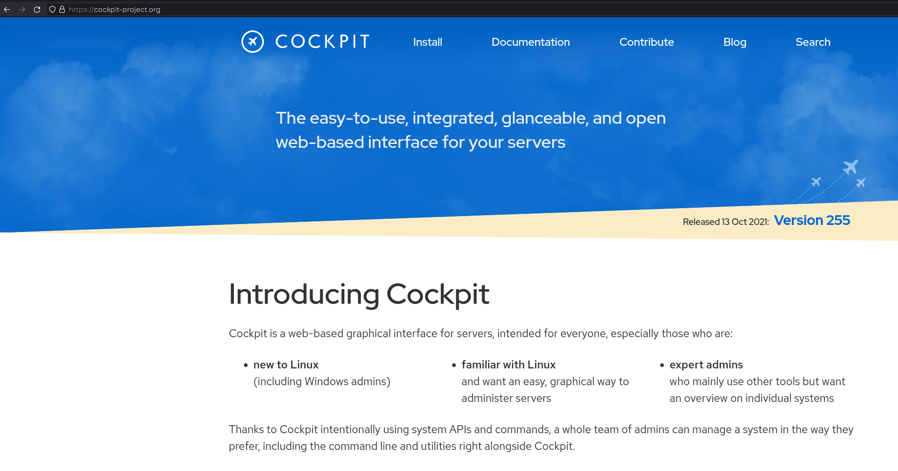

Как мы говорили, на серверах обычно не ставят графический интерфейс, так как всё можно сделать через командную строку. А графический интерфейс тянет за собой кучу пакетов, которые могут иметь уязвимости, ну и впустую использует ресурсы. Да и сервера стоят не на локальных машинах, т.е. если мы хотим графический интерфейс, нужно удалённо подключаться через какие-нибудь протоколы, к примеру, VNC. Но при задержках в сети подключение начинает подвисать, изображение задерживается и всё такое, что довольно неприятно.

Многие программы, используемые администраторами в компаниях, имеют веб-интерфейс - к примеру, гипервизоры, антивирусы, файрволы и т.д. и т.п. Веб-интерфейс лучше справляется с задержками в сети, не так сильно грузит сервер и имеет меньше зависимостей. Раньше как было - к примеру, для управления гипервизором была только графическая утилита, написанная под Windows. И пользователям других систем приходилось постоянно подключаться к какой-нибудь виртуалке с графическим интерфейсом, где стоит этот софт. К счастью, сейчас почти всем можно управлять через веб интерфейс. 

Не исключение и Linux. Есть множество различных проектов, которые дают интерфейс и могут упростить настройку различных сервисов. Обычно это независимые проекты, но есть и исключение - проект [Cockpit](https://cockpit-project.org), который спонсируется и поддерживается компанией Red Hat. 


Хотя изначально Cockpit работал только на дистрибутивах RHEL, сейчас он работает на многих других, в том числе Убунту и Дебиан. 

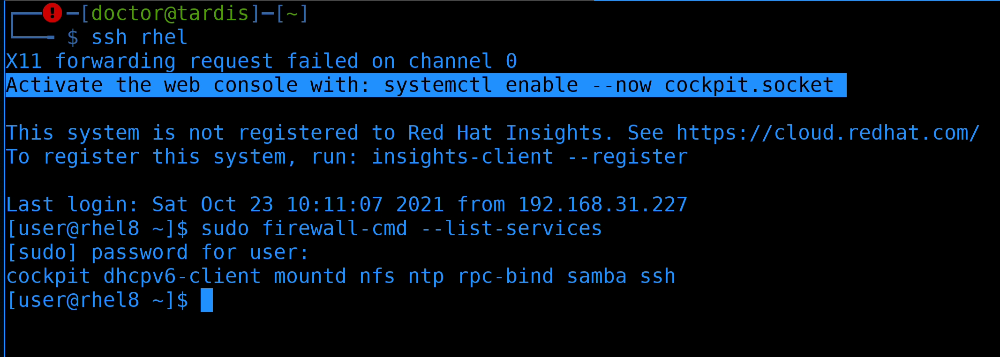

Мы часто встречали это название, когда логинились через SSH или смотрели firewall:

```
sudo firewall-cmd --list-services
```

Да, cockpit был прописан наряду с ssh. 

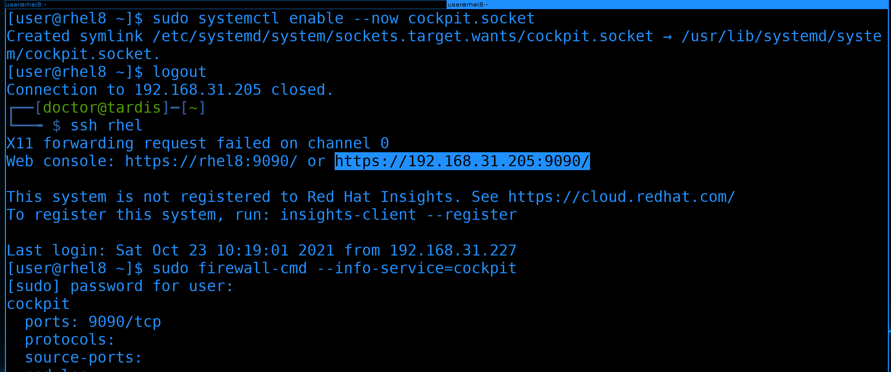

Сообщение при логине говорит о том, что сам cockpit установлен, нужно просто включить и запустить. Так и сделаем:

```
sudo systemctl enable --now cockpit.socket
```

Обратите внимание, что мы запускаем не сервис, а сокет. Это работает так - у нас на сервере работает сокет, который ждёт подключения. Если подключение есть - то systemd сам запускает сервис. Это позволяет сервису не работать постоянно, что немного облегчает нагрузку на сервер. Хотя cockpit использует довольно мало ресурсов.

Теперь, при подключении по ssh, мы будем видеть подсказку, как подключиться к веб-интерфейсу - https, ip адрес и порт 9090. Можем ещё убедиться, что у сервиса на файрволе тот же порт:

```
sudo firewall-cmd --info-service=cockpit
```


Скопируем ссылку и перейдём по ней в браузере. Сразу после этого вы увидите окно с предупреждением об угрозе безопасности. На самом деле угрозы нет, но, давайте объясню в чём дело. 

Есть так называемые центры сертификации. Что-то наподобии гос. органа, выдающего паспорта. Администраторы могут обращаться к ним, чтобы запросить "паспорт" для своего сайта. Эти паспорта - SSL сертификаты. И у каждого паспорта есть специальная метка, уникальная для центра сертификации. Подделать такую метку нельзя. Так вот, браузеры доверяют центрам сертификации и следят, чтобы на сертификатах была метка, соответствующая одному из центров. Если на паспорте метка не такая или истёк срок действия паспорта и т.п., то браузер перестаёт доверять сайту и выдаёт такую ошибку. Так как это очень похоже на то, что кто-то выдаёт себя за другого.

В локальной сети нет необходимости обращаться к центру сертификации, можно построить свой, что обычно и делают в компаниях. Это позволяет пользователям компании заходить на внутренние сайты без всяких ошибок. Но даже если нет своего центра сертификации, в нашем случае нет ничего страшного, мы уверены, что подключаемся именно к нашей виртуалке, поэтому можем проигнорировать ошибку. Нажимаем "Дополнительно", а затем "Принять риск и продолжить". 

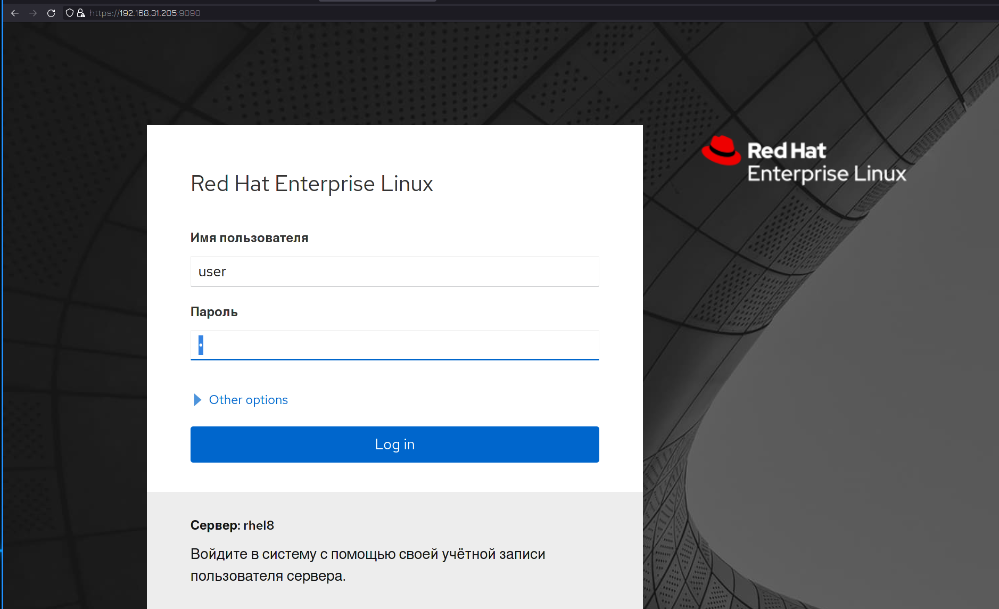

После чего нас встретит окно логина. Здесь мы можем указать пользователя из нашей системы, скажем, рута или нашего user-а. 

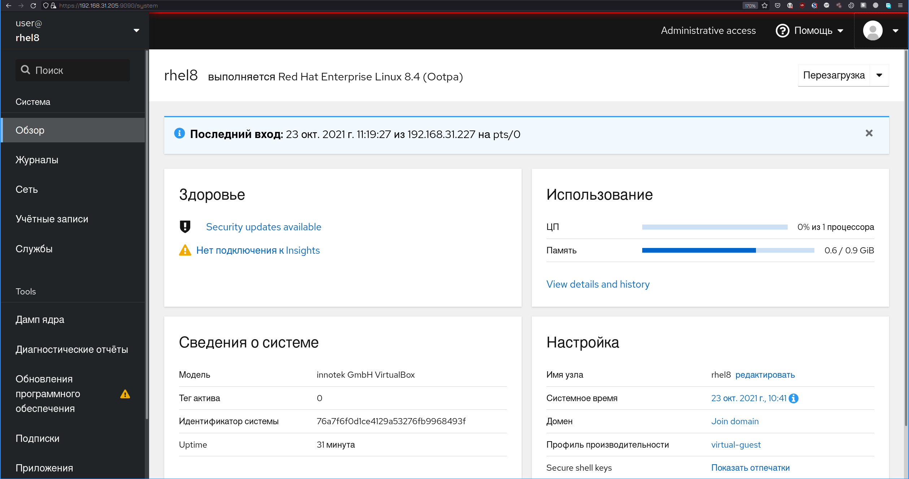

После логина нас встретит окно с общей информацией о системе. Так как у меня браузер на русском, то и интерфейс отображается на русском, что немного не привычно. Поэтому справа сверху можно ткнуть на иконку пользователя и сменить язык интерфейса. 

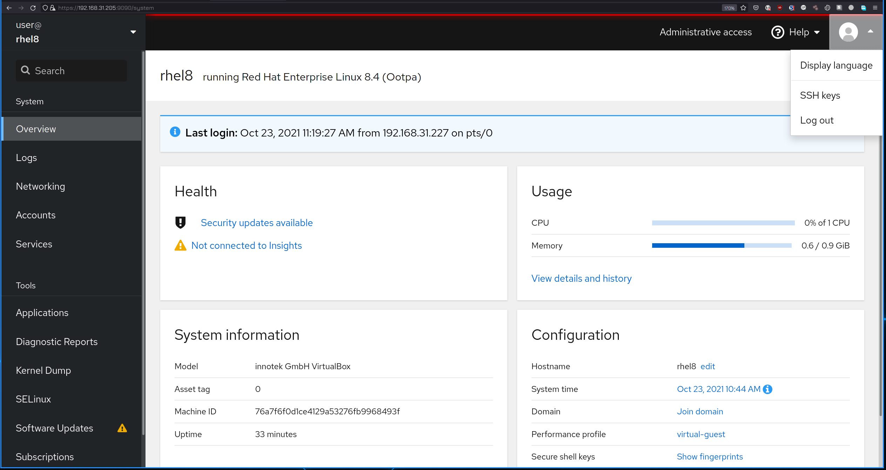

Интерфейс довольно простой и понятный. Я не буду тыкать на все все все кнопки, многое и так понятно, но, давайте пройдёмся по вкладкам. И так, Overview - общая информация о системе. Здесь мы видим, что доступны обновления безопасности, видим нагрузку на процессор, оперативку. Если бы у нас была физическая машина, мы бы видели модель и информацию о ней. Ну и различные настройки, такие как хостнейм, время, профиль производительности, домен и т.д. и т.п. Давайте нажмём на "View details and history" под "Usage".


Откроется чуть детальная информация, включая сервисы, использующие CPU и оперативку, swap, использование файловых систем, использование сети и т.п. Вся эта информация о текущем использовании ресурсов называется метриками. Снизу у нас также есть предлолжение установить cockpit-pcp - пакет, который позволит сохранять эти метрики на время, визуализировать их и т.п. Давайте нажмём на кнопку "Install".

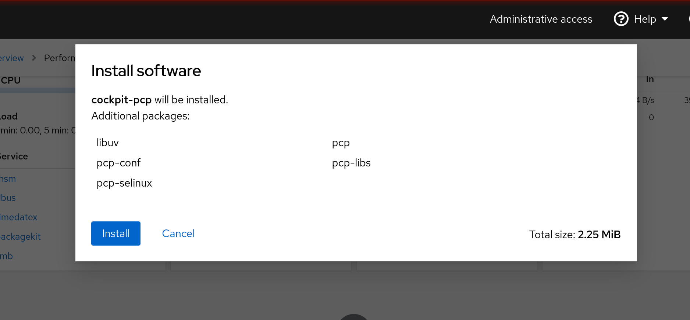

Откроется окно, в котором покажутся необходимые для установки пакеты и их общий объём. Опять нажмём Install.

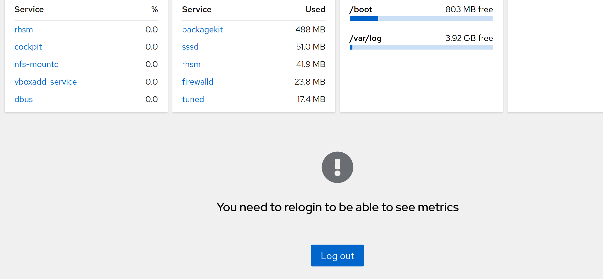

После установки нас просят перелогиниться, чтобы увидеть изменения.


После чего нам говорят, что нет истории метрик, и спрашивают - а работает ли сервис pmlogger? И снизу кнопка troubleshoot. Давайте нажмём.


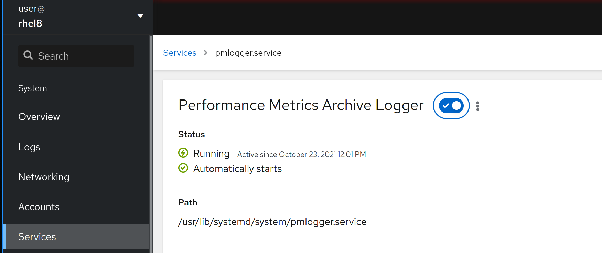

Нас перекидывает во вкладку сервиса. Как видите, статус сервиса disabled. Т.е. как обычно, после установки надо включить и запустить сервис. Здесь это можно сделать нажав на ползунок. 

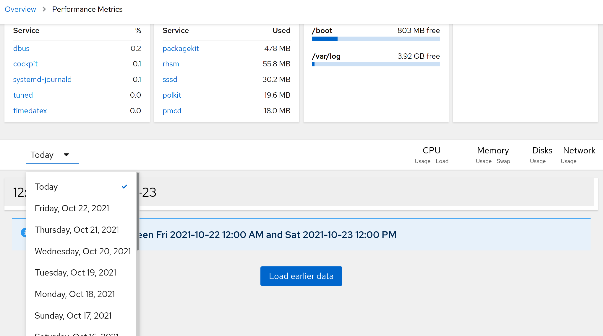

Теперь вернёмся в окно с метриками и обновим его. На этот раз мы просто видим, что нет информации. Сервис просто должен набрать достаточно информации. Оставим его включённым, чтобы в будущем можно было посмотреть метрики за сегодняшний и предыдущие дни. 

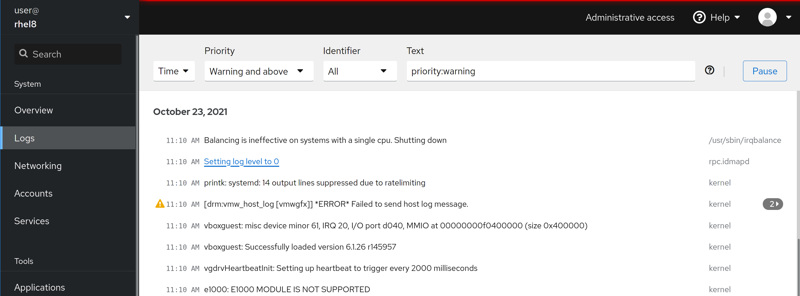

Во вкладке Logs, соответственно, логи. Можно их фильтровать, выбирая время, важность и прочие параметры. Ну и нажимая на лог можно увидеть больше деталей о нём.

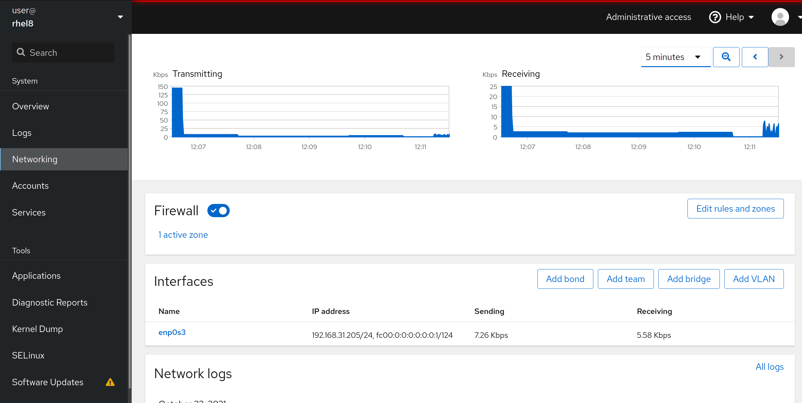

Во вкладке Networking у нас нагрузка сети, логи, а также настройки файрвола и интерфейсов.

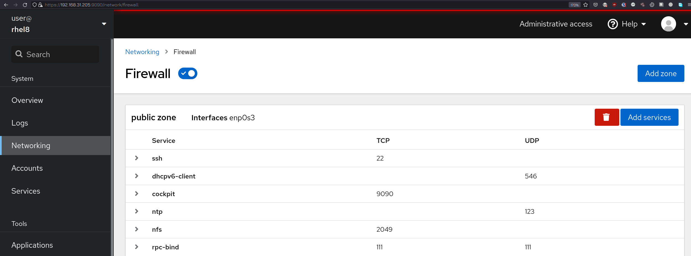

В том же самом файрволе можно добавить или удалить сервисы и зоны. Ну и всё это наглядно и просто.


Во вкладке Accounts обычные пользователи. Отсюда же можно их создавать или изменять.

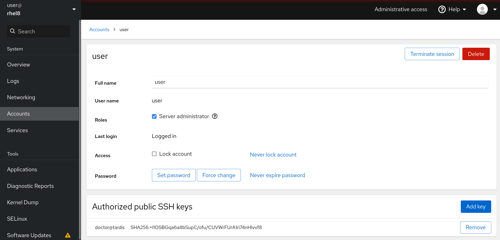

Скажем, можно давать или отнимать административный доступ, блокировать аккаунты, менять пароли и даже добавлять публичные ssh ключи, чтобы пользователь мог по ssh ключам логиниться.


Ну и во вкладке Services можно смотреть информацию и управлять сервисами, скажем, включать, выключать, перезапускать и т.п. 

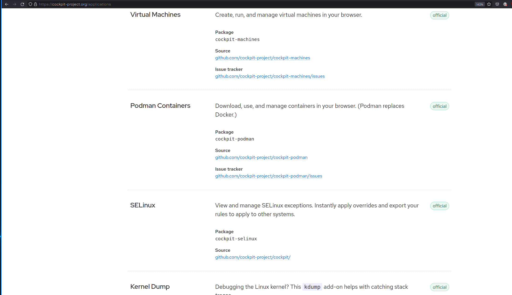

Функционал Cockpit можно расширять модулями. Скажем, есть модули, которые могут управлять виртуалками, контейнерами, файловыми шарами, селинуксом и т.п. На [сайте проекта](https://cockpit-project.org/applications) есть список известных модулей.


Некоторые модули можно найти в репозиториях и установить:

```
sudo dnf search cockpit-
```

Ну и любой желающий может разработать свои модули.

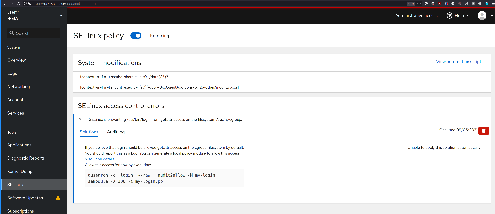

Вернёмся ко вкладкам. Один из модулей - SElinux - позволяет увидеть наши модификации, посмотреть ошибки и даже предложить решения проблем. 

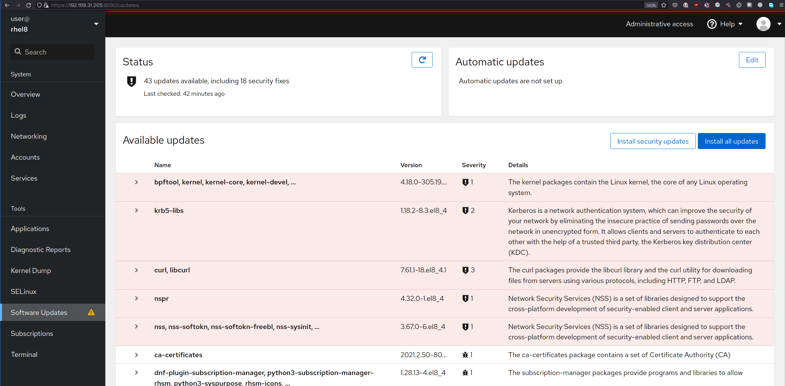

Во вкладке Software Updates мы можем посмотреть доступные обновления, их важность и выбрать что необходимо обновить - только обновления безопасности или все пакеты.

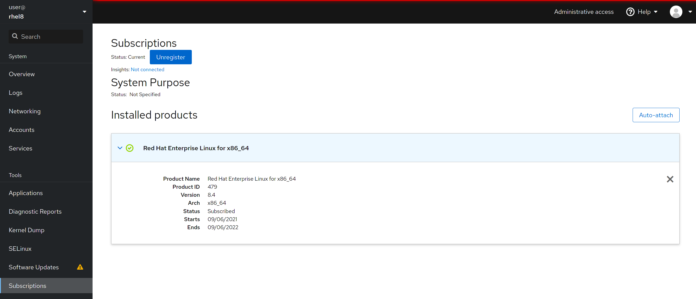

Во вкладке Subscription можно зарегистрировать RHEL или посмотреть статус подписки, время, когда закончится подписка и прочую информацию. 


Ну и вкладка Terminal позволяет запускать команды прямо из браузера. Это не так удобно, как работать с терминалом напрямую, так как некоторые горячие клавиши перехватываются браузером, но для простых задач вполне хороший вариант.

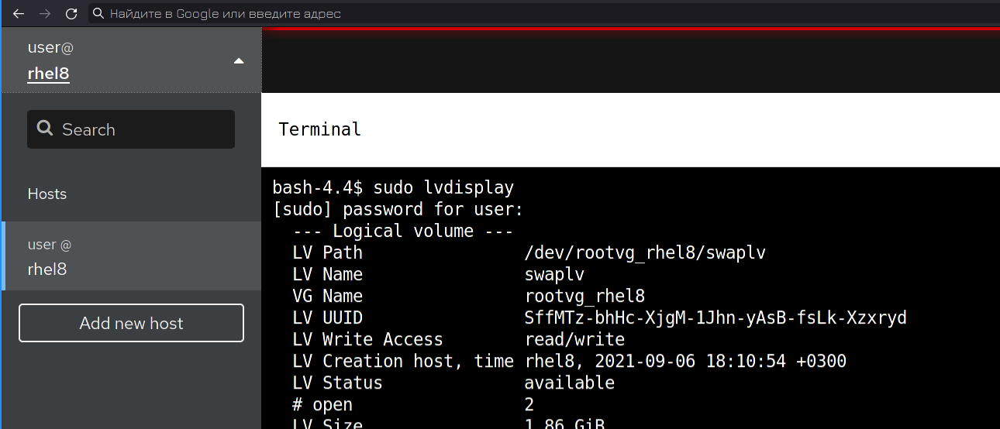

В один Cockpit можно подключить несколько хостов для мониторинга и управления. Чтобы добавить новый хост, нажмите в левом верхнем углу на выпадающее меню и нажмите "Add new host".


Давайте пропишем здесь наш Centos, укажем IP адрес и логин пользователя, после чего нажмём Add.


Но мы видим ошибку - не удаётся связаться с хостом. Cockpit пытается подключиться к хосту по ssh. На Centos-е мы меняли порт ssh на 2233. 

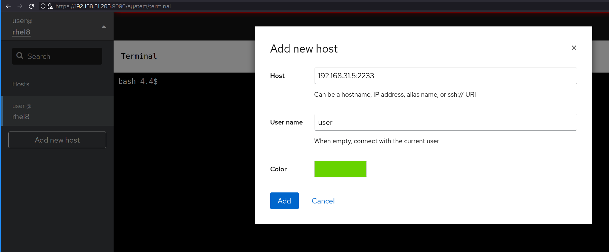

Давайте попробуем заново добавить, указав при этом нужный порт.


Теперь мы видим сообщение с ключом хоста. Да, мы уверены, что подключаемся к тому самому хосту.


Потом у нас спросят пароль и предложат создать ssh ключ, чтобы user с хоста rhel мог без пароля подключаться к user-у c хоста centos.


Теперь у нас в левом меню два хоста и мы можем выбирать, каким хотим управлять.

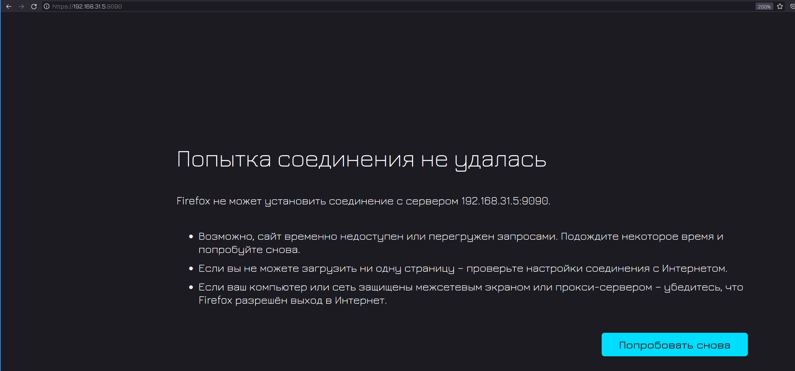

При этом на самом Centos Cockpit не запущен, RHEL лишь управляет Centos через SSH.

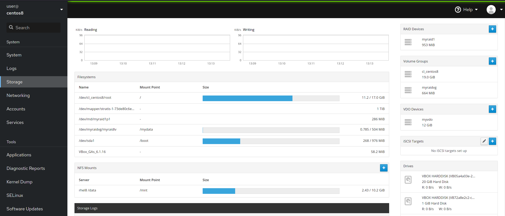

На Centos-е внешний вид и некоторые вкладки могут отличаться. К примеру, здесь у нас стоит пакет cockpit-storaged, который позволяет управлять дисками, рейдом, lvm, nfs и прочим. Т.е. у вас могут быть хосты, на которых нужна виртуализация - для них ставите одни модули. На других хостах контейнеры - ставите другие. И, соответственно, на каждом хосте вы будете видеть и управлять тем, что вам нужно.

Говоря в целом о вкладках, о различном функционале Cockpit, всё это вам должно быть знакомо, потому что мы всё это разбирали. Зная, как это работает на самом деле, что делает каждая из этих кнопок, вы понимаете процесс - что, в каком порядке и зачем делать. Cockpit лишь веб-админка, которая оборачивает часто используемые простые задачи в красивый и простой интерфейс. Он, конечно, не замена командной строке, но некоторые вещи здесь смотреть и настраивать удобнее. 