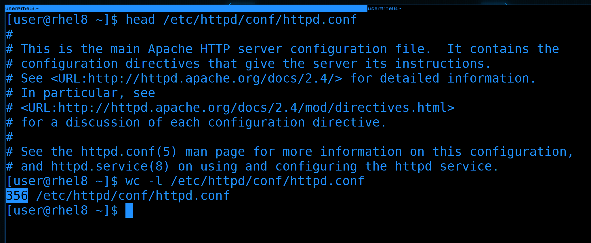
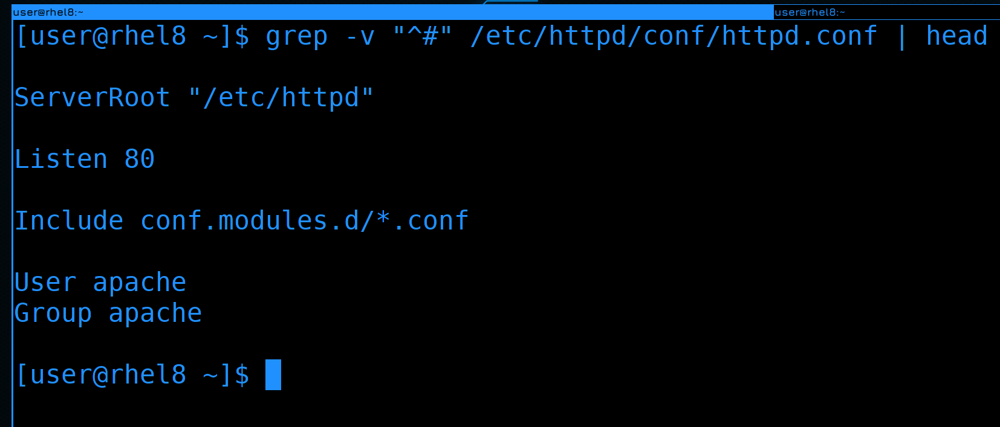
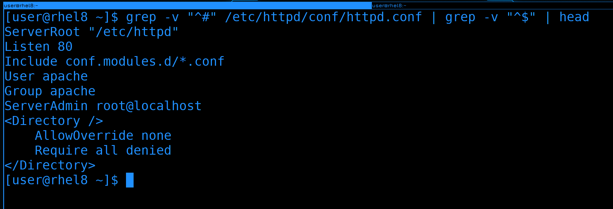
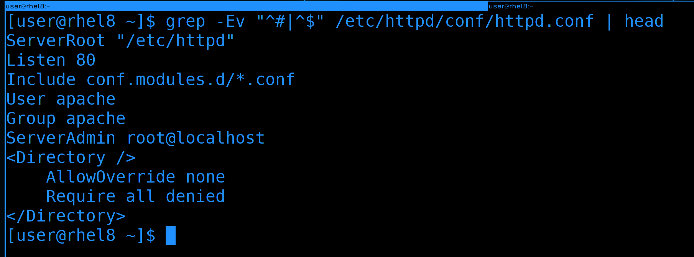
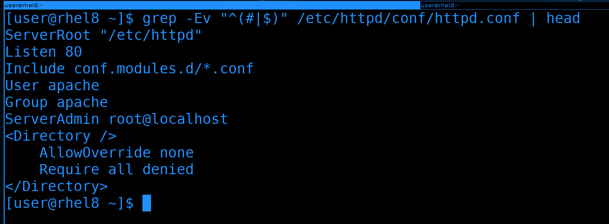
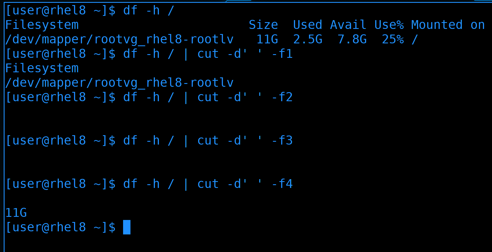
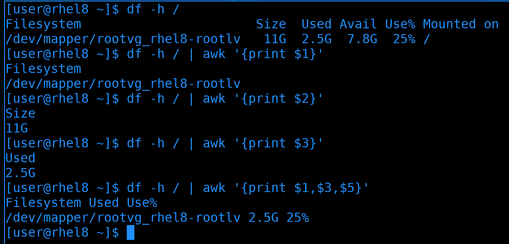




У нас накопилось несколько тем, которые мы вскольз упомянули в течении курса и которые требуют некоторой ясности. В частности это регулярные выражения, глоббинг и такие утилиты, как grep, sed, awk. Но регулярные выражения огромная тема, которую можно усложнять до бесконечности, они очень специфичны и необходимости всем детально в них разбираться нет. Поэтому я буду ориентироваться лишь на то, с чем лично сталкиваюсь и что легко запомнить. Если вы хотите углубиться в эту тему, то советую начать со [статьи](https://habr.com/ru/post/545150/) на хабре.


##### Globbing


Начнём с глоббинга. Он напрямую связан с оболочкой командной строки, например, с тем же bash. Глоббинг нужен для подстановки имён файлов и напоминает регулярные выражения. Мы не раз прибегали к глоббингу, например, при создании файлов:

```
mkdir test
touch test/file{1..3}
```

Видите фигурные кавычки? Это один из примеров глоббинга. Суть в том, что сама команда touch может не уметь работать с этими кавычками. Прежде чем выполнить команду, bash написанное пропускает через себя, при этом подставляя значения переменных, выполняя глоббинг и т.п. И, в итоге, на самом деле, выполняется такая команда:

```
touch test/file1 test/file2 test/file3
```

А это уже простой синтаксис для команды touch. Тоже самое касается любой другой программы или самописного скрипта - bash за вас подставит названия файлов.


Очень частый пример использования фигурных кавычек - эдакий бэкап файлов. Например:

```
sudo cp /etc/fstab{,.bkp}
```

До этого мы в кавычках писали диапазон значений. Сейчас же таким выражением мы просто взяли два значения - /etc/fstab и /etc/fstab.bkp. Запятая в фигурных скобках разделяет эти два значения. Т.е. в итоге команда после обработки bash-ем выглядит так:

```
sudo cp /etc/fstab /etc/fstab.bkp
```

Т.е. особого смысла в таком глоббинге нет, так как второй раз написать /etc/fstab будет проще, чем заморачиваться с фигурными кавычками. Но если путь длинный или в каких-то скриптах это может иметь смысл. Ну и наткнувшись на такое выражение в какой-нибудь статье в интернете вы будете понимать, что вообще происходит.


wildcard, или звёздочка (*), заменяют любое количество символов, хоть в конце файла, хоть в начале, хоть посреди:

```
ls /etc/fstab*
ls /etc/l*.conf
```

В квадратных скобках можно указать несколько вариантов одного символа. Скажем, если нужно найти все файлы, начинающиеся с буквы d, маленькой или большой:

```
ls /etc/[Dd]*
```


Также есть вопросительный знак, который заменяет один символ. Например, если мы знаем количество символов в названии файла или не знаем только определённые пару символов:

```
echo /etc/???
```

Ну и естественно, выражения можно совмещать. Например, найдём все файлы, которые начинаются на s или d и заканчиваются на .conf или .d:

```
echo /etc/[sd]*.{conf,d}
```

В целом, глоббинг небольшая и простая тема. Чуть больше примеров с глоббингом можете найти по [ссылке](https://linuxhint.com/bash_globbing_tutorial/).


##### Регулярные выражения

В отличии от глоббинга, который нужен для подстановки имён файлов, регулярные выражения нужны для работы с текстом, поиска и замены. Регулярные выражения универсальны для разных программ и их уже не bash обрабатывает, а сами программы. 


Глоббинг сделан на основе регулярок, поэтому и здесь эти символы актуальны, но уже с точки зрения текста. Например, найдём в тексте все строки, содержащие большую букву A или P.

```
grep "[AP]" /etc/passwd
```

Но, как я уже сказал, я постараюсь концентрироваться на более реальных случаях. К примеру, возьмём настройку какого-нибудь сервиса, допустим, веб-сервера. Хотя мы его пока не проходили, нас интересует только обработка текста, а в конфигах вебсервера много всяких строк. 


Начнём с установки, пакет называется httpd:

```
sudo dnf install httpd
```



После установки глянем основной файл настроек - /etc/httpd/conf/httpd.conf. Большой конфиг файл с кучей комментариев. Давайте посмотрим, сколько всего здесь строк:

```
wc -l /etc/httpd/conf/httpd.conf
```

356 строк, довольно много. Ориентироваться в таком файле неудобно, но мы знаем, что большая часть строк просто комментарии и они нам не нужны. 

##### grep



Давайте выведем только те строки, в которых нет комментариев. Все строки с комментариями начинаются со знака решётки, а значит с помощью grep мне нужно вывести все строки, которые не начинаются с этого символа. Можно использовать символ карет(^), чтобы найти все строки, начинающиеся с решётки и ключ -v, чтобы инверсировать запрос:

```
grep -v "^#" /etc/httpd/conf/httpd.conf
```

Теперь мы уже видим непосредственно настройки, а не комментарии. Хотя всё ещё куча пустых строк, от которых мы тоже можем избавиться.



Самым простым вариантом будет поставить ещё один grep после пайпа и найти все строки, начинающиеся и заканчивающиеся ничем, т.е. являющиеся пустой строкой. Если карет - начало строки, то доллар - конец строки. Объединив их мы можем найти пустые строки:

```
grep -v "^#" /etc/httpd/conf/httpd.conf | grep -v "^$"
```



Мы можем объединить оба grep-а символом "или" - прямой линией. Но чтобы это выглядело чуть более читаемо, grep-у нужен дополнительный ключ - E:

```
grep -Ev "^#|^$" /etc/httpd/conf/httpd.conf
```



Так как карет относится и к первому выражению, и ко второму, мы можем их сгруппировать с помощью круглых скобок:

```
grep -Ev "^(#|$)" /etc/httpd/conf/httpd.conf
```


Но не то, чтобы наше выражение полностью избавило вывод от закомментированных строк. Если посмотреть весь файл, то можно заметить, что какие-то закомментированные строки остались, потому что они начинаются с пробелов, что не подходит под наше выражение. 


То есть, нам желательно ещё убрать все строки, содержащие просто пробелы или начинающеся с пробелов, за которыми начинается комментарий. Для этого можем добавить специальное выражение \s, которое соответствует пробелам и табуляции:

```
grep -Ev "^\s*(#|$)" /etc/httpd/conf/httpd.conf
```

И вроде бы мы добились, чего хотели, но в какой момент это выражение из простого превратилось в сложное? Можно ли его запомнить? В принципе, можно. Но это будет одно выражение. А таких выражений может быть сотни и тысячи. Естественно, всё не запомнить и универсального рецепта нет. Если вам по работе часто нужно будет работать с регулярками - запомните выражения и сами научитесь строить, да и заведёте себе заметки. 


Вывод grep можно направить куда-нибудь в новый файл и будет готовый файл без всяких комментариев. Ну и количество строк в нём будет гораздо меньше, всего 57:

```
grep -Ev "^\s*(#|$)" /etc/httpd/conf/httpd.conf > ~/httpd.conf
wc -l httpd.conf
```

С таким файлом работать куда проще.

##### sed

Другой инструмент, с которым периодически приходится работать - sed. Он позволяет работать с файлами - искать текст, заменять его и прочее, при этом работает из командной строки. Если вам нужно нужно в файле что-то заменить не вручную, т.е. без всяких nano и vi, скажем, через скрипты - то sed чуть ли не единственный вариант. При этом функционал у него почти безграничный. По [ссылке](https://linuxhint.com/50_sed_command_examples/) вы можете найти кучу примеров его использования.


Мы же запомним только парочку самых популярных. Для начала - как поменять значение. В файле httpd.conf написано, чтобы вебсервер слушает на 80 порту:

```
grep 80 /etc/httpd/conf/httpd.conf
```

Поменяем стандартный порт на другой, допустим, на 555:

```
sed 's/Listen\ 80/Listen\ 555/g' httpd.conf
```

В таком виде sed просто считывает файл, заменяет значение и выводит на экран, при этом сам файл не изменяется. Я мог бы просто заменить 80 на 555, но может в этом файле и в других местах встречается цифра 80? Чтобы не затронуть лишнее, лучше писать и сам параметр Listen. В этой команде 's' означает функцию поиска и замены текста, а 'g' - что нужно поменять по всему файлу. Ну и обратите внимание, что пробелы, как и другие специальные символы, надо экранировать. 


Окей, в первый раз лучше проверять на тестовом файле или без изменений. Допустим, мы убедились, что команда работает правильно и не перезаписывает ничего лишнего. Как сделать так, чтобы файл всё таки изменился? Нужен ключ -i:

```
sudo sed -i 's/Listen\ 80/Listen\ 555/g' /etc/httpd/conf/httpd.conf
grep Listen /etc/httpd/conf/httpd.conf
```

Как видите, теперь в конфиге вебсервера поменялся порт. 


Давайте для теста запустим вебсервер:

```
sudo systemctl enable --now httpd
```

Хоть он и добавился в автозагрузку, но не смог стартануть. Опять же, мы поменяли стандартный порт, а значит дело в selinux. 


Мы помним, что в логах можно найти подсказку, как исправить проблему. Но чтобы это работало, нужен пакет setroubleshoot, которого может не быть в минимальной системе. Давайте установим его:

```
sudo dnf install setroubleshoot
```


После установки перезапустим вебсервер и попробуем найти в логах информацию:

```
sudo systemctl restart httpd
```

Можно было и покопаться в выводе journald, но попытаемся найти через grep. Знаем, что команда как-то связана с semanage:

```
sudo journalctl -e | grep semanage
```

И так, команда почти есть, осталось определится с типом порта - PORT_TYPE. 


Ещё раз воспользуемся grep:

```
sudo journalctl -e | grep PORT_TYPE
```

Где мы увидим список вариантов. Из всех описанных больше всего подходит http_port_t, его и используем.


Используем команду semanage, чтобы разрешить вебсерверу работать на 555 порту:

```
sudo semanage port -a -t http_port_t -p tcp 555
```

После чего перезапустим сервис и проверим доступность порта:

```
sudo systemctl restart httpd
nc -zv localhost 555
```

Сервис запустился без ошибок и порт доступен. 


Остаётся разве что прописать этот порт на файрволе:

```
sudo firewall-cmd --add-port=555/tcp --permanent
sudo firewall-cmd --reload
```

Ну и для теста пропишем в браузере адрес сервера и порт:

```
http://192.168.31.205:555
```

Страничка открывается, значит всё правильно. 


##### awk 

Ну и напоследок, разберём awk. Он, как и sed, предназначен для обработки текста и даже является отдельным языком, внутри которого можно запускать циклы, условия и т.п.. Как и с sed-ом, у awk-а огромный функционал и большая часть ситуативна. Но одну комбинацию всё же стоит запомнить. 


awk очень часто используют для вырезания столбцов, как мы этот делали с cut:

```
ls -l test | cut -d' ' -f9
```



Но cut работает только с одним делителем, и если у нас в выводе есть и пробелы, и табуляция, и ещё что-то - то cut справляется плохо:

```
df -h /
df -h / | cut -d' ' -f1
df -h / | cut -d' ' -f2
df -h / | cut -d' ' -f3
df -h / | cut -d' ' -f4
```

Как видите, вместо второго и третьего столбика видим пробелы, а в качестве четвёртого - второй.  



С той же задачей awk справляется лучше, хотя синтаксис у него чуть посложнее:

```
df -h /
df -h / | awk '{print $1}'
df -h / | awk '{print $2}'
df -h / | awk '{print $3}'
df -h / | awk '{print $1,$3,$5}'
```

Но это не значит, что awk всегда лучше. В большинстве случаев cut-а вполне хватает. Но вот такое применение awk стоит запомнить.

И так, сегодня мы с вами разобрали глоббинг и регулярные выражения, а также утилиты grep, sed, awk и в очередной раз разобрали решение проблем с SElinux на примере незнакомого сервиса. У этих инструментов огромный функционал, но кроме пары базовых команд всё остальное очень ситуативно. Поэтому зубрить всё не нужно, просто знайте, что есть такая команда, она делает то-то, и если встанет задача, нагуглить решение будет проще.